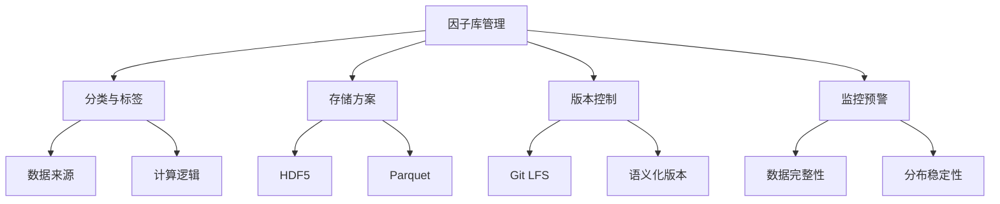

# 因子库管理：让因子井井有条的艺术

做量化这些年，我见过太多人把因子文件随便扔在文件夹里，命名成「因子_v1」「因子_最终版」「因子_真的最终版」。嗯，这种混乱我太熟悉了。我自己早期也踩过这个坑，直到某次回测时发现用了旧版本的因子数据，白白浪费了两周时间。

今天我们就聊聊因子库管理。说白了，就是怎么让你的因子像图书馆里的书一样，分类清晰、版本可控、随时可查。

## 因子分类与标签：给因子打上身份标识

因子多了以后，光靠名字根本记不住。我习惯给每个因子打上标签，就像给文件贴便签一样。

常见的分类维度有这么几种：

- **按数据来源**：行情类、财务类、另类数据
- **按计算逻辑**：动量因子、反转因子、波动率因子、价值因子
- **按频率**：日频、周频、月频
- **按状态**：研发中、已上线、已废弃

我个人习惯用 JSON 来管理标签信息，结构清晰，也方便程序读取：

```json
{
  "factor_id": "momentum_20d",
  "name": "20日动量因子",
  "category": "动量",
  "source": "行情数据",
  "frequency": "日频",
  "status": "已上线",
  "tags": ["动量", "短期", "趋势跟踪"],
  "create_date": "2024-01-15",
  "version": "2.1.0"
}
```

> **小技巧**：标签不要太多，3-5个就够。太多反而不好检索。我一般用「大类+小类+特征」的组合方式。

## 因子存储方案：HDF5 vs Parquet

存储因子数据，选对格式很重要。我试过 CSV、SQLite，最后稳定在 HDF5 和 Parquet 上。为什么？

先看个对比：

| 特性 | HDF5 | Parquet |
| --- | --- | --- |
| 压缩率 | 中等 | 高（通常能压到30%） |
| 读取速度 | 快（支持切片读取） | 非常快（列式存储） |
| 跨语言支持 | Python/C++/Java | 几乎所有大数据工具 |
| 适合场景 | 中小规模因子库 | 大规模、分布式场景 |

我个人习惯：**单机用 HDF5，集群用 Parquet**。HDF5 在 Python 里用 pandas 直接读写，非常方便。但如果你要处理几百个因子、上亿条数据，Parquet 的列式存储优势就出来了。

举个例子，用 HDF5 存储因子：

```python
import pandas as pd

# 存储因子数据
factor_data = pd.DataFrame({
    'date': ['2024-01-01', '2024-01-02', '2024-01-03'],
    'stock_000001': [0.12, 0.15, 0.11],
    'stock_000002': [0.08, 0.09, 0.07]
})

# 保存到 HDF5
factor_data.to_hdf('factor_store.h5', key='momentum_20d', mode='a')

# 读取
df = pd.read_hdf('factor_store.h5', key='momentum_20d')
```

> **注意**：HDF5 有个坑——不同版本的 h5py 库可能不兼容。我曾经因为升级了库，导致旧文件读不出来。建议固定版本，或者用 Parquet 做备份。

## 因子版本控制：别让旧版本害了你

因子会迭代，会修复 bug，会调整参数。没有版本控制，你根本不知道回测用的是哪个版本。

我推荐用 Git LFS 来管理因子文件。为什么是 LFS？因为因子数据文件通常很大，普通 Git 会拖慢仓库。

版本命名规则我建议这样：

- **主版本号**：因子逻辑有重大变化时升级
- **次版本号**：参数调整、数据源变更
- **修订号**：bug 修复、小优化

比如 `v2.1.0` 表示第二个大版本，第一次参数调整，没有 bug 修复。

实际操作中，我会在因子文件里嵌入版本信息：

```python
# 因子计算时记录版本
factor_meta = {
    'version': '2.1.0',
    'changelog': '修复了停牌日期的处理逻辑',
    'author': '张三',
    'compute_date': '2024-06-01'
}

# 保存到 HDF5 的属性中
with pd.HDFStore('factor_store.h5') as store:
    store.get_storer('momentum_20d').attrs.metadata = factor_meta
```

> **避坑指南**：我曾经因为忘记记录版本，回测时用了旧因子，结果策略表现特别好。上线后才发现是新因子根本没生效。嗯，从那以后我强制要求每个因子必须带版本号。

## 因子监控预警：别等亏钱了才发现

因子不是算出来就完事了。它会衰减，会失效，甚至数据源会出问题。我见过有人因子数据断了一天都没发现，回测结果全错了。

监控什么？我总结了几个关键指标：

- **数据完整性**：每天是否有缺失？覆盖率是否达标？
- **分布稳定性**：均值、标准差是否突变？
- **因子收益率**：IC 值是否持续下降？
- **计算耗时**：是不是突然变慢了？

举个简单的监控脚本：

```python
import numpy as np

def monitor_factor(factor_data, threshold=3):
    """
    监控因子分布是否异常
    """
    daily_mean = factor_data.mean(axis=1)
    daily_std = factor_data.std(axis=1)

    # 检查均值是否超过3倍标准差
    mean_zscore = (daily_mean - daily_mean.mean()) / daily_mean.std()
    abnormal_days = np.where(np.abs(mean_zscore) > threshold)[0]

    if len(abnormal_days) > 0:
        print(f"警告：发现 {len(abnormal_days)} 天异常")
        return False
    return True
```

我一般用邮件+企业微信做预警通知。阈值设得太紧容易误报，太松又漏报。建议先用历史数据跑一遍，找到合理的阈值范围。

> **核心要点**：因子库管理不是一次性工作，而是持续的过程。分类让因子可检索，存储让数据可访问，版本控制让结果可复现，监控让问题可发现。四者缺一不可。

## 知识体系总览

下面这张图概括了因子库管理的核心逻辑，我画了很久才理清楚：



你想想看，如果这四个环节都做好了，因子库就像一台精密的机器，每个齿轮都咬合得很好。数据进来，因子出去，中间的过程清晰可控。

最后说一句：**因子库管理不是锦上添花，而是基本功**。我见过太多团队在因子数量超过50个后开始混乱，不得不花大量时间重构。与其事后补救，不如一开始就建立好规范。

