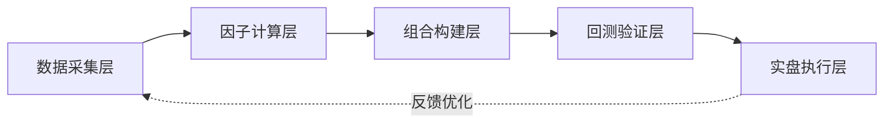

# 实战项目：从零构建一个Alpha因子组合

说实话，很多人在因子挖掘这条路上走不远，不是因为策略不行，而是因为「组合」这一步没做好。我见过太多人，挖了几十个因子，回测曲线漂亮得不行，一上实盘就崩。为什么？因为因子之间互相打架，组合方式太粗糙。

今天我们就来干一件实事：从零开始，构建一个完整的Alpha因子组合。我会带着你走一遍我自己的实战流程。

## 第一步：选因子，别贪多

我个人习惯，一个组合里放5-8个因子就够了。多了反而容易过拟合。你想想看，因子之间相关性高了，其实就是重复表达同一个信息。

选因子时，我一般遵循三个原则：

- **低相关性**：两两相关系数最好低于0.3
- **逻辑可解释**：能说清楚为什么这个因子能赚钱
- **覆盖度够**：在全市场大部分股票上都能计算

举个例子，我常用的一个组合：

| 因子名称 | 因子逻辑 | 预期收益来源 |
| --- | --- | --- |
| 反转因子 | 过去5日跌幅最大 | 短期超跌反弹 |
| 动量因子 | 过去20日涨幅 | 趋势延续 |
| 质量因子 | ROE稳定性 | 基本面支撑 |
| 低波因子 | 过去60日波动率 | 风险溢价 |
| 价值因子 | PB分位数 | 估值修复 |

> **我的经验：** 别一上来就搞机器学习选因子。先用手工组合跑通流程，理解每个因子在组合里的「角色」，比什么都重要。

## 第二步：因子标准化与合成

因子值五花八门，有的在0-1之间，有的能到几百。直接加权平均？那肯定不行。我习惯的做法是：

1. **去极值**：用MAD方法，把超过3倍中位数绝对偏差的值拉回来
2. **标准化**：转成Z-score，均值为0，标准差为1
3. **行业中性化**：在每个行业内重新标准化，消除行业偏好

代码实现其实不复杂：

```python
import pandas as pd
import numpy as np

def factor_normalize(df, factor_col, group_col='industry'):
    # 去极值
    median = df[factor_col].median()
    mad = (df[factor_col] - median).abs().median()
    df[factor_col] = df[factor_col].clip(median - 3*mad, median + 3*mad)

    # 行业中性化
    df['zscore'] = df.groupby(group_col)[factor_col].transform(
        lambda x: (x - x.mean()) / x.std()
    )
    return df
```

> **注意：** 标准化一定要在截面（每个时间点）上做，而不是在时序上做。我曾经犯过这个错，结果因子值在时间序列上漂移，回测结果完全失真。

## 第三步：权重分配，别太复杂

很多人喜欢搞动态权重、机器学习权重。说实话，在因子组合的初期，等权或者简单IC加权就够用了。我自己的经验是：

- **等权**：简单粗暴，但稳健。适合因子数量少、质量都还不错的情况
- **IC加权**：用过去一段时间的IC值（信息系数）作为权重。因子表现好就多给点权重
- **半衰加权**：近期的IC权重更高，远期的低一些

我个人最常用的是半衰IC加权，衰减系数设为0.94。为什么是0.94？嗯，这个参数我试过很多次，在A股市场上效果比较稳定。

## 第四步：组合打分与选股

合成完因子得分后，就是选股了。我一般选得分最高的前10%到20%的股票。这里有个细节：

**不要只看排名，要看得分的分布。** 如果前几名得分特别高，后面断崖式下跌，那说明因子区分度好。如果得分分布很均匀，那这个因子组合可能没什么用。

```python
def select_stocks(df, score_col, top_pct=0.1):
    df['rank'] = df[score_col].rank(pct=True)
    selected = df[df['rank'] >= (1 - top_pct)]
    return selected
```

> **核心要点：** 选股数量要适中。太少了（比如只选5只）波动大，太多了（比如选500只）又摊薄了收益。我一般控制在30-50只。

## 因子全流程自动化Pipeline

手动跑因子？那太累了。我刚开始做的时候，每天手动更新数据、跑因子、调权重，坚持了两个月就受不了了。后来我搭了一套自动化Pipeline，每天自动运行，省心多了。

### Pipeline的核心架构

先看一张我画的流程图，这就是整套系统的骨架：



这套Pipeline的核心逻辑就是：数据进来，因子算出来，组合构建好，回测验证，最后实盘执行。每一步都是自动化的。

### 自动化实现的关键点

我来说几个我在搭建过程中踩过的坑：

- **数据校验不能省**：每天跑之前，先检查数据是否完整。我曾经因为某天数据缺失，导致因子全部算错，幸好及时发现。
- **因子计算要增量**：不要每次都全量重算。只算新增的数据，能节省大量时间。
- **结果落地要留痕**：每次运行的结果都保存下来，方便回溯。我习惯用Parquet格式，压缩率高，读取快。

```python
# 伪代码：Pipeline主流程
def run_pipeline(date):
    # 1. 数据校验
    if not check_data_integrity(date):
        send_alert('数据异常，请检查')
        return

    # 2. 增量计算因子
    factors = compute_factors_incremental(date)

    # 3. 因子合成
    combined = combine_factors(factors)

    # 4. 选股
    portfolio = select_stocks(combined)

    # 5. 生成交易指令
    orders = generate_orders(portfolio)

    # 6. 保存结果
    save_results(portfolio, orders, date)

    return orders
```

> **我的建议：** 用Airflow或者简单的Cron Job来调度。别一开始就上Kubernetes，太重了。一个简单的定时任务，加上完善的日志，就够用了。

## 实盘注意事项与心理建设

终于到了实盘这一步。说实话，从回测到实盘，中间隔着一道天堑。我见过太多人在这一步栽跟头。

### 实盘前必须检查的三件事

1. **交易成本**：回测里用的万二佣金？实盘里可能更高。尤其是小市值股票，滑点能吃掉你一半收益。
2. **流动性检查**：你的因子选出来的股票，能不能买进去？我遇到过因子选出一只日成交额只有200万的股票，一买就把价格拉上去了。
3. **容量测试**：你的资金量，会不会对市场造成冲击？一般来说，单只股票的持仓不要超过日成交额的5%。

> **血的教训：** 我曾经有一个因子，回测年化收益30%，实盘第一周就亏了8%。后来发现，是因为回测时没考虑停牌股票。实盘里遇到停牌，资金被锁住，完全没法操作。

### 心理建设：实盘是一场马拉松

实盘和回测最大的区别是什么？是「真实感」。回测里亏10%，你眼睛都不眨一下。实盘里亏10%，你可能晚上都睡不着。

我总结了几条心理建设的原则：

- **接受回撤**：没有策略是永远上涨的。回撤20%以内，都是正常波动。别一跌就慌。
- **不要频繁优化**：实盘前三个月，尽量别改参数。你想想看，回测里你优化了100次，实盘里改一次，就等于又做了一次回测。
- **记录交易日志**：每天记录你的操作和当时的想法。三个月后回头看，你会发现很多决策其实是被情绪驱动的。

我记得有一次，我的策略连续回撤了15天。那段时间真的很难熬。但我坚持住了，没有改参数。结果第16天开始反弹，一个月后创了新高。如果当时我改了参数，可能就错过了后面的收益。

### 实盘监控的几个指标

我每天会看这几个指标，来判断策略是否还在正常运行：

| 指标 | 正常范围 | 异常信号 |
| --- | --- | --- |
| 日收益率 | -3% ~ +3% | 连续5天超出范围 |
| 最大回撤 | < 15% | 超过20%需要暂停 |
| 换手率 | 10% ~ 30% | 突然翻倍或腰斩 |
| 因子IC | 正值为主 | 连续10天为负 |

> **最后说一句：** 实盘不是终点，而是新的起点。你的因子组合会随着市场环境变化而失效，这是必然的。保持学习，持续迭代，才是长期生存之道。

好了，这一章的内容就到这里。从因子选择到组合构建，从自动化Pipeline到实盘心理建设，我希望你能真正理解：量化交易不是靠一个神奇因子赚钱，而是靠一套完整的、可执行的系统。

