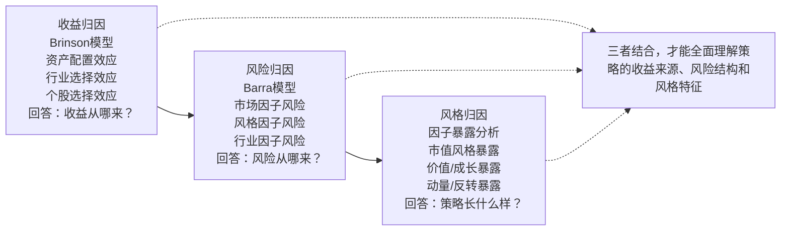

# 1. 绩效归因基础：从"赚了还是亏了"到"为什么赚、为什么亏"

各位同学，咱们今天聊一个很实在的话题——绩效归因。

你可能听过一句话："投资里最难的不是赚钱，而是知道钱是怎么赚来的。" 我做了这么多年量化，深有体会。很多时候，策略跑出来净值曲线漂亮得很，但一问到"这收益到底从哪来的"，很多人就支支吾吾了。说白了，绩效归因就是帮你回答这个问题的。

### 1.1 什么是绩效归因？

绩效归因，就是把一个投资组合的收益和风险，拆解成一个个可解释的"零件"。

举个例子。你买了一只股票基金，一年赚了15%。这15%里，有多少是因为大盘涨了？有多少是因为你选的行业对了？又有多少是因为你选的个股确实牛？把这些拆开，就是归因。

我个人习惯把绩效归因比作"体检报告"。你光知道体重涨了没用，得知道是脂肪多了还是肌肉多了，对吧？归因就是给策略做体检。

> **核心定义：** 绩效归因是通过分解组合收益与风险，识别各决策环节（如资产配置、行业选择、个股选择）对最终业绩的贡献程度。

### 1.2 为什么非要做归因？

你可能会问："我策略赚钱不就行了，管它怎么赚的？" 嗯，这个问题我当年也问过。直到有一次，我辛辛苦苦跑了一个多因子模型，回测漂亮得不行，实盘一跑就崩。后来一归因才发现，收益全来自一个行业因子，那个行业刚好在回测期暴涨，但实盘时已经到顶了。

所以，归因的价值在哪？我总结了三句话：

- **验证策略逻辑：** 你的策略到底是不是按你设想的方式在赚钱？
- **识别风险来源：** 哪些因子在贡献收益，哪些在贡献风险？
- **指导改进方向：** 知道哪里做对了，哪里做错了，才能有针对性地优化。

> **避坑指南：** 我曾经见过一个团队，策略年化收益30%，他们高兴得不行。结果一归因，发现90%的收益来自小市值因子暴露。那年刚好是小盘股牛市，风格一转，策略直接腰斩。所以，别只看收益，要看收益是怎么来的。

### 1.3 归因分析的三大维度

归因不是一锤子买卖。我个人习惯从三个维度去看：收益、风险、风格。这三个维度缺一不可。

#### 1.3.1 收益归因

收益归因是最基础的。它回答的是："我的收益从哪来？"

常见的做法是Brinson模型，把收益拆成三块：

- **资产配置效应：** 因为你在不同资产（股票、债券、商品）上的配置比例不同带来的收益。
- **行业/板块选择效应：** 因为你在不同行业上的超配或低配带来的收益。
- **个股选择效应：** 因为你在同一行业内选对了或选错了股票带来的收益。

举个例子，你超配了科技股，科技板块涨了20%，而基准只涨10%。那这多出来的10%，就是行业选择效应。如果你在科技板块里选的个股涨了30%，而板块平均只涨20%，那多出来的10%就是个股选择效应。

> **收益归因的核心公式（Brinson模型）：**
> ```text
> 组合超额收益 = 资产配置效应 + 行业选择效应 + 个股选择效应
> ```

#### 1.3.2 风险归因

收益归因告诉你"赚在哪"，风险归因告诉你"亏在哪"。

我刚开始做量化时，只盯着收益看，觉得风险就是波动率。后来发现不对。风险归因要回答的是："我的组合风险到底来自哪些因子？"

举个例子，你的组合波动率是20%。这20%里，有多少来自市场风险？有多少来自行业集中度？有多少来自个股的异质风险？把这些拆开，你才能知道该控制什么。

常用的工具是风险因子模型，比如Barra模型。它把风险拆解成：

- **市场因子：** 大盘涨跌带来的系统性风险。
- **风格因子：** 比如价值、成长、动量、市值等因子带来的风险。
- **行业因子：** 行业集中度带来的风险。
- **特异风险：** 个股自身波动带来的风险。

> **注意：** 很多新手只做收益归因，不做风险归因。这是大忌。你想想看，一个策略收益很高，但风险全集中在某个因子上，那跟赌博有什么区别？

#### 1.3.3 风格归因

风格归因，说白了就是看你的策略"长什么样"。

你的策略是偏价值还是偏成长？是大盘股还是小盘股？是动量策略还是反转策略？这些风格特征，决定了你的策略在不同市场环境下的表现。

我记得有一次，一个朋友跟我说他的策略最近表现不好。我一看，他的组合全是小盘成长股，而最近市场风格正好切换到大盘价值。这就是风格暴露带来的问题。

风格归因通常用因子暴露度来衡量。比如：

| 风格因子 | 组合暴露度 | 因子收益率 | 风格贡献 |
| --- | --- | --- | --- |
| 市值因子 | 0.8 | 2.5% | 2.0% |
| 价值因子 | -0.3 | 1.2% | -0.36% |
| 动量因子 | 0.5 | -0.8% | -0.4% |

你看，这个组合在市值因子上暴露很高（0.8），说明它偏小盘股。如果小盘股行情好，它就赚；行情不好，它就亏。风格归因就是帮你搞清楚这些。

### 1.4 一张图看懂绩效归因

下面我用一张图，把这三个维度的关系画出来。你一看就明白了。



### 1.5 小结

好了，咱们把绩效归因的基础捋了一遍。说白了，归因就是帮你从"赚了还是亏了"这种模糊认知，升级到"为什么赚、为什么亏"的清晰理解。

我个人觉得，做量化最怕的就是"黑箱"——策略跑得好，不知道为什么；跑得差，也不知道为什么。绩效归因就是打开这个黑箱的钥匙。

记住三个维度：收益归因看"赚在哪"，风险归因看"亏在哪"，风格归因看"你是谁"。三者缺一不可。

> **一个小建议：** 刚开始做归因时，别贪多。先从收益归因入手，用Brinson模型把你的组合收益拆开看看。等熟悉了，再慢慢加入风险和风格归因。一步一步来，别急。
