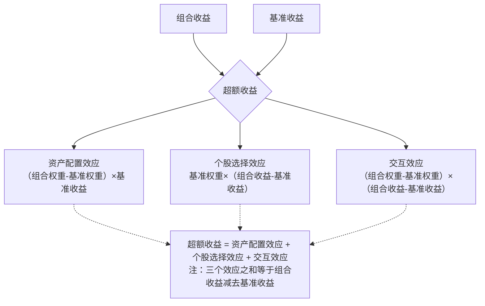

# 收益归因-Brinson模型：拆解你的超额收益从哪来

做量化投资，最怕什么？不是亏钱，而是亏了不知道为啥亏，赚了也不知道为啥赚。我早年带团队的时候，有个策略回测曲线漂亮得不行，实盘一跑就拉胯。后来一查，问题出在行业配置上——我们重仓的板块刚好踩雷了。这时候你就需要一套工具，把收益拆开来看。Brinson模型，就是干这个的。

说白了，Brinson模型就是帮你回答三个问题：

- 我的资产配置对不对？（选行业、选市场）
- 我在每个板块里选的股票好不好？（选个股）
- 配置和选股之间有没有互相影响？（交互效应）

嗯，咱们一个一个来看。

### Brinson模型原理：基准是你的镜子

Brinson模型的核心思想很简单——把你的组合收益和基准收益做对比，然后拆成三部分。基准是什么？比如沪深300、中证500，或者你自己定义的一个指数。你想想看，如果你跑赢了基准，那多出来的这部分收益，到底是因为你多配了涨得好的行业，还是因为你在同一个行业里选到了牛股？

公式长这样：

```text
超额收益 = 组合收益 - 基准收益
         = 资产配置效应 + 个股选择效应 + 交互效应
```

每个效应怎么算？我习惯用一张表来理解。假设我们把市场分成几个板块（比如行业），每个板块有基准权重和组合权重，也有基准收益和组合收益。

| 板块 | 基准权重 | 组合权重 | 基准收益 | 组合收益 |
| --- | --- | --- | --- | --- |
| 科技 | 30% | 40% | 10% | 12% |
| 消费 | 40% | 30% | 8% | 9% |
| 医药 | 30% | 30% | 5% | 4% |

有了这张表，咱们就能算效应了。

### 资产配置效应：你押对了赛道吗？

资产配置效应衡量的是：你相对于基准，多配了哪些板块、少配了哪些板块，这些板块本身的涨跌给你带来了多少超额收益。

公式：

```text
资产配置效应 = Σ (组合权重_i - 基准权重_i) × 基准收益_i
```

什么意思？你超配了一个板块，如果这个板块涨得好，你就赚了；如果涨得不好，你就亏了。注意，这里用的是基准收益，不是组合收益——因为我们只考察配置决策，不考察选股能力。

拿上面的例子算一下：

- 科技：(40% - 30%) × 10% = 1%
- 消费：(30% - 40%) × 8% = -0.8%
- 医药：(30% - 30%) × 5% = 0%
- 合计：1% - 0.8% + 0% = 0.2%

也就是说，你的配置决策贡献了0.2%的超额收益。嗯，不多，但至少是正的。

> **我的经验：** 我在做多因子策略的时候，经常发现配置效应是负的。为什么？因为因子在某些行业里失效，但我们还在超配。这时候就要考虑是不是该做行业中性化处理了。

### 个股选择效应：你在每个板块里选股水平如何？

个股选择效应衡量的是：在同一个板块内，你选的股票比基准指数里的股票表现好多少。

公式：

```text
个股选择效应 = Σ 基准权重_i × (组合收益_i - 基准收益_i)
```

注意，这里用的是基准权重——我们假设你的配置比例和基准一样，只看选股能力。

继续算：

- 科技：30% × (12% - 10%) = 0.6%
- 消费：40% × (9% - 8%) = 0.4%
- 医药：30% × (4% - 5%) = -0.3%
- 合计：0.6% + 0.4% - 0.3% = 0.7%

选股效应贡献了0.7%。看起来你在科技和消费板块选股还不错，但医药板块拖了后腿。

> **避坑指南：** 我曾经犯过一个错误——把个股选择效应和配置效应混在一起看。有一次组合跑赢了基准，我以为是选股厉害，结果一拆，发现是配置效应贡献了大部分，选股反而是负的。这就很危险了，因为配置效应可能只是运气，选股能力才是可持续的。

### 交互效应：配置和选股的化学反应

交互效应是Brinson模型里最容易被忽略的部分。它衡量的是：你在某个板块上同时做了超配和选股，这两件事叠加在一起的效果。

公式：

```text
交互效应 = Σ (组合权重_i - 基准权重_i) × (组合收益_i - 基准收益_i)
```

算一下：

- 科技：(40% - 30%) × (12% - 10%) = 0.2%
- 消费：(30% - 40%) × (9% - 8%) = -0.1%
- 医药：(30% - 30%) × (4% - 5%) = 0%
- 合计：0.2% - 0.1% + 0% = 0.1%

交互效应是0.1%，不大。但有时候这个数字会很大——比如你超配了一个板块，同时在这个板块里选股又特别好，那交互效应就会很可观。

你想想看，如果交互效应是负的，说明什么？说明你虽然超配了某个板块，但在这个板块里选的股票反而比基准差。这就有点尴尬了——你既押对了赛道，又选错了马。

### 一张图看懂Brinson模型

下面这张图，把整个逻辑串起来了。我建议你保存下来，以后做归因分析的时候对照着看。



### 实际应用中的注意事项

Brinson模型看起来简单，但用起来有几个坑。我踩过，所以提醒你一下：

- **板块划分要合理**：分得太粗，归因结果没意义；分得太细，数据噪音太大。我个人习惯用申万一级行业，28个左右，刚刚好。
- **基准要选对**：如果你的策略是沪深300增强，基准就用沪深300。别拿中证500去比，那是关公战秦琼。
- **交互效应别忽略**：很多人只看配置和选股，把交互效应扔一边。但有时候交互效应能占到超额收益的20%以上，不看就亏了。
- **多期归因要小心**：如果做多期Brinson归因，需要处理复利效应。简单累加会有误差，建议用对数收益或者Carino方法调整。

> **核心要点：** Brinson模型不是万能的，但它给了你一个框架，让你知道该往哪个方向去改进策略。如果配置效应是负的，你就去优化行业轮动模型；如果选股效应是负的，你就去改进因子选股逻辑。方向对了，努力才有意义。

好了，Brinson模型就讲到这里。下次你跑完策略，记得拆一拆，看看你的超额收益到底从哪来。说不定会有惊喜，也可能会有惊吓——但总比蒙在鼓里强。
