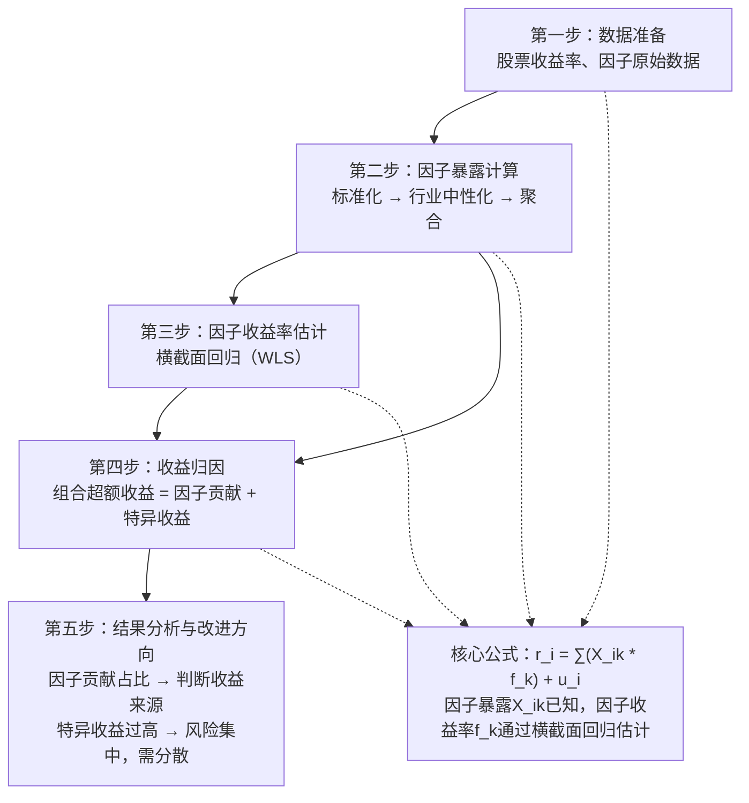

# 3. 收益归因-多因子模型：基于Barra模型的因子归因、因子暴露计算、因子收益率估计

聊到收益归因，很多朋友第一反应就是Brinson。没错，Brinson确实经典，但它有个硬伤——它只能解释配置和选股，解释不了「为什么这个股票涨了，那个跌了」。说白了，它是个黑箱。

那怎么办？用多因子模型拆开看。我个人习惯用Barra框架，它能把收益拆成一个个因子的贡献。今天我们就聊聊这个。

### 3.1 Barra模型的核心逻辑

Barra模型本质上是一个线性回归模型。它假设股票的收益可以被一组共同因子解释，再加上一个特异收益。公式长这样：

```text
r_i = ∑(X_ik * f_k) + u_i
```

其中：

- **r_i**：股票i的收益率
- **X_ik**：股票i在因子k上的暴露（也叫因子载荷）
- **f_k**：因子k的收益率（因子溢价）
- **u_i**：特异收益（残差）

嗯，这里要注意：因子暴露是已知的，因子收益率是未知的。我们需要通过横截面回归来估计因子收益率。

> **核心思想**：把组合收益拆解为「因子贡献」+「选股贡献」。因子贡献是你能解释的部分，选股贡献是残差。

### 3.2 因子暴露计算

因子暴露，说白了就是你的组合在某个因子上的「敏感度」。比如市值因子暴露高，说明你持仓偏大盘还是小盘。

计算因子暴露，我一般分三步走：

1. **原始数据标准化**：把原始特征（比如市值、市盈率）转化为Z-score
2. **行业中性化处理**：剔除行业影响，得到纯因子暴露
3. **组合层面聚合**：按权重加权平均

举个例子，计算市值因子暴露：

```python
# 伪代码示例
def calc_size_exposure(stock_pool, weights):
    # 1. 取对数市值
    log_mkt_cap = np.log(stock_pool['mkt_cap'])

    # 2. 标准化
    z_score = (log_mkt_cap - log_mkt_cap.mean()) / log_mkt_cap.std()

    # 3. 行业中性化（这里省略具体实现）
    neutralized = industry_neutralize(z_score, stock_pool['industry'])

    # 4. 组合暴露
    portfolio_exposure = np.dot(weights, neutralized)

    return portfolio_exposure
```

> **避坑指南**：我曾经在计算因子暴露时忘了做行业中性化，结果发现组合的「价值因子暴露」很高，其实是因为重仓了银行股。行业中性化能帮你剔除这种虚假暴露。

### 3.3 因子收益率估计

因子收益率怎么估计？最常用的方法是横截面回归。具体来说，在每个时间截面（比如每个月末），用所有股票的收益率对因子暴露做回归，回归系数就是因子收益率。

模型长这样：

```text
r_i = α + β_1 * X_i1 + β_2 * X_i2 + ... + β_K * X_iK + ε_i
```

其中β_j就是因子j的收益率。你想想看，这个β_j代表的是「单位因子暴露带来的超额收益」。

实际操作中，我一般用加权最小二乘法（WLS），权重用市值平方根。为什么？因为大市值股票波动小，应该给更高权重。

```python
# Python示例：横截面回归估计因子收益率
import statsmodels.api as sm

def estimate_factor_returns(returns, exposures, weights):
    """
    returns: 股票收益率向量 (N,)
    exposures: 因子暴露矩阵 (N, K)
    weights: 权重向量 (N,)
    """
    model = sm.WLS(returns, exposures, weights=weights)
    results = model.fit()
    return results.params  # 因子收益率向量
```

### 3.4 收益归因实战

有了因子暴露和因子收益率，收益归因就简单了。组合的超额收益可以拆成：

```text
组合超额收益 = ∑(因子暴露 * 因子收益率) + 特异收益
```

我习惯用一张表格来展示归因结果：

| 因子名称 | 因子暴露 | 因子收益率 | 因子贡献 | 贡献占比 |
| --- | --- | --- | --- | --- |
| 市值因子 | -0.32 | 1.25% | -0.40% | -8.0% |
| 价值因子 | 0.45 | 0.80% | 0.36% | 7.2% |
| 动量因子 | 0.21 | 2.10% | 0.44% | 8.8% |
| 质量因子 | 0.15 | 1.50% | 0.23% | 4.6% |
| 特异收益 | - | - | 3.87% | 77.4% |
| **总超额收益** | - | - | **5.00%** | **100%** |

看到没？这个组合的超额收益主要来自特异收益（选股能力），因子贡献只占22.6%。这说明什么？说明这个基金经理可能是个选股高手，但因子择时能力一般。

> **注意**：特异收益占比过高不一定好。如果特异收益占比超过80%，说明组合的收益来源不够分散，风险集中。我见过一个极端案例，特异收益占比95%，结果某只重仓股暴雷，一个月亏了20%。

### 3.5 知识体系总览

下面这张图是我自己画的，把Barra因子归因的整个流程串起来了。你一看就明白：



### 3.6 常见问题与改进方向

在实际项目中，我遇到过几个常见问题：

- **因子共线性**：比如价值和质量因子高度相关，导致回归系数不稳定。我一般用VIF（方差膨胀因子）检测，超过10就剔除一个。
- **因子暴露计算周期**：日频还是月频？我个人习惯月频重算，因为日频噪声太大，而且计算量也大。
- **特异收益的解读**：特异收益高不一定好。如果特异收益长期为正，说明选股能力强；但如果波动大，说明风险集中。

> **我的经验**：做因子归因时，别只看一期结果。我一般滚动12个月看因子贡献的稳定性。如果某个因子贡献时正时负，说明你在这个因子上没有稳定的暴露，那这个因子对你的收益贡献就是运气。

好了，Barra因子归因的核心逻辑就这些。说白了就是三步：算暴露、估收益、拆贡献。你把这个流程跑通了，组合的收益来源就一清二楚了。
