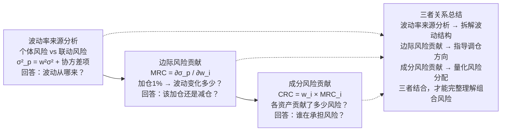

# 4. 风险归因-波动率分解：波动率来源分析、边际风险贡献、成分风险贡献

波动率分解，说白了就是搞清楚一件事：**你组合的波动到底是谁惹的祸？**

我刚开始做多因子模型那会儿，经常遇到这种情况——回测曲线漂亮得不行，实盘一跑就崩。后来才发现，问题出在风险归因上。你光看收益来源是不够的，风险来源才是真正要命的。

今天咱们就聊聊波动率分解的三个核心概念：波动率来源分析、边际风险贡献、成分风险贡献。嗯，这三个东西搞明白了，你就能像拆解一台精密仪器一样，把组合的风险拆得明明白白。

### 4.1 波动率来源分析：谁在制造波动？

先问个问题：组合的波动率，是来自单个资产的波动，还是资产之间的联动？

答案是——**两者都有**。而且很多时候，资产之间的相关性才是波动的放大器。

举个例子。你持有两个股票，A和B。A波动大，B波动小。如果它们正相关，组合波动会被放大；如果负相关，反而能对冲。这就是波动率来源分析要干的事。

数学上，组合方差可以写成：

```text
σ²_p = w₁²σ₁² + w₂²σ₂² + 2w₁w₂σ₁σ₂ρ₁₂
```

你看，前三项分别是：

- **w₁²σ₁²**：资产1自身的波动贡献
- **w₂²σ₂²**：资产2自身的波动贡献
- **2w₁w₂σ₁σ₂ρ₁₂**：两者协方差的贡献

我习惯把这三部分拆开来看。如果协方差项占比超过50%，说明组合的波动主要来自资产之间的联动，而不是单个资产本身。这时候你调整权重，效果可能不如调整相关性来得快。

> **关键洞察**：波动率来源分析的核心，是区分「个体风险」和「联动风险」。前者可以通过分散化降低，后者则需要通过对冲或择时来管理。

### 4.2 边际风险贡献：加仓还是减仓？

边际风险贡献（Marginal Risk Contribution, MRC），衡量的是：**如果你对某个资产增加1%的权重，组合波动率会变化多少？**

公式很简单：

```text
MRC_i = ∂σ_p / ∂w_i = (w_i σ_i² + Σⱼ≠ᵢ w_j σ_ij) / σ_p
```

说白了，就是求偏导。你想想看，如果你知道加仓某个资产会让波动率飙升，那你还敢加吗？

我在项目中遇到过一件事。有个同事做CTA策略，组合里配了20%的原油期货。他总觉得原油波动大，想减仓。我帮他算了一下边际风险贡献，发现原油的MRC其实很低——因为原油和其他品种负相关，反而起到了对冲作用。减仓之后，组合波动率反而上升了。

嗯，这就是边际风险贡献的妙用。它告诉你：**不是波动大的资产就危险，要看它对组合的边际影响。**

> **实用技巧**：边际风险贡献可以用来做动态调仓。当某个资产的MRC远高于其他资产时，说明它已经成为组合的「风险集中点」，可以考虑减仓。

### 4.3 成分风险贡献：谁在承担风险？

成分风险贡献（Component Risk Contribution, CRC），是边际风险贡献的加权版本：

```text
CRC_i = w_i × MRC_i
```

这个指标的意义在于：**它告诉你组合总波动率中，有多少百分比是由某个资产贡献的。**

而且，所有资产的CRC加起来，正好等于组合的总波动率。这就是所谓的「风险可加性」。

我举个例子。假设组合总波动率是20%，资产A的CRC是8%，资产B的CRC是12%。那意味着：

- 资产A贡献了40%的风险
- 资产B贡献了60%的风险

这时候你可能会问：那是不是应该把资产B的权重降下来？

不一定。因为CRC高，可能是因为资产B的波动大，也可能是因为它在组合中的权重高。你需要结合边际风险贡献来看。如果资产B的MRC也很高，那确实该减；如果MRC不高，只是权重高，那可能只是「规模效应」。

> **避坑指南**：我曾经犯过一个错误——只看CRC，不看MRC。结果把权重降了，波动率反而没降下来。后来才发现，那个资产的CRC高是因为权重高，但它的MRC其实很低。减仓之后，其他资产的CRC反而被放大了。

### 4.4 三者关系：一张图说清楚

为了让你更直观地理解这三个概念的关系，我画了一张图：



你看，这三个概念是层层递进的：

1. **波动率来源分析**：先搞清楚波动是从哪来的——是单个资产自身波动，还是资产之间的联动？
2. **边际风险贡献**：然后看每个资产对波动的「边际影响」——加仓或减仓会带来什么变化？
3. **成分风险贡献**：最后量化每个资产「实际承担」了多少风险——谁在扛雷？

### 4.5 实战案例：一个三资产组合

咱们来个具体的例子。假设一个组合包含三个资产：

| 资产 | 权重 | 波动率 | 与资产1相关性 | 与资产2相关性 | 与资产3相关性 |
| --- | --- | --- | --- | --- | --- |
| 资产1 | 40% | 15% | 1.0 | 0.3 | -0.2 |
| 资产2 | 35% | 20% | 0.3 | 1.0 | 0.1 |
| 资产3 | 25% | 10% | -0.2 | 0.1 | 1.0 |

计算一下组合波动率：

```text
σ²_p = (0.4² × 0.15²) + (0.35² × 0.20²) + (0.25² × 0.10²)
       + 2×0.4×0.35×0.15×0.20×0.3
       + 2×0.4×0.25×0.15×0.10×(-0.2)
       + 2×0.35×0.25×0.20×0.10×0.1

= 0.0036 + 0.0049 + 0.000625
  + 0.00252 - 0.0006 + 0.00035

= 0.011395

σ_p = √0.011395 ≈ 10.67%
```

然后算边际风险贡献和成分风险贡献：

| 资产 | MRC | CRC | CRC占比 |
| --- | --- | --- | --- |
| 资产1 | 0.105 | 0.042 | 39.4% |
| 资产2 | 0.142 | 0.050 | 46.9% |
| 资产3 | 0.058 | 0.015 | 14.1% |
| **合计** | - | **0.107** | **100%** |

你看，资产2的权重只有35%，但CRC占比却高达46.9%。这说明它才是组合的「风险大户」。而资产3虽然波动率低，但它的CRC占比只有14.1%，说明它确实起到了分散风险的作用。

> **核心结论**：资产2的边际风险贡献最高（0.142），意味着加仓资产2会显著增加组合波动。如果你想降低波动，减仓资产2是最有效的选择。

### 4.6 避坑指南：我踩过的三个坑

最后，分享几个我亲身踩过的坑：

- **坑一：只看波动率，不看相关性**。我曾经配了一个「低波动」组合，结果波动率反而很高。后来才发现，那些低波动资产之间高度正相关，一荣俱荣一损俱损。
- **坑二：把CRC当成调仓的唯一依据**。CRC高不代表一定要减仓，还要看MRC。如果MRC低，只是权重高，那减仓效果有限。
- **坑三：忽略时间窗口的选择**。波动率分解对时间窗口很敏感。用30天窗口和用90天窗口，结果可能完全不同。我建议至少用两种窗口对比着看。

嗯，波动率分解这东西，说难不难，说简单也不简单。关键是你要理解每个指标背后的含义，而不是机械地套公式。搞明白了，你就能像庖丁解牛一样，把组合的风险拆得清清楚楚。
