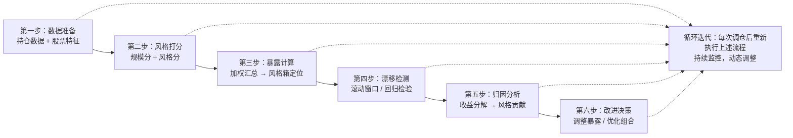

# 第六讲：风格归因——风格箱法

风格归因这事儿，说白了就是搞清楚你的策略到底在赚什么钱。是赚了大盘成长的钱？还是小盘价值的钱？我个人习惯把风格归因看作策略的「基因检测」——你得知道自己的策略天生偏向哪一边。

今天咱们聊的晨星风格箱，就是最经典的风格分析工具之一。我当年刚入行时，第一个任务就是给公司的量化产品做风格箱分析，那时候还手算过一阵子，现在想想真是原始。

### 一、晨星风格箱：九宫格里的秘密

晨星风格箱长什么样？一个3×3的九宫格。横轴是「风格」：价值、混合、成长。纵轴是「规模」：大盘、中盘、小盘。一共9个格子，每个格子代表一种风格组合。

举个例子：你持仓里全是工商银行、中国石油这种大家伙，那大概率落在大盘价值那个格子里。要是满手宁德时代、迈瑞医疗，那就是大盘成长。

为什么会这样设计？其实逻辑很简单：

- **规模维度**：按市值分，大中小盘
- **风格维度**：按估值和成长性分，价值vs成长

我在项目中遇到过一件事：有个同事的量化策略回测年化20%，他特别得意。结果我拿风格箱一分析，发现他的超额收益几乎全部来自小盘风格暴露。那年刚好小盘股牛市，策略自然表现好。后来风格切换，策略直接崩了。这就是典型的「伪alpha」——你以为是能力，其实是运气。

> **核心要点**：风格箱不是用来选股的，是用来诊断你的策略到底暴露在哪些风险因子上的。

### 二、风格暴露度计算：别凭感觉，要算数

风格暴露度怎么算？我建议分三步走：

1. **计算每只股票的规模得分**：通常用市值的对数标准化
2. **计算每只股票的风格得分**：综合市盈率、市净率、股息率、营收增长率等指标
3. **加权汇总**：按持仓权重，得到组合的整体风格暴露

给你看个我常用的计算框架：

```python
# 风格暴露度计算示例（伪代码）
def calculate_style_exposure(portfolio):
    # 1. 规模得分：市值取log后标准化
    portfolio['size_score'] = (np.log(portfolio['market_cap']) - mean_log_mcap) / std_log_mcap

    # 2. 风格得分：综合价值因子和成长因子
    portfolio['value_score'] = zscore(portfolio['pe_ttm']) * (-1)  # 低PE得高分
    portfolio['growth_score'] = zscore(portfolio['revenue_growth'])
    portfolio['style_score'] = 0.5 * portfolio['value_score'] + 0.5 * portfolio['growth_score']

    # 3. 组合暴露 = 持仓权重加权平均
    size_exposure = np.average(portfolio['size_score'], weights=portfolio['weight'])
    style_exposure = np.average(portfolio['style_score'], weights=portfolio['weight'])

    return size_exposure, style_exposure
```

嗯，这里要注意：不同机构的打分方法略有差异。晨星用的是「10分位法」，把股票按指标排序后分成10组打分。我个人习惯用Z-score标准化，效果差不多，但更直观。

> **避坑指南**：我曾经犯过一个低级错误——直接用市值原始值做规模打分。结果茅台这种巨无霸把其他股票全压扁了。后来改成对数市值，才合理。记住：金融数据大多呈对数正态分布，取对数再标准化是常规操作。

### 三、风格漂移检测：你的策略变心了吗？

风格漂移，就是你的策略风格随时间发生了变化。比如你本来做大盘价值，结果最近偷偷买了不少小盘成长。这本身不一定错，但你需要知道——而且需要向投资者解释。

检测风格漂移，我常用三种方法：

| 方法 | 原理 | 我常用的场景 |
| --- | --- | --- |
| 滚动窗口法 | 每N天计算一次风格暴露，看时间序列 | 日常监控，简单粗暴 |
| 回归检验法 | 用Fama-French因子模型回归，看因子载荷变化 | 深度分析，学术范儿 |
| 聚类分析法 | 把不同时期的持仓聚类，看类别是否稳定 | 组合诊断，可视化效果好 |

我个人最常用的是滚动窗口法。为什么？因为它直观。你画一条风格暴露度的时间序列曲线，一眼就能看出策略有没有「出轨」。

举个例子：我监控过一个CTA策略，本来风格暴露很稳定，突然有一天小盘价值暴露从0.2飙到0.8。一查原因，原来是基金经理换人了，新来的哥们喜欢炒小盘股。这就是典型的风格漂移。

> **警告**：风格漂移不一定是坏事。有时候市场风格切换，主动调整是合理的。但问题在于：**你必须有记录、有理由、有风控**。如果漂移了却说不出为什么，那就是风险。

### 四、实战框架：风格归因的完整流程

下面这张图是我自己总结的风格归因流程，你想想看，是不是这个理儿：



这个流程我用了好几年，效果不错。核心思路就是：先算清楚你暴露在哪，再看暴露稳不稳定，最后决定要不要调整。

### 五、改进方向：从归因到优化

风格归因做完之后，下一步就是改进。我总结了几条实用建议：

- **暴露太集中？** 分散到多个风格箱格子，降低单一风格风险
- **漂移太频繁？** 设定风格暴露的上下限，比如小盘暴露不超过±0.3
- **风格贡献为负？** 检查选股逻辑，是不是在错误的时间做了错误的事
- **想增强收益？** 在风格暴露上做战术调整，比如判断小盘要涨就主动加仓

> **记住一句话**：风格归因不是为了证明你多牛，而是为了让你知道——你的收益里，哪些是市场给的，哪些是你自己赚的。分清楚这两部分，你才能持续改进。

好了，风格箱法就聊到这儿。下次你再看自己的策略报告，记得先画个九宫格，看看自己到底在哪个格子里待着。
