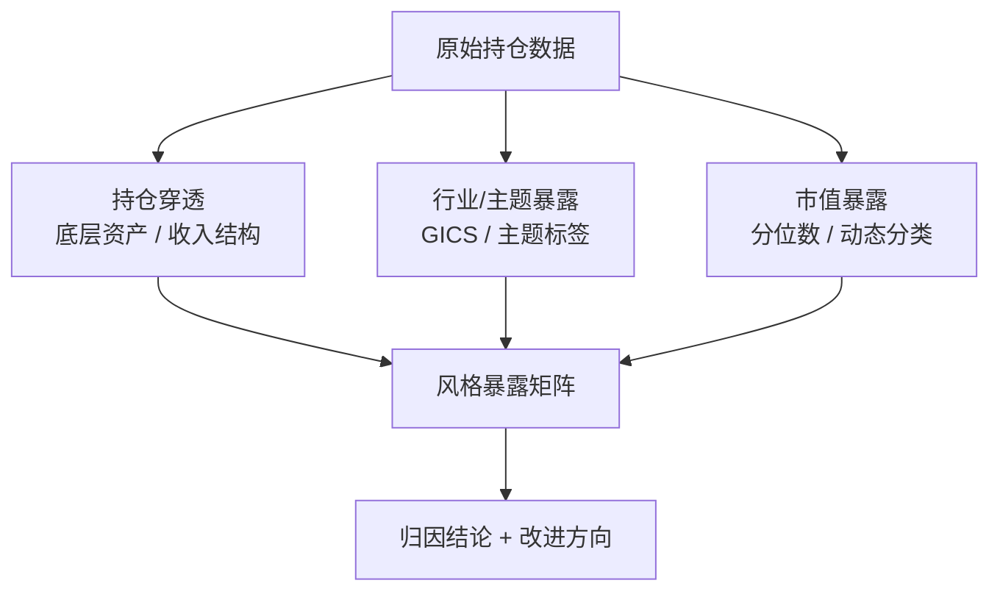

# 7、风格归因-基于持仓的归因：持仓穿透、行业/主题暴露、市值暴露

风格归因，说白了就是回答一个问题：**我的组合到底在赌什么？**

你想想看，一个组合涨了5%，到底是运气好撞上了大盘上涨，还是你刻意选了小盘股？是押对了新能源赛道，还是纯粹因为重仓了茅台？

基于持仓的风格归因，就是把这些「说不清道不明」的东西，一层层剥开给你看。

## 7.1 持仓穿透：别被表面数据骗了

我刚开始做归因的时候，踩过一个坑。当时我拿到的持仓数据，显示某只基金重仓了「XX控股」。我一看，好家伙，这公司名字带「科技」俩字，我直接把它归到了科技板块。

结果呢？业绩归因怎么都对不上。后来一查，这家公司80%的收入来自房地产。嗯，这就是典型的「持仓穿透」没做透。

> **⚠️ 注意：** 很多基金持仓只披露前十大重仓股，而且只给股票代码或简称。你看到的「XX科技」，可能是个养猪的。

持仓穿透的核心，就是要把每一笔持仓，映射到它真正的业务本质上去。我个人习惯用以下三步：

1. **第一步：查底层资产** —— 如果是ETF或指数基金，要穿透到它持有的股票。比如你买了「消费ETF」，它里面可能还藏着不少白酒股。
2. **第二步：查收入结构** —— 对于个股，不能只看行业标签。我建议用最新的年报或季报，看它收入占比最高的业务是什么。
3. **第三步：查关联交易** —— 有些公司通过子公司或关联方，实际业务和名义业务完全不同。这一步容易被忽略。

> **💡 小技巧：** 我一般会用Wind或Bloomberg的「业务收入拆分」功能，直接拉取最近4个季度的收入占比。如果某个公司「科技」标签下，收入主要来自房地产，我会手动把它重分类到「房地产」板块。

## 7.2 行业/主题暴露：你的组合在哪个赛道里游泳？

行业暴露，就是看你的组合在哪些行业上「押了重注」。主题暴露更细一点，比如「碳中和」、「人工智能」、「国产替代」这些概念。

为什么要做这个？

举个例子。2023年AI行情爆发，如果你的组合里没有算力、没有大模型，那这波行情基本跟你没关系。但如果你重仓了「AI概念股」，结果发现这些公司其实做的是安防监控……那你的暴露就是假的。

我一般用两种方法来做行业/主题暴露分析：

### 方法一：基于GICS或申万行业分类

这是最标准的做法。把每只股票映射到一级行业（比如「信息技术」）、二级行业（比如「半导体」）、三级行业（比如「集成电路设计」）。

代码示例（Python伪代码）：

```python
# 假设你有一个持仓DataFrame：holdings
# 包含字段：stock_code, weight, industry_gics

# 计算行业暴露
industry_exposure = holdings.groupby('industry_gics')['weight'].sum()

# 输出结果
print(industry_exposure.sort_values(ascending=False))
```

### 方法二：基于主题标签

主题暴露更灵活，但也更主观。我建议用关键词匹配 + 人工复核的方式。

举个例子：

```python
# 定义主题关键词
theme_keywords = {
    'AI': ['人工智能', '大模型', '算力', 'GPU', '深度学习'],
    '新能源': ['光伏', '锂电池', '风电', '储能', '新能源汽车'],
    '国产替代': ['芯片', '操作系统', '信创', '自主可控']
}

# 对每只股票的业务描述进行关键词匹配
# 如果匹配到某个主题，就标记为该主题暴露
```

> **📌 重点：** 行业暴露和主题暴露，一定要结合持仓穿透的结果来做。否则你看到的暴露，可能只是「表面暴露」。

## 7.3 市值暴露：你是大盘股选手还是小盘股赌徒？

市值暴露，就是看你的组合里，大盘股、中盘股、小盘股各占多少比例。

为什么重要？

因为A股市场有明显的「大小盘轮动」特征。2016-2020年，大盘股（沪深300）明显跑赢小盘股。但2021年以后，小盘股（中证1000、国证2000）又翻身了。

如果你的组合一直重仓小盘股，那2021年之后你大概率跑得不错。但如果你在2018年重仓小盘股……嗯，那一年小盘股跌得挺惨的。

我一般用市值分位数来做暴露分析：

| 市值分位 | 分类 | 典型指数 |
| --- | --- | --- |
| 前10% | 超大盘 | 上证50 |
| 10%-30% | 大盘 | 沪深300 |
| 30%-50% | 中盘 | 中证500 |
| 50%-80% | 小盘 | 中证1000 |
| 后20% | 微盘 | 国证2000 |

计算方式很简单：

```python
# 获取全市场股票的市值分位数
# 然后看你的持仓股票落在哪个分位区间

# 示例：计算组合的市值暴露
market_cap_percentile = get_market_cap_percentile(holdings['stock_code'])
holdings['cap_bucket'] = pd.cut(market_cap_percentile,
                                bins=[0, 0.1, 0.3, 0.5, 0.8, 1.0],
                                labels=['超大盘', '大盘', '中盘', '小盘', '微盘'])

cap_exposure = holdings.groupby('cap_bucket')['weight'].sum()
print(cap_exposure)
```

> **⚠️ 避坑指南：** 我曾经犯过一个错——直接用持仓日的市值来做分类。结果发现，有些股票在持仓期间市值变化很大，从大盘股跌成了中盘股。所以，我建议用**动态市值**，也就是每天或每周更新一次市值分类，而不是用静态的。

## 7.4 风格归因的整体框架

好了，我们把上面三个东西串起来。风格归因的整体逻辑是这样的：



你看，整个流程其实不复杂。先做持仓穿透，把数据洗干净。然后分别计算行业/主题暴露和市值暴露。最后合成一个风格暴露矩阵。

有了这个矩阵，你就能回答：

- 我的组合到底是「大盘价值」还是「小盘成长」？
- 我的超额收益，有多少来自行业选择，多少来自市值风格？
- 如果市场风格切换，我的组合会不会被「精准打击」？

> **📌 核心观点：** 风格归因不是为了好看，而是为了让你知道——你的组合到底在承担什么风险。如果你连自己在赌什么都说不清楚，那赚钱可能只是运气，亏钱才是常态。

嗯，这一节的内容就到这里。下一节我们会讲如何用这些暴露数据，做更精细的绩效归因——也就是把收益拆解成「风格收益」和「选股收益」两部分。
