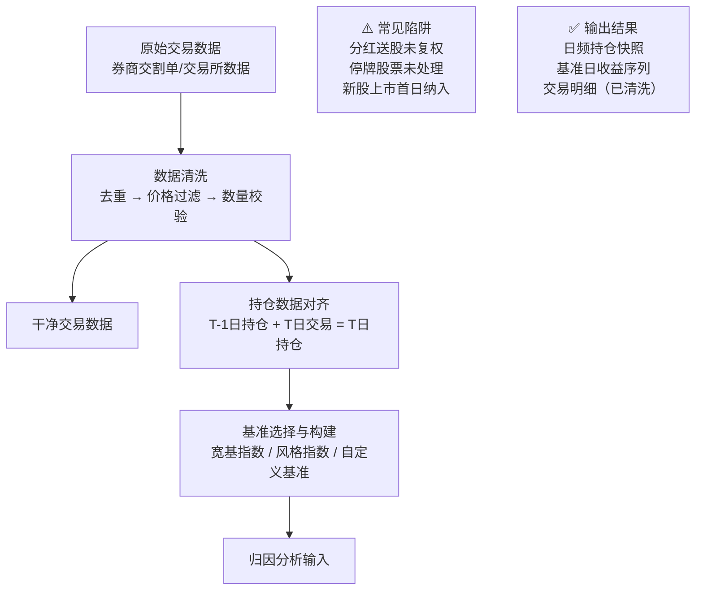

# 第八章：归因数据准备——交易数据清洗、持仓数据对齐、基准选择与构建

各位同学，咱们今天聊点实在的。

做绩效归因，最怕什么？不是模型不够复杂，不是算法不够高级。最怕的是——数据是脏的。我见过太多团队，花三个月搭归因系统，最后发现是交易数据里多了几笔废单，整个分析全白做。嗯，今天我就把这块的坑，一个一个给你们指出来。

## 8.1 交易数据清洗：别让脏数据毁了你的归因

交易数据，说白了就是你的成交记录。但你以为交易所给你的数据就是干净的？太天真了。

我在项目中遇到过，某次回测跑出来年化收益高得离谱，一查，原来是某天有一笔“买入100股”被记录成了“买入100万股”。你想想看，这种错误不清理，归因结果能看吗？

> **⚠️ 常见脏数据类型：**
>
> - **重复记录**：同一笔成交被记录了两次
> - **价格异常**：成交价明显偏离市场价（比如涨停价成交但记录成跌停价）
> - **数量错误**：手数、股数单位搞混
> - **时间错位**：成交时间戳与行情时间戳不匹配
> - **废单残留**：未成交的委托单被错误标记为成交

我个人习惯，清洗交易数据时，先做三件事：

1. **去重**：按交易ID或（时间+证券代码+方向+数量+价格）做唯一性检查
2. **价格过滤**：剔除成交价超出当日涨跌停范围的数据
3. **数量校验**：检查是否与券商交割单一致

```python
# 一个简单的清洗示例（Python伪代码）
def clean_trade_data(df):
    # 去重
    df = df.drop_duplicates(subset=['trade_id'])
    # 价格过滤
    df = df[(df['price'] >= df['low_limit']) & (df['price'] <= df['high_limit'])]
    # 数量校验
    df = df[df['volume'] > 0]
    return df
```

> **💡 我的小技巧：** 清洗完数据后，一定要做一次“总量校验”。比如，当日买入总金额 vs 账户资金变动，如果对不上，说明还有问题。

## 8.2 持仓数据对齐：时间切片要精准

归因分析，本质上是在比较“我的持仓”和“基准的持仓”之间的差异。所以，持仓数据必须对齐到同一个时间点上。

我曾经犯过一个错：用收盘后的持仓数据，去对应当天的交易数据。结果呢？当天买入的股票，在收盘持仓里已经有了，但归因时却算成了“超额收益的来源”。其实那只是正常的建仓行为。

正确的做法是什么？

- **日频归因**：用当日开盘前持仓 vs 当日收盘后持仓，中间的变化就是交易带来的
- **高频归因**：用每个时间切片（比如每分钟）的持仓快照
- **注意分红、送股、配股**：这些会导致持仓数量变化，但并不是交易行为，需要单独处理

> **🔑 核心原则：** 持仓数据的时间戳，必须与交易数据的时间戳严格对应。不要用T日收盘持仓去分析T日的交易，要用：
>
> ```text
> T-1日收盘持仓 + T日交易 = T日收盘持仓
> ```

## 8.3 基准选择与构建：没有基准，归因就是自嗨

归因的核心是“超额收益”。

```text
超额收益 = 组合收益 - 基准收益
```

基准选错了，后面全白搭。

我见过有人用沪深300做基准，结果他的组合全是小盘股。你想想看，这能比吗？风格都不匹配，归因出来的结果全是“行业配置贡献”，其实只是风格暴露的差异。

### 8.3.1 基准选择的三种思路

| 类型 | 适用场景 | 例子 |
| --- | --- | --- |
| **宽基指数** | 全市场选股、大盘风格 | 沪深300、中证500 |
| **风格指数** | 特定风格（价值、成长、小盘） | 中证1000成长、国证价值 |
| **自定义基准** | 策略有特殊约束（如行业中性） | 等权行业指数、因子暴露匹配组合 |

我个人建议，如果你的策略有明显的风格偏好，最好用“风格匹配基准”。比如你做小盘股，就别拿沪深300当基准，用中证1000或者国证2000更合适。

### 8.3.2 基准构建实操

有时候，现成的指数并不完全符合你的需求。那就自己构建一个基准。

构建基准的核心步骤：

1. **确定成分股**：与你的策略选股池一致（比如剔除ST、次新股等）
2. **确定权重方式**：等权、市值加权、因子暴露匹配
3. **确定再平衡频率**：月度、季度、还是跟随策略调仓
4. **计算每日收益**：用成分股的复权价格计算

```python
# 构建一个简单的等权基准
def build_equal_weight_benchmark(stock_list, price_df):
    # 每日等权
    weights = 1.0 / len(stock_list)
    # 计算每日组合收益
    daily_returns = price_df[stock_list].pct_change().mean(axis=1)
    # 累计净值
    nav = (1 + daily_returns).cumprod()
    return nav
```

> **⚠️ 注意：** 自己构建基准时，一定要考虑“幸存者偏差”。如果你用现在的成分股去回测历史，那基准收益会偏高。正确的做法是：用历史时刻的成分股列表。

## 8.4 数据对齐的完整流程（SVG流程图）

说了这么多，咱们用一张图把整个流程串起来。这是我做归因数据准备的标准流程，你可以直接拿去用。



## 8.5 避坑指南：我踩过的那些坑

最后，分享几个我亲身经历过的坑，希望你们别重蹈覆辙。

- **我曾经以为交易所数据就是权威**，结果发现某券商的柜台系统会把“废单”也推送过来。从那以后，我每次都要做“成交金额 vs 资金流水”的交叉验证。
- **我曾经用复权因子直接调整持仓**，结果发现分红除权后，持仓数量没变，但价格变了，导致归因里多出一大笔“莫名其妙的正收益”。正确的做法是：用不复权价格计算收益，用复权价格计算累计净值。
- **我曾经偷懒用沪深300做所有策略的基准**，结果被老板骂了一顿。他说：“你一个做可转债的，拿股票指数做基准，是想证明什么？” 嗯，从那以后，我学会了“基准必须与策略的资产类别匹配”。

> **📌 最后一个小建议：** 数据准备阶段，多花一小时做校验，能省下后面十小时的排查时间。别问我怎么知道的。
