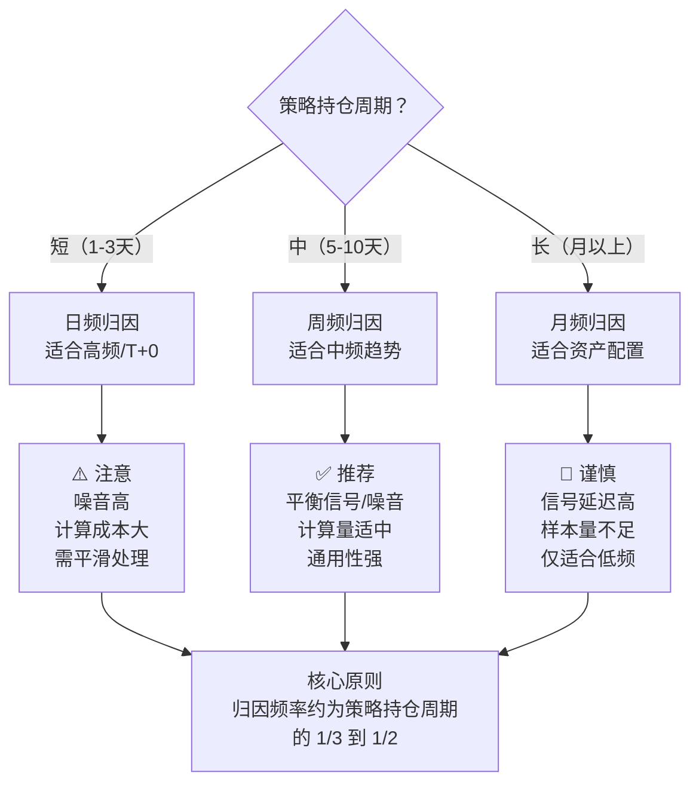

# 归因频率选择：日频归因、周频归因、月频归因的优劣对比

做绩效归因，第一个要拍板的问题就是：**用多细的时间颗粒度？**

日频、周频、月频，各有各的脾气。我见过不少团队，一上来就上日频归因，结果被噪音折腾得半死；也见过有人只用月频，结果策略出了问题，两个月后才反应过来，亏都亏完了。

今天咱们就把这三种频率掰开揉碎，看看它们各自适合什么场景。

## 一、三种频率的核心差异

说白了，归因频率决定了你看到的是「信号」还是「噪音」。

| 维度 | 日频归因 | 周频归因 | 月频归因 |
| --- | --- | --- | --- |
| 数据量 | 大（约250个/年） | 中（约52个/年） | 小（约12个/年） |
| 噪音水平 | 高 | 中 | 低 |
| 信号延迟 | 低 | 中 | 高 |
| 计算成本 | 高 | 中 | 低 |
| 适用策略 | 高频、T+0 | 中频、趋势 | 低频、配置 |

嗯，这里要注意：**没有绝对的好坏，只有合不合适的场景。**

## 二、日频归因：快刀斩乱麻，但容易砍到手指

日频归因，就是每天收盘后跑一次归因。我个人习惯在开发高频策略时用这个频率。

> **优点：**
>
> - 能捕捉到极短期的因子失效。比如某天市场风格突然切换，日频归因第二天就能告诉你。
> - 适合做事件驱动型策略的归因。财报发布、政策出台，当天就能看到影响。
> - 统计显著性容易达标——样本量大嘛。

> **缺点：**
>
> - 噪音太大。我曾经被日频归因坑过一次：连续三天显示「动量因子贡献为负」，我差点把因子权重砍掉。结果后来发现，那三天只是随机波动，第四天就恢复正常了。
> - 交易成本被放大。日频归因会把微小的滑点、手续费都算进去，容易让你误以为策略不行。
> - 计算量爆炸。如果你管着几百个因子、几千只股票，每天跑一次归因，服务器都得冒烟。

> **避坑指南：**我曾经在日频归因里加了个「移动平均平滑」处理，把过去5天的归因结果做平均，噪音立马降下来不少。你可以试试。

## 三、周频归因：折中的艺术

周频归因是我用得最多的频率。为什么？因为它刚好卡在「信号」和「噪音」的平衡点上。

你想想看，A股市场很多策略的持仓周期就是3-5天。用周频归因，刚好能覆盖一个完整的交易周期。我建议做中频趋势策略的朋友，优先考虑周频。

> **优点：**
>
> - 噪音过滤效果不错。一周5个交易日，随机波动被自然平滑了。
> - 计算量适中。一年52个样本点，做统计检验也够用。
> - 与大多数策略的调仓频率匹配。你一周调一次仓，那就用周频归因，逻辑上自洽。

> **缺点：**
>
> - 对突发事件反应慢半拍。比如周一出了大利空，周频归因要等到周五收盘才能看到影响。
> - 周内效应会被掩盖。比如「周一效应」「周五效应」，在周频归因里是看不出来的。

我记得有一次，一个学员问我：「老师，我周频归因显示因子一直很稳定，但实盘就是亏钱。」我让他改成日频跑一次，结果发现——因子在周三到周五表现很好，但周一和周二亏得厉害。周频一平均，把问题给掩盖了。

## 四、月频归因：大方向上的定海神针

月频归因，适合做资产配置、宏观对冲这类低频策略。说白了，就是看大方向。

> **优点：**
>
> - 噪音极低。一个月的数据，随机波动基本被抹平了。
> - 计算成本几乎可以忽略。一年12个样本，Excel都能跑。
> - 适合做长期绩效评估。比如考核基金经理，按月看归因结果，比较公平。

> **缺点：**
>
> - 信号延迟太严重。等月频归因告诉你因子失效了，可能已经亏了两个月。
> - 样本量太少。12个点做统计检验，p值基本不靠谱。
> - 无法做精细调整。你想优化某个因子的权重？月频归因给不了你足够的信息。

我见过一些私募，只用月频归因。结果呢？策略回撤了20%才反应过来，因为月频归因显示「一切正常」。嗯，这就是典型的归因频率选错了。

## 五、核心逻辑框架图

下面这张图，帮你理清三种频率的选择逻辑：

## 六、实战中的选择建议

说了这么多，到底怎么选？我给出三条实操建议：

1. **多频率并行**：我个人习惯同时跑日频和周频。日频用来做预警，周频用来做决策。如果日频连续3天发出异常信号，我再去看周频确认。
2. **根据策略类型定主频率**：
   - 高频策略（持仓&lt;1天）：日频为主，辅以小时频
   - 中频策略（持仓3-10天）：周频为主，日频为辅
   - 低频策略（持仓&gt;1月）：月频为主，周频为辅
3. **注意样本量陷阱**：月频归因一年只有12个点，做统计检验时p值基本不可信。我建议月频归因只看趋势方向，别太纠结具体数值。

> **一个小技巧：**如果你不确定该用哪个频率，先跑周频。它是最安全的起点。然后根据周频结果，再决定要不要细化到日频，或者放宽到月频。

最后说一句：**归因频率没有标准答案，只有最适合你策略的答案。**别迷信某个频率，多试试，找到那个让你「看得清、反应快、算得起」的平衡点。
