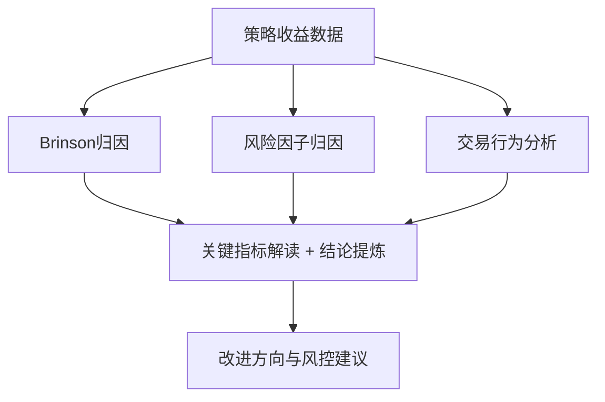

# 第十一章：归因报告撰写：报告结构、关键指标解读、结论提炼

写归因报告这事儿，我做了快十年了。说实话，很多策略本身没问题，但报告写得一塌糊涂，老板看不懂，风控过不去，最后项目黄了。你想想看，这多冤？

今天我就把压箱底的经验掏出来。一份好的归因报告，说白了就是三个字：**讲人话**。把复杂的数学逻辑，翻译成业务能听懂的语言。

## 报告结构：别让读者猜你想说什么

我个人习惯用「倒金字塔」结构。最重要的结论放最前面，细节往后堆。为什么？因为看报告的人，通常只有30秒的耐心。

标准结构长这样：

1. **执行摘要**（半页纸说清楚：赚了还是亏了？为什么？）
2. **总体绩效概览**（收益率、夏普、最大回撤，一张表搞定）
3. **Brinson归因分解**（资产配置贡献 vs 个股选择贡献）
4. **风险因子归因**（Barra模型拆解：风格因子、行业因子、特异收益）
5. **交易行为分析**（换手率、冲击成本、择时能力）
6. **结论与改进建议**（三条以内，别写论文）

我在项目中遇到过最典型的错误：有人把归因分析做了20页，但第一页没写结论。老板翻了两页就扔一边了，说「看不懂」。嗯，这锅得自己背。

> **核心原则：**每一页报告，都应该能独立回答问题。读者只看这一页，也能知道发生了什么。

## 关键指标解读：别只给数字，要给故事

很多新手喜欢堆数字。收益率5.2%，夏普0.8，最大回撤-3.1%……然后呢？这些数字背后是什么？

我建议你按这个逻辑来解读：

| 指标 | 常见误区 | 正确解读方式 |
| --- | --- | --- |
| 超额收益 | 只看正负，不看来源 | 是选股赚的，还是择时赚的？稳定性如何？ |
| 信息比率 | 大于0.5就觉得不错 | 要看跟踪误差是否合理。IR高但跟踪误差小，可能是运气 |
| 风格暴露 | 只看因子载荷大小 | 要看暴露是否稳定。忽大忽小说明策略逻辑不清晰 |
| 换手率 | 越低越好 | 要看换手带来的边际收益。我曾经见过换手率200%但超额收益为负的策略 |

举个例子。有一次我帮客户看一个量化多头策略，超额收益年化8%，看着不错。但一拆Brinson归因，发现所有超额都来自小市值因子暴露。去掉这个因子，超额直接变负。这就是典型的「伪Alpha」。

> **我的习惯：**每个关键指标旁边，都写一句「这意味着什么」。比如：夏普0.8 → 意味着每承担1单位风险，获得0.8单位收益，在同类策略中处于中上水平。

## 结论提炼：三条以内，每条都要能落地

结论不是总结，是行动指南。我见过最差的结论：「策略表现良好，建议继续持有。」——这跟没说一样。

好的结论长这样：

- **问题定位：**「超额收益主要来自动量因子，但近期动量因子出现回撤，需警惕风格切换风险。」
- **改进方向：**「建议将动量因子的权重从30%降至15%，同时增加低波因子配置以平滑收益。」
- **风控建议：**「设置风格因子偏离度阈值，当动量因子暴露超过2个标准差时，自动触发再平衡。」

我曾经犯过一个错：写了一大堆结论，但每条都需要额外数据才能执行。后来我学乖了，每条结论后面都跟一句「具体怎么做」。

> **避坑指南：**我曾经在报告里写「建议优化选股模型」，结果被老板追问「优化哪个环节？参数怎么调？预期效果如何？」——从那以后，我的结论必须包含：做什么、为什么做、预期效果、风险点。

## 可视化：一张图胜过千言万语

归因报告里，图表比表格重要得多。我通常放三张图：

1. **累计超额收益曲线**（看稳定性，有没有突然的断崖）
2. **Brinson归因柱状图**（一眼看出超额来源）
3. **风格因子暴露热力图**（看因子暴露随时间的变化）

下面这张图，是我常用的归因分析框架。它把整个报告的逻辑串起来了：

你看，整个流程就是：数据进来 → 多维度拆解 → 提炼关键指标 → 给出行动建议。每一步都不能跳。

## 避坑指南：我踩过的三个坑

最后分享几个血泪教训：

- **坑一：过度归因。**我曾经把收益拆到20个因子，结果每个因子贡献都不显著。后来学乖了，只拆解贡献度超过5%的因子，其他归为「其他」。
- **坑二：忽略交易成本。**有一次归因显示选股能力很强，但实际收益很差。一查，换手率太高，交易成本吃掉了所有超额。从那以后，我必做「净超额收益」分析。
- **坑三：结论太模糊。**「建议优化风控」这种话，说了等于没说。现在我的结论必须包含：具体参数、触发条件、预期效果。

写归因报告，本质上是在讲一个故事。故事的主角是策略，配角是市场，反派是风险。你的任务，就是把这个故事讲清楚、讲明白、讲得有说服力。

记住：好的报告，能让一个不懂量化的人，也能理解策略到底赚了什么钱、亏了什么钱、下一步该怎么改。
