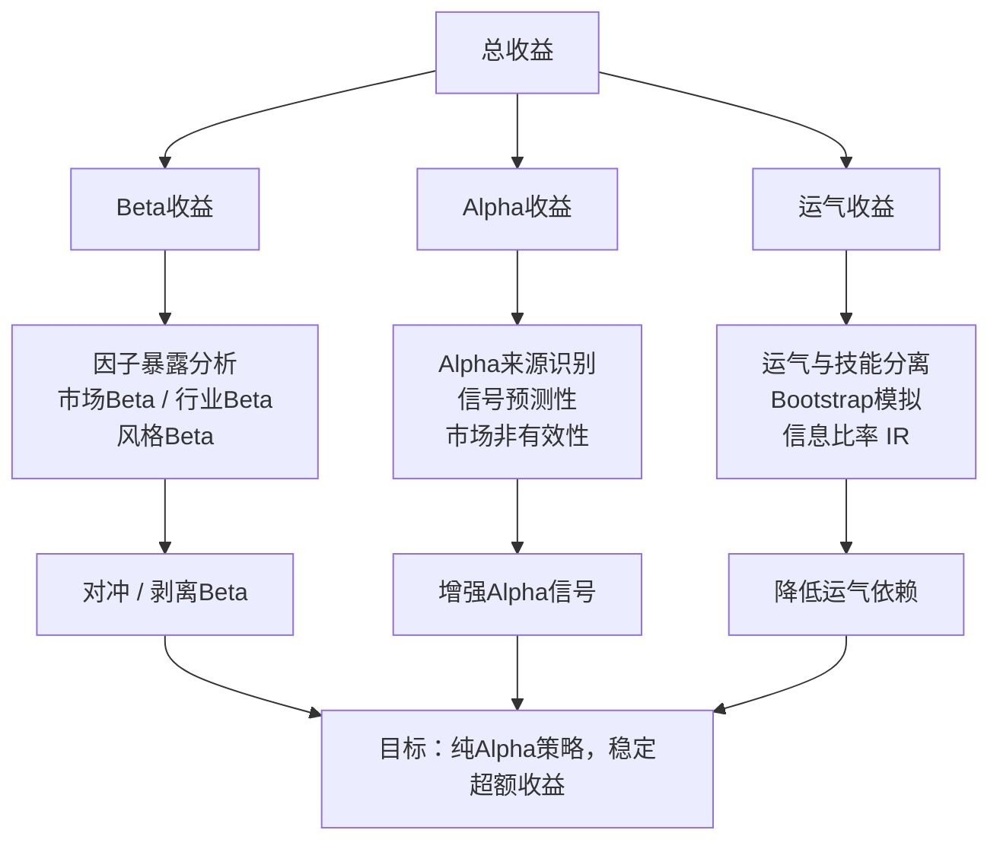

# 第12章：策略诊断-收益来源分析：Alpha来源识别、Beta暴露管理、运气与技能分离

做量化策略时间长了，你会发现一个扎心的事实：**赚钱的策略不一定好，亏钱的策略不一定差**。

这话听着有点绕，对吧？

我见过太多人，回测曲线漂亮得不行，实盘一跑就崩。为什么？因为根本没搞清楚钱是怎么赚来的。是市场赏饭吃（Beta），还是你真有两把刷子（Alpha），或者纯粹是运气好？

这一章，我们就来拆解这个问题。说白了，就是给策略做一次彻底的“体检”。

## 12.1 收益来源的“三原色”

我个人习惯把策略的收益拆成三部分：

- **Beta收益**：市场涨你也涨，市场跌你也跌。这是系统性风险带来的回报。
- **Alpha收益**：你跑赢市场的那部分。这才是你策略真正的价值。
- **运气收益**：随机波动带来的噪音。短期可能很大，长期必然归零。

你想想看，如果一个策略的收益90%来自Beta，那我还不如直接买ETF，省心省力还省管理费。所以，诊断的第一步，就是把这三种颜色分离开。

> **核心观点**：Alpha是能力，Beta是仓位，运气是噪音。三者不分，策略必死。

## 12.2 Alpha来源识别：你的策略凭什么赚钱？

Alpha不是凭空产生的。它一定来自某种**市场非有效性**。你需要问自己三个问题：

1. **你的信号是否具有预测性？** 比如，动量因子、反转因子、基本面因子。
2. **你的信号是否被市场充分定价？** 如果大家都知道，那就不值钱了。
3. **你的信号是否具有持续性？** 今天有效，明天就失效，那叫过拟合。

我在项目中遇到过一种情况：一个策略在A股市场表现很好，换到港股就完全失效。后来一查，原来它的Alpha来源是“散户情绪因子”。A股散户多，这个因子有效；港股机构多，这个因子就废了。

所以，识别Alpha来源，本质上是在回答：**你的策略在赚谁的钱？**

## 12.3 Beta暴露管理：别把Beta当Alpha

这是新手最容易犯的错误。回测里赚得盆满钵满，结果一看，是因为那几年是大牛市。

怎么管理Beta暴露？我建议用**因子暴露分析**。简单来说，就是跑一个回归：

```python
# 伪代码示例：计算策略的Beta暴露
import statsmodels.api as sm

# 策略收益率
strategy_returns = ...
# 市场收益率（比如沪深300）
market_returns = ...

# 回归：策略收益 = Alpha + Beta * 市场收益 + 残差
X = sm.add_constant(market_returns)
model = sm.OLS(strategy_returns, X).fit()

alpha = model.params[0]  # 截距项
beta = model.params[1]   # 市场Beta
residuals = model.resid  # 残差（运气部分）
```

这个Beta值，就是你对市场的暴露程度。如果Beta接近1，说明你的策略和市场同涨同跌。如果Beta接近0，说明你基本不受市场影响。

> **小技巧**：我习惯把Beta控制在0.3以下。超过这个值，我就会怀疑自己是不是在“赌方向”。

另外，别忘了**多因子暴露**。除了市场Beta，还有行业Beta、风格Beta（大小盘、价值成长等）。一个完整的Beta暴露管理，应该覆盖所有你能想到的系统性风险。

## 12.4 运气与技能分离：别被幸存者偏差骗了

这是最难的部分。因为运气和技能，在短期内几乎无法区分。

我曾经见过一个策略，连续12个月跑赢基准。所有人都觉得这是天才。结果第13个月，一把亏光。后来复盘发现，那12个月的超额收益，全部来自一个极端的行业配置——押对了新能源。这不是技能，这是运气。

怎么分离？我推荐两种方法：

- **模拟测试（Bootstrap）**：把策略的收益序列随机打乱，生成1000条模拟路径。如果真实收益显著优于95%的模拟路径，那才说明有技能。
- **信息比率（IR）**：

  ```text
  IR = Alpha / 跟踪误差
  ```

  IR大于0.5算及格，大于1算优秀。如果IR长期为负，那基本可以断定是运气。

> **避坑指南**：我曾经用Bootstrap测试一个高频策略，发现它的IR在统计上显著。但后来发现，是因为数据里有一个bug，导致回测结果虚高。所以，**先确保数据干净，再谈运气和技能**。

## 12.5 知识体系框架图

下面这张图，概括了本章的核心逻辑。你可以把它当作策略诊断的“检查清单”。



## 12.6 实战中的诊断流程

说了这么多理论，来点实际的。我一般按以下步骤做策略诊断：

| 步骤 | 操作 | 工具/方法 | 预期输出 |
| --- | --- | --- | --- |
| 1 | 计算总收益与基准收益 | 净值曲线、年化收益率 | 初步判断是否跑赢基准 |
| 2 | 因子暴露分析 | OLS回归、多因子模型 | Beta值、因子载荷 |
| 3 | Alpha显著性检验 | t检验、Bootstrap | Alpha是否统计显著 |
| 4 | 运气成分剥离 | 信息比率、夏普比率 | IR是否大于0.5 |
| 5 | 改进方向建议 | 因子择时、风险对冲 | 具体优化方案 |

> **记住**：诊断不是一次性的。市场在变，因子在变，你的策略也在变。我建议**每月做一次全面诊断**，至少每季度一次。别等到亏钱了才想起来检查。

嗯，这一章的内容就到这里。收益来源分析，说白了就是搞清楚你的策略到底有几斤几两。别被漂亮的曲线迷惑，也别被暂时的回撤吓倒。把Alpha、Beta、运气分清楚，你才能知道下一步该往哪走。
