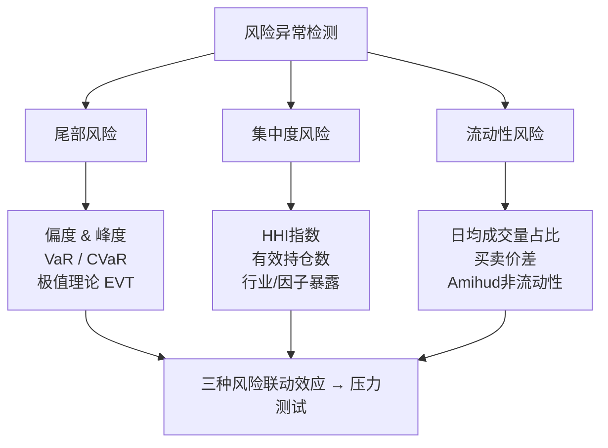

# 策略诊断-风险异常检测：尾部风险、集中度风险、流动性风险

做量化策略，最怕什么？

不是回撤大，而是死得不明不白。

我见过太多策略，回测曲线漂亮得像教科书，一上实盘就崩。崩的原因往往不是策略逻辑错了，而是风险暴露没管好。今天咱们就聊三个最要命的风险：尾部风险、集中度风险、流动性风险。这三兄弟，任何一个爆了，都能让你一夜回到解放前。

### 13.1 尾部风险：黑天鹅的獠牙

尾部风险，说白了就是极端行情。正态分布告诉你，跌5个标准差的事几万年才发生一次。但金融市场不是正态分布，它是个厚尾分布。我2015年做股指期货策略时，就吃过这个亏——模型里假设最大回撤不会超过3%，结果股灾来了，一天就干了5%。

怎么检测尾部风险？我习惯用这几个指标：

- **偏度（Skewness）**：负偏度意味着左尾更厚，容易出大亏。
- **峰度（Kurtosis）**：峰度大于3，说明极端值比正态分布多。
- **VaR（Value at Risk）**：95%或99%置信水平下的最大损失。
- **CVaR（Conditional VaR）**：也叫Expected Shortfall，算的是超过VaR那部分的平均损失。

我个人更看重CVaR。为什么？因为VaR只告诉你「最坏情况是亏100万」，但CVaR告诉你「一旦发生最坏情况，平均亏150万」。你想想看，哪个更有用？

> **核心观点：** 尾部风险不是靠历史数据能完全捕捉的。历史只发生过一次的事，不代表未来不会发生两次。我建议用极值理论（EVT）来建模尾部，虽然复杂点，但值得。

### 13.2 集中度风险：别把鸡蛋放一个篮子里

集中度风险，就是你的持仓太「挤」了。要么集中在某几只股票，要么集中在某个行业，要么集中在某个因子。

我记得有一次帮朋友诊断一个CTA策略，回测年化收益30%，夏普2.5，漂亮得不行。但我一看持仓，好家伙，80%的仓位押在螺纹钢和铁矿石上。我说你这策略不是做趋势的，你是赌黑色系的。后来黑色系暴跌，策略直接腰斩。

检测集中度风险，我常用这几个方法：

| 指标 | 含义 | 阈值建议 |
| --- | --- | --- |
| Herfindahl-Hirschman Index (HHI) | 持仓权重的平方和，衡量集中度 | HHI > 0.2 算偏高 |
| 有效持仓数 | 1 / HHI，等价于「等效持仓数量」 | 小于10只就要警惕 |
| 行业集中度 | 最大行业持仓占比 | 超过30%算风险 |
| 因子暴露集中度 | 对某个因子（如动量、价值）的暴露程度 | 单一因子暴露超过2个标准差 |

这里有个坑，我踩过。你以为分散了，其实没有。比如你买了10只银行股，看起来分散了，但行业集中度是100%。这种叫「伪分散」。真正的分散，要在行业、风格、市值、因子层面都分散开。

> **小技巧：** 我写了个函数，每天跑完策略后自动算HHI和行业集中度。一旦超标，系统自动报警。你可以在回测框架里也加上这个逻辑。

### 13.3 流动性风险：想跑的时候跑不掉

流动性风险，是量化策略的隐形杀手。回测里你假设以收盘价成交，但实盘里，小盘股你卖100万就能把价格砸下去2%。

我曾经做过一个高频做市策略，回测里每天交易几百次，收益稳定。结果一上实盘，滑点直接把利润吃光了。为什么？因为回测用的都是最优价成交，但实盘里流动性不够，你根本吃不到那个价。

检测流动性风险，我关注这几个维度：

- **日均成交量**：你的持仓量不能超过日均成交量的5%，这是底线。
- **买卖价差（Bid-Ask Spread）**：价差越大，交易成本越高。
- **Amihud非流动性指标**：衡量价格对成交量的敏感度。
- **换手率**：换手率低的股票，流动性天然差。

嗯，这里要注意一点。流动性不是静态的。平时流动性好的股票，极端行情下也可能瞬间枯竭。2020年3月美股熔断那会儿，连苹果、微软这种大盘股都出现了流动性危机。所以，压力测试里一定要模拟流动性枯竭的场景。

> **警告：** 千万别只看平均流动性。要看流动性分布的分位数。比如某只股票日均成交10亿，但5%分位数只有5000万。你的持仓量按5000万来算，而不是10亿。这是血的教训。

### 13.4 三种风险的联动效应

这三种风险不是孤立的。它们经常一起出现，互相放大。

举个例子：

1. 市场暴跌（尾部风险爆发）
2. 你的持仓集中在某个行业（集中度风险）
3. 你想减仓，但流动性枯竭了（流动性风险）

三连击，直接爆仓。

我2018年做量化选股时就遇到过。持仓集中在中小盘，市场一跌，小盘股流动性瞬间没了，想卖卖不掉，眼睁睁看着净值往下掉。那之后，我给自己定了个规矩：任何策略，必须同时通过尾部风险、集中度风险和流动性风险的检测，才能上实盘。

### 13.5 实操：写一个风险检测函数

光说不练假把式。我写了个简单的风险检测函数，你可以直接拿去用：

```python
import numpy as np
import pandas as pd

def risk_diagnosis(portfolio_returns, portfolio_weights, stock_data):
    """
    策略风险诊断
    :param portfolio_returns: 策略每日收益率序列
    :param portfolio_weights: 当前持仓权重（DataFrame，列为股票代码）
    :param stock_data: 股票日度数据（包含成交量、收盘价等）
    """
    # 1. 尾部风险检测
    skew = portfolio_returns.skew()
    kurt = portfolio_returns.kurtosis()
    var_95 = np.percentile(portfolio_returns, 5)
    cvar_95 = portfolio_returns[portfolio_returns <= var_95].mean()

    print(f"偏度: {skew:.3f}, 峰度: {kurt:.3f}")
    print(f"95% VaR: {var_95:.4f}, 95% CVaR: {cvar_95:.4f}")

    # 2. 集中度风险检测
    weights = portfolio_weights.values.flatten()
    hhi = np.sum(weights ** 2)
    effective_n = 1 / hhi
    print(f"HHI: {hhi:.4f}, 有效持仓数: {effective_n:.1f}")

    # 3. 流动性风险检测
    # 假设持仓市值1000万
    position_value = 10_000_000
    for stock in portfolio_weights.columns:
        avg_volume = stock_data[stock]['volume'].mean()
        avg_price = stock_data[stock]['close'].mean()
        daily_turnover = avg_volume * avg_price
        position_pct = (position_value * portfolio_weights[stock].values[0]) / daily_turnover
        if position_pct > 0.05:
            print(f"警告: {stock} 持仓占比日均成交量的 {position_pct:.1%}")

    return {'skew': skew, 'kurt': kurt, 'hhi': hhi, 'effective_n': effective_n}
```

这个函数虽然简单，但够用。你可以在每天收盘后跑一遍，把结果存下来，形成风险日志。时间长了，你就能摸清自己策略的风险特征。

> **总结一下：** 尾部风险看极端损失，集中度风险看持仓是否拥挤，流动性风险看能不能顺利进出。三者缺一不可。我建议你把这三个检测做成自动化流程，每天跑，每周复盘。别等到爆仓了才想起来检查风险。



最后说一句，风险检测不是一次性的事。市场在变，策略在变，风险特征也在变。我每个月都会重新审视一次策略的风险暴露，看看有没有新的风险点冒出来。养成这个习惯，你的策略才能活得久。

