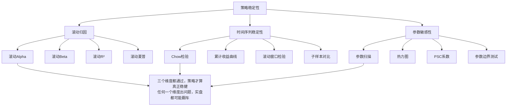

# 策略诊断-稳定性评估：滚动归因、时间序列稳定性、参数敏感性

做量化策略，最怕什么？

怕回测漂亮，实盘拉胯。

我见过太多策略，回测曲线跟教科书一样完美，一上实盘就原形毕露。说白了，就是策略的稳定性出了问题。今天咱们就聊聊怎么诊断策略的稳定性，从三个维度下手：滚动归因、时间序列稳定性、参数敏感性。

### 14.1 滚动归因：别只看总账，要看每一段

很多人的习惯是拉一个三年回测，看总收益、夏普比率，觉得不错就上实盘了。我告诉你，这很危险。

为什么？因为总账会掩盖很多问题。比如一个策略三年赚了50%，但可能其中80%的收益是某一年贡献的，其他两年都在亏。这种策略你敢用吗？

滚动归因，就是把整个回测期切成一个个小窗口，每个窗口单独做归因分析。我一般用3个月或6个月作为窗口长度。

```python
import pandas as pd
import numpy as np

def rolling_attribution(returns, factor_returns, window=63):
    """
    滚动归因分析
    returns: 策略日收益率
    factor_returns: 因子收益率DataFrame
    window: 滚动窗口长度（交易日）
    """
    results = []
    for i in range(window, len(returns)):
        # 取窗口数据
        ret_window = returns.iloc[i-window:i]
        factor_window = factor_returns.iloc[i-window:i]

        # 做回归归因
        X = sm.add_constant(factor_window)
        model = sm.OLS(ret_window, X).fit()

        results.append({
            'end_date': returns.index[i],
            'alpha': model.params[0],
            'alpha_tstat': model.tvalues[0],
            'beta': model.params[1:].to_dict(),
            'r_squared': model.rsquared
        })

    return pd.DataFrame(results)
```

我习惯把滚动alpha画成时间序列图。如果alpha大部分时间为正，且比较稳定，说明策略有持续的超额收益能力。如果alpha忽正忽负，像过山车一样，那就要小心了。

> **关键指标：**
>
> - **滚动alpha的均值**：越高越好，但更重要的是稳定性
> - **滚动alpha的t统计量**：绝对值大于2才算显著
> - **滚动R²的稳定性**：如果R²波动太大，说明策略对市场环境的依赖不稳定

### 14.2 时间序列稳定性：你的策略会"变心"吗？

时间序列稳定性，说白了就是检验策略的表现会不会随着时间推移而改变。我遇到过最典型的案例：一个动量策略在2015年之前表现很好，2015年之后突然失效了。为什么？因为市场结构变了。

常用的检验方法有几种：

#### 14.2.1 Chow检验

Chow检验可以判断策略在某个时间点前后是否存在结构性突变。比如你觉得2018年是个分水岭，那就用Chow检验看看策略在2018年前后有没有显著变化。

```python
from scipy import stats
import statsmodels.api as sm

def chow_test(returns, factor_returns, break_point):
    """
    Chow检验：判断是否存在结构性突变
    break_point: 断点位置（索引）
    """
    n = len(returns)
    n1 = break_point
    n2 = n - n1

    # 全样本回归
    X = sm.add_constant(factor_returns)
    model_full = sm.OLS(returns, X).fit()
    rss_full = model_full.ssr

    # 子样本1回归
    X1 = sm.add_constant(factor_returns.iloc[:n1])
    model1 = sm.OLS(returns.iloc[:n1], X1).fit()
    rss1 = model1.ssr

    # 子样本2回归
    X2 = sm.add_constant(factor_returns.iloc[n1:])
    model2 = sm.OLS(returns.iloc[n1:], X2).fit()
    rss2 = model2.ssr

    # 计算F统计量
    f_stat = ((rss_full - (rss1 + rss2)) / 2) / ((rss1 + rss2) / (n - 4))
    p_value = 1 - stats.f.cdf(f_stat, 2, n - 4)

    return f_stat, p_value
```

#### 14.2.2 累计收益曲线分析

这个更直观。把策略的累计收益画出来，看斜率是否稳定。如果某段时间斜率明显变平甚至向下，说明策略在那段时间失效了。

> **我的经验：** 累计收益曲线如果出现"平台期"（横盘超过3个月），基本可以判定策略在那段时间失效。别指望它自己恢复，大概率是市场环境变了。

### 14.3 参数敏感性：你的策略是"玻璃心"吗？

参数敏感性，就是看策略对参数变化的敏感程度。一个稳健的策略，参数稍微变一变，表现不应该有太大波动。

我见过最夸张的例子：一个策略用参数A回测年化收益30%，参数B只变了0.5，年化收益直接变成-10%。这种策略你敢用吗？实盘的时候参数稍微偏离一点，你就亏惨了。

#### 14.3.1 参数扫描

把参数在一定范围内扫描，看策略表现的变化。我一般会生成一个热力图，直观展示参数空间中的表现分布。

```python
def parameter_sweep(strategy_func, param_name, param_range, data):
    """
    参数扫描：遍历参数范围，计算每个参数下的策略表现
    """
    results = []
    for param_value in param_range:
        # 运行策略
        returns = strategy_func(data, **{param_name: param_value})

        # 计算绩效指标
        sharpe = np.mean(returns) / np.std(returns) * np.sqrt(252)
        max_dd = calculate_max_drawdown(returns)
        calmar = np.mean(returns) * 252 / max_dd

        results.append({
            param_name: param_value,
            'sharpe': sharpe,
            'max_drawdown': max_dd,
            'calmar': calmar
        })

    return pd.DataFrame(results)
```

#### 14.3.2 参数稳定性指标

我常用一个指标叫"参数稳定性系数"（PSC），计算方式很简单：

```python
def parameter_stability_coefficient(results_df, metric='sharpe'):
    """
    参数稳定性系数：衡量策略对参数变化的敏感程度
    值越小越稳定
    """
    values = results_df[metric].values
    # 计算相邻参数之间的绩效变化
    diffs = np.abs(np.diff(values))
    # 归一化
    psc = np.mean(diffs) / np.mean(np.abs(values))
    return psc
```

> **注意：** PSC小于0.1算比较稳定，0.1-0.3需要警惕，大于0.3基本可以判定策略对参数过于敏感。我曾经因为忽略这个指标，实盘亏了三个月才反应过来。

### 14.4 知识体系总览

下面这张图把稳定性评估的三个维度串起来了，你可以对照着检查自己的策略：



### 14.5 实战建议

说了这么多，最后给几条实操建议：

1. **先做滚动归因**：看看策略的alpha是不是持续稳定。如果alpha时有时无，别急着上实盘。
2. **再做时间序列稳定性检验**：用Chow检验找找有没有结构性突变点。如果有，搞清楚为什么。
3. **最后做参数敏感性分析**：把参数扫一遍，算PSC系数。PSC大于0.3的策略，我建议直接放弃。

> **一个小技巧：** 我习惯把这三个分析做成自动化报告，每次回测完自动生成。这样就不用每次都手动跑一遍，省时间。

嗯，稳定性评估这块就聊到这儿。记住一句话：回测是历史，实盘是未来。只有稳定的策略，才能把历史的表现延续到未来。

