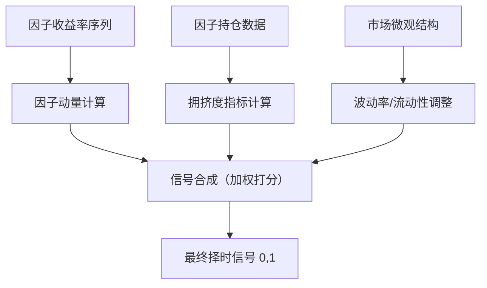

# 改进方向-因子择时：因子动量、因子拥挤度、因子择时信号构建

各位同学，咱们今天聊一个实战中特别有意思的话题——因子择时。

说实话，做量化策略最怕什么？不是策略亏钱，而是你明明知道这个因子长期有效，但偏偏在你重仓的时候它失效了。我早年做CTA策略时就吃过这个亏，一个动量因子回测漂亮得不行，实盘三个月直接打回原形。后来我才明白，因子不是一成不变的，它也有自己的生命周期。

所以，因子择时的核心思想很简单：**不是所有因子在所有时间都有效**。我们要做的，就是判断什么时候该用，什么时候该躲。

### 因子动量：趋势会延续吗？

先说说因子动量。这个概念其实借鉴了资产价格动量——过去表现好的因子，未来一段时间可能继续好。为什么？因为资金有惯性，机构调仓不是一天完成的。

我习惯用过去12个月的因子收益率来构建动量信号。具体做法：

```python
# 伪代码示例
def factor_momentum(factor_returns, lookback=252):
    """
    factor_returns: 因子每日收益率序列
    lookback: 回看天数，我一般用252个交易日
    """
    mom = factor_returns.rolling(lookback).mean()
    # 标准化处理，避免量纲影响
    mom_zscore = (mom - mom.mean()) / mom.std()
    return mom_zscore
```

这里有个坑——**回看窗口的选择**。我试过60天、120天、252天，发现不同因子对窗口敏感度差异很大。比如价值因子，动量持续性弱，窗口短一点反而好；而低波因子，动量持久性强，适合长窗口。

> **我的经验：** 对于多因子组合，建议用滚动优化来确定每个因子的最优动量窗口。别偷懒用统一参数，效果差很多。

### 因子拥挤度：别挤在同一个门口

因子拥挤度，说白了就是**有多少资金在交易同一个因子**。拥挤度过高时，一旦有人先跑，踩踏效应会让你措手不及。

我记得2020年那次小盘因子崩盘，就是典型的拥挤度爆表。当时全市场都在做小盘反转，结果流动性一收紧，大家同时撤，小盘股直接崩了20%。

怎么衡量拥挤度？我常用三个指标：

| 指标 | 计算方法 | 含义 |
| --- | --- | --- |
| 因子持仓集中度 | 因子多空组合中，前10%持仓的市值占比 | 占比越高，越拥挤 |
| 因子相关性 | 因子收益率与市场平均收益率的滚动相关性 | 相关性越高，同质化越严重 |
| 因子换手率 | 因子组合的日均换手率 | 换手率异常升高，往往是拥挤信号 |

> **避坑指南：** 我曾经犯过一个错误——只看拥挤度绝对值，没看变化趋势。后来发现，拥挤度从低位快速上升，比高位横盘更危险。前者意味着资金正在疯狂涌入，随时可能反转。

### 因子择时信号构建：把碎片拼成图

好了，现在我们有因子动量和因子拥挤度两个维度。怎么合成一个可用的择时信号？

我个人习惯用**打分法**。每个维度打分，然后加权合成。举个例子：

```python
def factor_timing_signal(momentum_score, crowding_score):
    """
    momentum_score: 因子动量得分，范围[-1, 1]
    crowding_score: 因子拥挤度得分，范围[0, 1]，越高越拥挤
    """
    # 动量得分越高越好，拥挤度得分越低越好
    # 我一般给动量权重0.6，拥挤度0.4
    signal = 0.6 * momentum_score - 0.4 * crowding_score
    # 映射到[0, 1]区间
    signal = (signal + 1) / 2
    return signal
```

你可能会问：权重怎么定？嗯，这个问题没有标准答案。我建议用**滚动窗口的IC值**来动态调整。动量信号IC高时，给它更大权重；拥挤度信号IC高时，给它更大权重。

下面这张图是我自己总结的因子择时框架，你可以参考：



你看，整个流程其实不复杂。但真正难的是**信号阈值的设定**。信号大于0.7就开仓？还是大于0.8？这个需要根据你的策略风险偏好来定。

> **核心要点：**
>
> - 因子动量：过去12个月收益率，滚动窗口计算
> - 因子拥挤度：持仓集中度、相关性、换手率三管齐下
> - 信号合成：动量权重0.6，拥挤度权重0.4，动态调整更佳
> - 阈值设定：建议用滚动回测确定，别拍脑袋

最后说一句，因子择时不是万能药。它能在因子失效前帮你减仓，但不可能完全避免回撤。我自己的经验是，**因子择时能让夏普比率提升0.3-0.5**，但前提是你得坚持执行信号，别在信号不好时硬扛。

好了，这部分内容就到这里。记住，因子择时不是预测未来，而是管理风险。你把它当风险管理工具用，效果反而更好。

