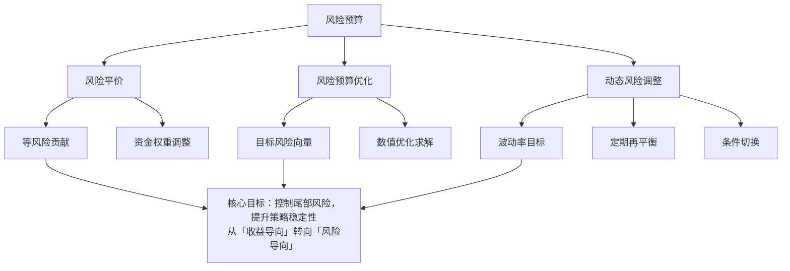

# 改进方向-风险预算：风险平价、风险预算优化、动态风险调整

聊到风险预算，我得先坦白一件事。

早些年我做策略，满脑子想的都是怎么提高收益。夏普比率做到2.0，年化收益做到30%，觉得自己牛得不行。结果呢？2015年股灾，一天回撤8%，我那个号称「稳健」的CTA策略直接被打回原形。痛定思痛，我才真正开始重视风险预算这件事。

说白了，风险预算不是让你赚更多钱，而是让你活得久。

### 风险平价：最简单的风险预算

风险平价这个概念，桥水基金带火的。核心思想其实很简单：**让每个资产对组合的风险贡献相等**。

你想想看，传统资产配置是按资金权重来的。比如60%股票+40%债券。但股票的波动率可能是债券的3倍，结果呢？组合里90%的风险都来自股票。债券那40%的资金，基本就是个摆设。

风险平价要解决的就是这个问题。它不管资金权重，只管风险权重。

> **核心公式：**
>
> ```text
> 风险贡献 RC_i = w_i × (∂σ_p / ∂w_i) = w_i × (Σw_j × σ_ij) / σ_p
> 风险平价条件：RC_1 = RC_2 = ... = RC_n
> ```

我在项目中遇到过这样一个案例：一个股债60/40组合，算下来股票的风险贡献占了85%。改成风险平价后，股票的资金权重降到了25%左右，债券占了75%。回测下来，年化收益虽然从12%降到了9%，但最大回撤从-25%降到了-8%。

值不值？我觉得值。毕竟回撤50%需要涨100%才能回本，这个账大家都会算。

### 风险预算优化：从等风险到定制化

风险平价是个好起点，但太死板了。你想想，如果我就是看好股票，想多配一点，怎么办？

这时候就需要风险预算优化了。它允许你设定每个资产的目标风险贡献比例，然后求解最优权重。

> **我的个人习惯：**
>
> 做风险预算优化时，我一般会设一个「风险预算向量」b = [b₁, b₂, ..., bₙ]，其中Σb_i = 1。然后求解使得每个资产的实际风险贡献RC_i尽可能接近b_i的权重。

举个例子。假设我想让股票的风险贡献占60%，债券占40%。那优化目标就是：

```text
min Σ (RC_i - b_i × σ_p)²
s.t. Σ w_i = 1
     w_i ≥ 0
```

这个优化问题可以用数值方法求解。我一般用scipy.optimize里的minimize函数，方法选SLSQP，收敛性还不错。

这里有个坑，我曾经踩过：**风险预算优化对输入参数非常敏感**。协方差矩阵稍微变一点，最优权重可能就天差地别。所以我建议做两步：

1. 用滚动窗口估计协方差矩阵，不要用全样本
2. 对权重做约束，比如单资产权重不超过40%

> **避坑指南：**
>
> 我曾经用全样本协方差矩阵做风险预算优化，回测漂亮得不行。结果实盘一跑，权重每天都在剧烈跳动，交易成本直接吃掉所有超额收益。后来加了权重变化约束，才稳住。

### 动态风险调整：让预算活起来

静态的风险预算有个问题：市场变了，你的预算没变。

比如2020年疫情爆发那会儿，股票波动率瞬间翻倍。如果你还维持原来的风险预算，股票的实际风险贡献会远超目标值。这时候就需要动态调整。

动态风险调整的核心逻辑就一句话：**根据市场状态，实时调整风险预算**。

我常用的方法有三种：

| 方法 | 核心思路 | 我用的场景 |
| --- | --- | --- |
| 波动率目标法 | 设定组合目标波动率，动态调整杠杆 | 趋势跟踪策略 |
| 风险预算再平衡 | 定期重新求解风险预算权重 | 多资产配置 |
| 条件风险预算 | 根据市场状态切换预算向量 | 宏观对冲 |

波动率目标法最简单。比如我设定组合目标波动率15%，当前实际波动率20%，那就把整体仓位降到75%。等波动率回落了再加回去。这个方法我在CTA策略里用了很多年，效果稳定。

风险预算再平衡，说白了就是定期重新算一遍权重。我一般按月做，遇到极端行情会临时加一次。频率太高了不行，交易成本受不了。

条件风险预算就更有意思了。比如我定义两个市场状态：低波动状态和高波动状态。低波动时股票风险预算60%，高波动时降到30%。这个切换逻辑可以用一个简单的阈值触发，也可以用更复杂的马尔可夫模型。

### 知识体系总览

下面这张图，是我自己梳理的风险预算知识框架。你看一眼，心里就有谱了。



### 实战中的几点体会

做了这么多年风险预算，我有几点体会想分享给你：

- **不要追求完美**。风险预算优化是个近似解，不是精确解。差不多就行了，别在0.1%的差异上纠结。
- **关注极端情况**。正常市场里风险预算表现都不错，但一遇到黑天鹅，相关性全变了，预算就失效了。所以一定要做压力测试。
- **交易成本是隐形杀手**。动态调整越频繁，交易成本越高。我一般建议月度再平衡，极端行情才临时调整。

嗯，风险预算这块内容就这些。说白了就是一句话：**别把所有风险押在一个资产上，也别让一个资产的风险失控**。做到这两点，你的策略就能在市场里活得久一点。

