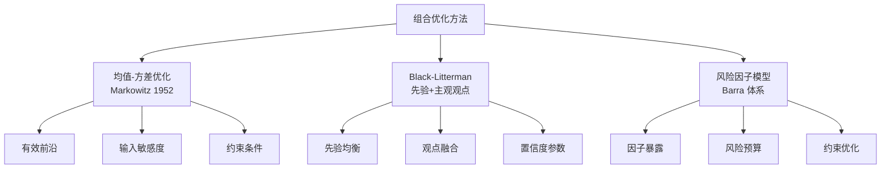

# 改进方向-组合优化：均值-方差优化、Black-Litterman模型、风险因子模型优化

各位同学，今天我们来聊聊组合优化。说实话，这是量化策略从「能赚钱」到「稳定赚钱」的关键一步。我见过太多策略，回测曲线漂亮得不行，一上实盘就崩了。为什么？多半是组合构建出了问题。

组合优化，说白了就是解决两个问题：**买什么**和**买多少**。别小看这个「买多少」，它往往比「买什么」更重要。我自己早期做策略时，花了大量精力选股，结果仓位分配一塌糊涂，最后收益全被波动吃掉了。

> **核心观点：** 一个好的策略，60%靠信号，40%靠组合优化。很多人只盯着信号，忽略了组合管理，这是个大坑。



### 一、均值-方差优化：经典但脆弱

均值-方差优化是马科维茨老爷子1952年提出的，到现在70多年了，依然是组合优化的基石。它的逻辑很简单：给定预期收益和协方差矩阵，找到那个「风险最小、收益最大」的平衡点。

但我要说句实话——**这个模型在实际中用起来，坑特别多**。我自己第一次用的时候，优化出来的权重全是极端值，有的资产配了80%，有的直接归零。当时我还以为是代码写错了，查了半天才发现，这就是均值-方差优化的通病。

> **避坑指南：** 均值-方差优化对输入参数极其敏感。预期收益稍微改0.5%，最优权重可能天翻地覆。我曾经因为用了一年的历史均值做预期收益，结果优化出来的组合在实盘里直接跑输基准5个点。后来我学乖了，一定要做稳健性检验。

来看一个简单的Python实现：

```python
import numpy as np
from scipy.optimize import minimize

def mean_variance_optimize(mu, cov, target_return):
    """
    均值-方差优化：给定目标收益，最小化风险
    mu: 预期收益向量
    cov: 协方差矩阵
    target_return: 目标收益
    """
    n = len(mu)

    def portfolio_vol(w):
        return np.sqrt(w @ cov @ w)

    constraints = [
        {'type': 'eq', 'fun': lambda w: np.sum(w) - 1},  # 权重和为1
        {'type': 'eq', 'fun': lambda w: w @ mu - target_return}  # 目标收益
    ]

    bounds = [(0, 1) for _ in range(n)]  # 不允许做空
    init_w = np.ones(n) / n

    result = minimize(portfolio_vol, init_w,
                      constraints=constraints,
                      bounds=bounds)
    return result.x

# 使用示例
mu = np.array([0.12, 0.08, 0.15])  # 预期收益
cov = np.array([[0.04, 0.01, 0.02],
                [0.01, 0.03, 0.01],
                [0.02, 0.01, 0.05]])  # 协方差矩阵
weights = mean_variance_optimize(mu, cov, 0.10)
print(f"最优权重: {weights}")
```

代码看着简单吧？但实际用起来，你会发现几个问题：

- **预期收益估计不准**——历史均值往往不是好指标
- **协方差矩阵不稳定**——市场一变，相关性全变了
- **权重过于集中**——没有分散化效果

所以，均值-方差优化更适合作为**基准方法**，而不是最终方案。我一般用它来做初步筛选，然后结合其他方法做调整。

### 二、Black-Litterman模型：把主观判断加进去

Black-Litterman模型（以下简称BL模型）是解决均值-方差优化「输入敏感」问题的一个好办法。它由Fisher Black和Robert Litterman在高盛时提出，核心思想是：**先有一个市场均衡的基准组合，然后根据你的主观观点去调整**。

说白了，就是「先相信市场是有效的，再局部修正」。这个思路我个人非常喜欢，因为它避免了「全凭历史数据说话」的尴尬。

> **我的经验：** BL模型特别适合那些「你有一定判断力，但又不完全确定」的场景。比如你对某个行业有研究，觉得它未来三个月会跑赢大盘5%，但你又不敢全仓押注。BL模型会帮你把这个观点「稀释」到组合里，既体现了你的判断，又保留了分散化。

BL模型的核心公式其实不复杂：

```python
import numpy as np

def black_litterman(cov, tau, P, Q, Omega, pi):
    """
    Black-Litterman 模型
    cov: 协方差矩阵
    tau: 标量，表示先验的置信度（通常取0.01-0.05）
    P: 观点矩阵（每个观点一行）
    Q: 观点收益向量
    Omega: 观点误差协方差矩阵（对角矩阵）
    pi: 市场均衡收益（通常用CAPM推导）
    """
    n = cov.shape[0]

    # 后验收益
    M_inv = np.linalg.inv(np.linalg.inv(tau * cov) + P.T @ np.linalg.inv(Omega) @ P)
    mu_bl = M_inv @ (np.linalg.inv(tau * cov) @ pi + P.T @ np.linalg.inv(Omega) @ Q)

    # 后验协方差
    cov_bl = cov + M_inv

    return mu_bl, cov_bl

# 示例：3个资产，1个观点
cov = np.array([[0.04, 0.01, 0.02],
                [0.01, 0.03, 0.01],
                [0.02, 0.01, 0.05]])
tau = 0.025
P = np.array([[1, 0, -1]])  # 观点：资产1比资产3多赚5%
Q = np.array([0.05])
Omega = np.array([[0.01]])  # 观点置信度
pi = np.array([0.08, 0.06, 0.07])  # 均衡收益

mu_bl, cov_bl = black_litterman(cov, tau, P, Q, Omega, pi)
print(f"BL后验收益: {mu_bl}")
print(f"BL后验协方差:\n{cov_bl}")
```

你看，BL模型把主观观点（资产1比资产3多赚5%）和先验均衡收益融合在一起，得到了后验收益。这个后验收益比纯历史数据更稳健，也更符合直觉。

不过，BL模型也有它的局限性：

- **观点数量不能太多**——观点太多，模型容易过拟合
- **Omega参数难调**——观点置信度设多少，没有标准答案
- **计算复杂度高**——资产数量多时，矩阵求逆很慢

> **关键点：** BL模型不是万能药。它更适合「你有少量高质量观点」的场景。如果你对市场完全没有判断，那直接用均值-方差或者等权组合可能更好。

### 三、风险因子模型优化：从资产到因子

最后说说风险因子模型优化。这个思路和前面两个完全不同——它不直接优化资产权重，而是优化**因子暴露**。

什么意思呢？你想想看，一个股票组合的风险，其实不是由股票本身决定的，而是由它背后的因子决定的。比如你买了10只科技股，表面上看是分散了，但本质上你还是在赌「科技因子」。一旦科技板块崩了，你照样亏。

风险因子模型优化的核心就是：**把组合的风险拆解到因子层面，然后控制每个因子的暴露**。

我曾在项目中遇到过这样一个案例：一个客户的多因子策略，回测年化收益25%，夏普比2.0，看着完美。但一分析因子暴露，发现它在「小市值因子」上的暴露高达3个标准差。这意味着什么？一旦小市值风格反转，策略就会大幅回撤。后来我们通过风险因子模型优化，把因子暴露控制在1个标准差以内，虽然收益降到了18%，但最大回撤从30%降到了12%。

来看一个简化的实现：

```python
import numpy as np
from scipy.optimize import minimize

def factor_risk_optimize(factor_exposures, factor_cov, target_factor_exposure,
                         asset_returns=None, risk_aversion=1.0):
    """
    风险因子模型优化
    factor_exposures: 资产对因子的暴露矩阵 (n_assets x n_factors)
    factor_cov: 因子协方差矩阵 (n_factors x n_factors)
    target_factor_exposure: 目标因子暴露向量 (n_factors,)
    asset_returns: 资产预期收益 (可选)
    risk_aversion: 风险厌恶系数
    """
    n_assets = factor_exposures.shape[0]

    def portfolio_factor_exposure(w):
        return w @ factor_exposures

    def objective(w):
        # 因子风险
        fe = portfolio_factor_exposure(w)
        factor_risk = fe @ factor_cov @ fe

        # 跟踪误差：与目标暴露的偏差
        tracking_error = np.sum((fe - target_factor_exposure) ** 2)

        # 如果有预期收益，加入目标
        if asset_returns is not None:
            expected_return = w @ asset_returns
            return -expected_return + risk_aversion * factor_risk + 10 * tracking_error
        else:
            return factor_risk + 10 * tracking_error

    constraints = [{'type': 'eq', 'fun': lambda w: np.sum(w) - 1}]
    bounds = [(0, 0.1) for _ in range(n_assets)]  # 单个资产上限10%
    init_w = np.ones(n_assets) / n_assets

    result = minimize(objective, init_w,
                      constraints=constraints,
                      bounds=bounds)
    return result.x

# 示例：5个资产，3个因子
factor_exposures = np.array([
    [0.8, 0.2, 0.1],  # 资产1：高市值、中价值、低动量
    [0.3, 0.7, 0.4],  # 资产2
    [0.5, 0.5, 0.6],  # 资产3
    [0.2, 0.3, 0.8],  # 资产4
    [0.9, 0.1, 0.2]   # 资产5
])
factor_cov = np.array([[0.04, 0.01, 0.005],
                       [0.01, 0.03, 0.008],
                       [0.005, 0.008, 0.02]])
target_exposure = np.array([0.5, 0.3, 0.2])  # 中性暴露

weights = factor_risk_optimize(factor_exposures, factor_cov, target_exposure)
print(f"优化权重: {weights}")
print(f"实际因子暴露: {weights @ factor_exposures}")
```

这个代码的核心逻辑是：**让组合的因子暴露尽可能接近目标暴露**。如果你想要「市场中性」，就把目标暴露设成0；如果你想要「价值因子偏多」，就把价值因子的目标暴露设高一些。

> **注意：** 因子暴露的估计本身也有误差。我建议用滚动窗口估计因子暴露，并且做稳定性检验。如果因子暴露一个月变一次，那这个模型基本没法用。

### 三种方法的对比与选择

说了这么多，到底该用哪个？我整理了一个对比表：

| 方法 | 优点 | 缺点 | 适用场景 |
| --- | --- | --- | --- |
| 均值-方差优化 | 理论成熟、计算简单 | 输入敏感、权重极端 | 作为基准、初步筛选 |
| Black-Litterman | 融合主观观点、稳健 | 参数难调、观点数量受限 | 有高质量判断时 |
| 风险因子模型 | 风险归因清晰、可控性强 | 因子选择依赖经验 | 机构级组合管理 |

我个人习惯是：**先用均值-方差做个初步框架，然后用BL模型加入主观判断，最后用风险因子模型做精细化调整**。三个方法不是互斥的，而是可以叠加使用的。

举个例子，我在做一个行业轮动策略时，流程是这样的：

1. 用均值-方差算出各行业的基准权重
2. 用BL模型加入我对某些行业的超配/低配观点
3. 用风险因子模型控制组合在「市值、估值、动量」等因子上的暴露

这样下来，组合既体现了我的判断，又不会在某个因子上过度暴露。嗯，这才是实战中该有的思路。

> **最后一个小建议：** 不管用哪种方法，一定要做**回测外的稳健性检验**。比如改变输入参数，看权重变化大不大；或者用不同时间段的数据，看结果是否稳定。如果稍微改个参数权重就大变，那这个优化结果基本不可信。

好了，组合优化这块就聊到这儿。记住，优化不是目的，稳健才是。下次你们做策略时，不妨试试把这三个方法结合起来用，效果可能会让你惊喜。

