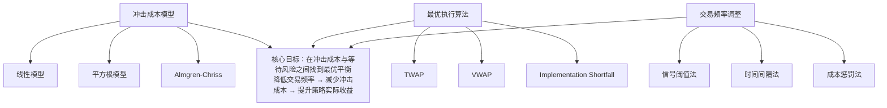

# 改进方向-交易成本优化：冲击成本模型、最优执行算法、交易频率调整

交易成本这东西，说白了就是策略的隐形杀手。我见过太多回测曲线漂亮的策略，一上实盘就蔫了。为什么？因为回测里没算冲击成本，没算滑点。今天我们就来聊聊怎么优化这块。

### 一、冲击成本模型：你的订单在市场上砸出多大的坑？

冲击成本，就是你下单时对市场价格造成的影响。你想想看，一个100万的大单砸进去，跟一个1万的小单，效果能一样吗？

我个人习惯把冲击成本分成两块：

- **永久冲击**：订单改变了市场供需结构，价格回不去了
- **临时冲击**：订单只是暂时推高了价格，流动性恢复后价格会回来

我在项目中遇到过最典型的案例：一个高频策略在回测里年化收益30%，实盘第一天就亏了5%。查了半天，原来是策略在流动性差的时段频繁下单，每次下单都把价格打偏了。嗯，这就是典型的冲击成本没算对。

#### 常用的冲击成本模型

| 模型名称 | 核心公式 | 适用场景 |
| --- | --- | --- |
| 线性模型 | `I = α × Q / V` | 流动性较好的股票 |
| 平方根模型 | `I = α × √(Q / V)` | 流动性一般的品种 |
| Almgren-Chriss模型 | `I = α × Q + β × σ × √(Q / V)` | 最常用，兼顾波动率 |

其中Q是你的订单量，V是市场成交量，σ是波动率。说白了，订单量越大、市场越不活跃、波动越剧烈，冲击成本就越高。

> **核心观点**：冲击成本不是线性的。你下10手和100手，成本不是10倍关系，可能是20倍。因为大单会吃掉多个价位的挂单。

### 二、最优执行算法：怎么把大单拆成小单？

既然大单冲击大，那我们就拆成小单慢慢打。但问题来了：拆得太碎，时间拉长，价格可能跑偏了。拆得太粗，冲击成本又高。怎么平衡？

这里我推荐一个经典框架——**Almgren-Chriss最优执行模型**。它的核心思想很简单：在冲击成本和等待风险之间找平衡。

```python
# 一个简化的最优执行算法示例
def optimal_execution(Q, T, sigma, alpha, beta):
    """
    Q: 总订单量
    T: 执行时间窗口
    sigma: 波动率
    alpha: 冲击成本系数
    beta: 风险厌恶系数
    """
    # 计算最优执行速度
    lambda_ = np.sqrt(beta * sigma**2 / (2 * alpha))

    # 每个时间点的最优持仓
    x_t = Q * (np.sinh(lambda_ * (T - t)) / np.sinh(lambda_ * T))

    # 每个时间点的最优交易量
    v_t = -dx_t/dt

    return v_t
```

这个代码看着简单，但实际用起来坑不少。我曾经在一个CTA策略里用这个模型，结果发现参数alpha和beta怎么调都不对。后来才意识到，不同品种的冲击成本系数差很多——股指期货和螺纹钢，完全不是一个量级。

> **实战技巧**：我建议先用历史数据回测冲击成本系数，至少用3个月的数据。别偷懒用默认值，每个品种都得单独算。

#### 常见的执行算法对比

| 算法 | 特点 | 适合场景 |
| --- | --- | --- |
| TWAP（时间加权平均价格） | 均匀拆单，简单粗暴 | 流动性好、波动小的品种 |
| VWAP（成交量加权平均价格） | 按历史成交量分布拆单 | 日内交易，有成交量规律 |
| Implementation Shortfall | 动态优化，追求最小化执行成本 | 大单、流动性差的品种 |
| Adaptive算法 | 根据实时市场情况调整 | 波动剧烈、不确定性高的场景 |

我个人习惯用Implementation Shortfall，因为它最灵活。但要注意，这个算法对参数敏感，需要定期校准。

### 三、交易频率调整：少动比多动好

交易频率越高，交易成本就越高。这不是废话吗？但很多策略设计者就是忍不住频繁交易。

我见过一个极端案例：一个日内策略每天交易50次，每次赚0.1%。看起来不错吧？但算上冲击成本和手续费，每次实际成本0.15%。结果就是——越做越亏。

> **避坑指南**：我曾经犯过一个错误——在回测里把交易成本设得太低。结果实盘时发现，高频交易的成本比想象的高得多。后来我学乖了，回测时至少用两倍的实际成本来测试。

#### 怎么调整交易频率？

1. **信号阈值法**：只有信号强度超过某个阈值才交易。比如预测收益超过0.5%才下单，低于这个值就观望。
2. **时间间隔法**：强制设定最小交易间隔。比如每5分钟最多交易一次，避免频繁进出。
3. **成本惩罚法**：在策略目标函数里加入交易成本项。让策略自己学会少交易。

你想想看，如果一个策略的胜率是60%，但每次交易成本吃掉0.2%的利润，那实际胜率可能就降到50%以下了。所以，降低频率往往比优化信号更有效。

### 四、知识体系框架

下面这张图总结了交易成本优化的核心逻辑，我画了很久才理清楚。



这张图把三个优化方向串起来了。冲击成本模型是基础，你得先知道成本是多少。最优执行算法是工具，帮你把大单拆好。交易频率调整是策略层面的优化，从源头减少成本。

> **最后说一句**：交易成本优化不是一锤子买卖。市场在变，流动性在变，你的策略参数也得跟着调。我建议每季度做一次成本复盘，看看实际执行成本跟模型预测差多少，然后修正参数。这才是持续优化的正确姿势。

