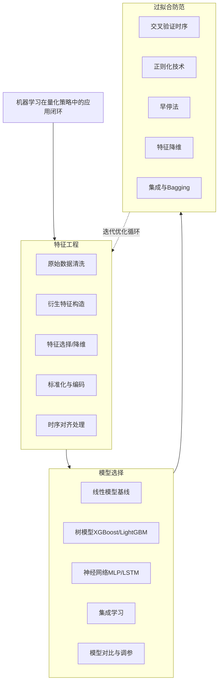

# 改进方向-机器学习应用：特征工程、模型选择、过拟合防范

各位同学，咱们今天聊点硬核的。量化策略做到一定阶段，你会发现传统多因子模型开始吃力了。非线性关系、市场微观结构噪音、高维数据……这些痛点，说白了就是传统线性模型的天花板。这时候，机器学习就该上场了。

但我得先泼盆冷水：**机器学习不是万能药**。我见过太多人，上来就把LSTM、Transformer往行情数据上怼，结果回测曲线漂亮得像假图，实盘一跑就崩。为什么？因为量化金融里，机器学习的坑比想象中多得多。今天我就把这三个核心环节——特征工程、模型选择、过拟合防范——掰开了讲，全是实战中淌出来的经验。



## 一、特征工程：决定模型上限的脏活累活

我常说一句话：**数据和特征决定了机器学习的上限，而模型和算法只是逼近这个上限**。在量化领域，这句话尤其扎心。你想想看，行情数据本身信噪比极低，如果特征构造得不好，再牛的模型也白搭。

### 1.1 原始数据清洗——别让脏数据毁了模型

我个人习惯，拿到数据第一件事不是算因子，而是做数据质量审计。常见的问题包括：

- **缺失值处理**：金融数据里，停牌、节假日、数据源中断都会产生缺失。千万别用均值填充！我建议用前向填充（ffill）或者插值法，更符合时序逻辑。
- **异常值检测**：比如某只股票突然出现-99%的日收益率，这大概率是数据错误。可以用MAD（中位数绝对偏差）或者分位数截断来处理。
- **幸存者偏差**：这是个大坑。如果你只用了当前还在交易的股票数据做回测，那结果肯定虚高。必须包含已经退市、被并购的股票。

> **核心原则**：特征工程必须严格遵循「未来信息不可用」原则。任何用到未来数据的特征，都是作弊。

### 1.2 衍生特征构造——从原始数据中挖金子

原始的价格、成交量数据，信息量太有限了。我们需要构造更有预测力的衍生特征。我一般把特征分成几类：

| 特征类别 | 典型示例 | 说明 |
|---------|---------|------|
| 动量/反转类 | 过去N日收益率、RSI、MACD | 捕捉趋势延续或反转信号 |
| 波动率类 | ATR、历史波动率、已实现波动率 | 反映市场风险程度 |
| 成交量/资金流类 | OBV、成交量加权均价偏离、资金流强度 | 识别主力资金动向 |
| 横截面类 | 个股相对行业指数的超额收益、市值分位数 | 捕捉相对强弱关系 |
| 微观结构类 | 买卖价差、订单簿不平衡、高频波动 | 高频交易常用，低频慎用 |

嗯，这里要注意：特征不是越多越好。我见过有人一口气构造了500个特征，结果模型训练时间暴涨，性能反而下降。这就是典型的「维度灾难」。

### 1.3 特征选择与降维——做减法比做加法更难

特征太多怎么办？我个人常用的方法有：

- **单变量筛选**：计算每个特征与目标变量的IC（信息系数）或秩相关系数，保留显著的特征。
- **基于模型的特征重要性**：用随机森林或XGBoost跑一遍，看特征重要性排序，砍掉排名靠后的。
- **PCA（主成分分析）**：适合处理高度相关的特征组，但缺点是解释性变差。
- **L1正则化（Lasso）**：在模型训练过程中自动做特征选择，系数被压缩到0的特征就被淘汰了。

> **实战技巧**：我建议先做一轮粗筛（比如IC绝对值低于0.02的直接扔掉），再做一轮精筛（用模型重要性或Lasso）。这样效率最高。

## 二、模型选择：没有最好的模型，只有最合适的

很多新手喜欢追新模型，什么新就上什么。但量化交易不是发论文，**稳定性和可解释性往往比精度更重要**。我自己的经验是：从简单模型开始，逐步增加复杂度。

### 2.1 基线模型——先跑通，再优化

我个人习惯，任何机器学习项目都先跑一个线性回归或逻辑回归作为基线。为什么？因为：

- 线性模型训练快，能快速验证特征是否有效
- 系数有明确的金融含义（正相关/负相关）
- 如果线性模型效果就不错，那说明问题本身偏线性，没必要上复杂模型

我曾经在一个CTA策略项目里，团队花了两周调LSTM，结果发现线性回归加上几个滞后特征，效果几乎一样。你说尴尬不尴尬？

### 2.2 树模型——量化领域的「万金油」

如果线性模型不够用，我下一个会尝试树模型，尤其是梯度提升树（XGBoost、LightGBM、CatBoost）。它们有几个优点：

- 天然处理非线性关系
- 对缺失值鲁棒
- 特征重要性可解释
- 训练速度快，调参相对简单

我建议重点关注LightGBM，它在处理高维稀疏特征时比XGBoost快很多，而且内存占用小。但要注意，树模型容易过拟合，尤其是当特征数量远大于样本数量时。

### 2.3 神经网络——双刃剑，慎用

神经网络在量化里确实能捕捉到一些复杂模式，但代价也很高：

- **数据量要求大**：没有几万条样本，别碰深度学习
- **调参困难**：层数、神经元数、学习率、优化器……每个参数都可能影响结果
- **可解释性差**：基金经理问你「为什么这个信号看多」，你很难用神经网络解释
- **过拟合风险极高**：金融数据噪音大，神经网络很容易学到噪音而非信号

> **避坑指南**：我曾经用LSTM预测股指期货的5分钟收益率，回测夏普比高达3.5，结果实盘一跑直接变成负的。后来发现模型学到了数据中的「周期性噪音」，而不是真正的预测信号。所以，用神经网络一定要配合严格的过拟合防范措施。

### 2.4 模型选择的核心原则

我总结了一个简单的选择逻辑：

1. **数据量 < 1000条**：用线性模型或简单决策树
2. **数据量 1000-10000条**：用XGBoost/LightGBM
3. **数据量 > 10000条，且特征维度高**：可以尝试MLP或简单LSTM
4. **需要高频交易**：优先考虑线性模型或LightGBM，推理速度快

## 三、过拟合防范：量化策略的生死线

说句实话，量化领域90%的失败策略，根源都是过拟合。回测曲线漂亮得像艺术品，实盘一跑就原形毕露。怎么防？我分享几个实战中验证过的方法。

### 3.1 时序交叉验证——别用K折，用时间序列分割

标准的K折交叉验证在金融数据里是错的。为什么？因为金融数据有严格的时间顺序，你不能用未来的数据去训练模型预测过去。我推荐使用「滚动时间窗口交叉验证」：

```python
# 伪代码示例：时序交叉验证
def time_series_cv(data, n_splits=5):
    # 按时间顺序分割数据
    # 每次用前80%训练，后20%验证
    # 窗口逐步向前滚动
    for i in range(n_splits):
        train_end = int(len(data) * (0.6 + i * 0.1))
        val_end = int(len(data) * (0.7 + i * 0.1))
        train = data[:train_end]
        val = data[train_end:val_end]
        yield train, val
```

我个人习惯至少做5次滚动验证，观察模型在不同时间段的表现是否稳定。如果某段时间表现特别差，那就要警惕了。

### 3.2 正则化——给模型戴上「紧箍咒」

正则化是防止过拟合最直接的手段。常用的有：

- **L1正则化（Lasso）**：让不重要特征的系数变为0，自动做特征选择
- **L2正则化（Ridge）**：让所有特征的系数都变小，防止某个特征过度主导
- **Elastic Net**：L1和L2的结合，兼顾两者优点

在树模型里，对应的参数是`max_depth`、`min_samples_leaf`、`subsample`等。我建议用网格搜索或贝叶斯优化来调这些参数，别凭感觉设。

### 3.3 早停法——见好就收

训练神经网络时，早停法几乎是标配。原理很简单：监控验证集上的损失，当损失连续N轮不再下降时，停止训练。这样可以防止模型在训练集上过度学习。

```python
# 早停法伪代码
early_stopping = EarlyStopping(monitor='val_loss', patience=10, restore_best_weights=True)
model.fit(X_train, y_train, validation_data=(X_val, y_val), callbacks=[early_stopping])
```

嗯，这里要注意：`patience`参数别设太小，否则模型还没收敛就停了。我一般设10-20轮，具体看数据量。

### 3.4 特征降维与噪音过滤

过拟合的本质是模型学到了数据中的噪音。所以，减少噪音输入是根本。除了前面提到的特征选择，还可以：

- **数据平滑**：对收益率做移动平均或指数平滑，减少短期噪音
- **分箱处理**：把连续变量离散化，降低模型对细微波动的敏感度
- **添加噪音**：在训练数据中加入少量高斯噪音，提高模型鲁棒性（类似数据增强）

### 3.5 集成学习——三个臭皮匠顶个诸葛亮

集成学习是防止过拟合的「大杀器」。通过组合多个弱学习器，可以显著降低方差。常用的方法：

- **Bagging**：随机森林就是典型，对数据做Bootstrap采样，训练多个树模型再平均
- **Stacking**：用不同模型（线性、树、神经网络）做第一层，再用一个元模型做第二层
- **时间集成**：在不同时间窗口上训练多个模型，取平均预测

> **我的经验**：在量化策略里，我推荐用「模型平均」而不是「模型选择」。与其花大量时间调参找一个「最优」模型，不如训练5-10个不同参数的模型，取它们的平均预测。这样虽然单模型可能不是最优，但整体稳定性会好很多。

## 四、实战案例：一个完整的机器学习量化流程

最后，我给大家梳理一个完整的实战流程，你们可以直接参考：

1. **数据准备**：获取日线数据，清洗缺失值和异常值，去除幸存者偏差
2. **特征构造**：生成50-100个候选特征，包括动量、波动率、成交量、横截面等类别
3. **特征筛选**：用IC筛选保留IC绝对值>0.02的特征，再用Lasso做二次筛选
4. **模型选择**：先跑线性回归作为基线，再跑LightGBM，对比验证集表现
5. **时序交叉验证**：用5折滚动验证，观察模型在不同时间段的表现稳定性
6. **调参与正则化**：用网格搜索调LightGBM的`num_leaves`、`learning_rate`、`lambda_l1`等参数
7. **集成预测**：训练5个不同随机种子的模型，取平均预测值作为最终信号
8. **回测验证**：在样本外数据上做回测，检查夏普比、最大回撤、胜率等指标
9. **压力测试**：在极端市场行情（如2020年3月、2015年股灾）下测试策略表现

> **最后一句忠告**：机器学习在量化里是工具，不是信仰。永远保持怀疑，永远做样本外验证。如果某个策略的回测结果好到让你不敢相信，那它大概率是假的。

