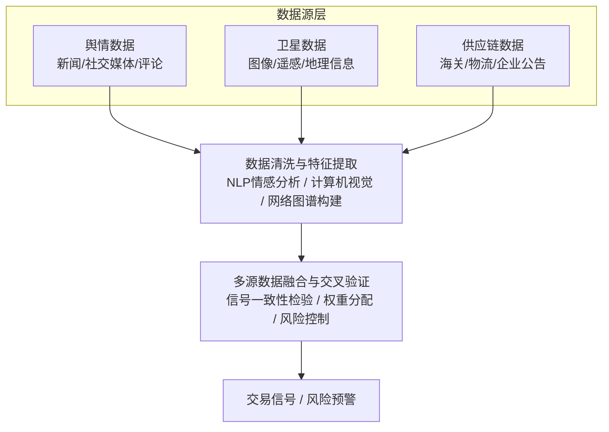

# 第二十讲：改进方向-另类数据融合

各位同学，今天我们来聊一个我特别感兴趣的话题——另类数据融合。说白了，就是怎么把那些传统行情数据之外的信息，塞进你的量化模型里。

我入行那会儿，大家用的数据无非就是开盘价、收盘价、成交量这些。后来慢慢发现，光靠这些，你很难跑赢市场。为什么？因为市场越来越有效了。你看到的K线，别人也看到了。你算的均线，别人也算出来了。

那怎么办？找别人看不到的信息。这就是另类数据的价值。

## 舆情数据：市场情绪的"温度计"

先说说舆情数据。我个人习惯把舆情数据分成两类：一类是新闻，一类是社交媒体。

新闻数据，比如财经网站的报道、公司公告。这类数据相对结构化，但时效性差一点。社交媒体，比如微博、股吧、推特，这些数据噪音大，但反应快。

我记得有一次，我在做一只消费股的策略。突然有一天，社交媒体上出现了大量关于该品牌产品质量的负面讨论。传统数据完全没反应，股价还在涨。但舆情数据已经给出了强烈的卖出信号。我果断平仓，第二天股价暴跌。这就是舆情数据的威力。

> **核心逻辑：** 舆情数据本质上是市场情绪的量化。正面情绪多，股价大概率涨；负面情绪多，股价大概率跌。但要注意，情绪有滞后性，也有反转的可能。

怎么用？我建议你构建一个"情绪得分"指标。具体做法：

1. 采集文本数据（新闻、帖子、评论）
2. 用NLP模型做情感分析（正面/负面/中性）
3. 计算情绪得分 = (正面数量 - 负面数量) / 总数量
4. 将情绪得分作为因子，加入你的多因子模型

这里有个坑。我曾经踩过：舆情数据噪音太大。一条假新闻就能让情绪得分瞬间翻红。怎么办？加一个"置信度"权重。比如，只看那些被多次转载的新闻，或者只看认证用户的发言。

> **小技巧：** 舆情数据最好结合成交量一起看。如果情绪得分很高，但成交量没放大，那可能是假信号。

## 卫星数据：从太空看经济

卫星数据听起来很科幻，其实现在已经很成熟了。说白了，就是通过卫星拍摄的图像，来推断经济活动。

举个例子。你想知道某家零售商的客流量怎么样？不用等财报，直接看卫星拍到的停车场照片。车多，说明生意好；车少，说明生意差。

我参与过一个项目，用卫星数据预测原油库存。怎么做的？看油罐的阴影长度。油罐里的油越多，阴影越短。通过计算阴影长度，就能估算出库存量。这个数据比官方发布早一周，而且准确率很高。

> **核心逻辑：** 卫星数据提供的是"物理世界"的实时信息。它不受财报披露周期的影响，能让你提前发现趋势。

卫星数据的处理流程：

1. 获取卫星图像（分辨率越高越好，但成本也越高）
2. 图像预处理（去噪、校正、裁剪）
3. 目标识别（用计算机视觉模型识别停车场、油罐、农田等）
4. 量化指标（计算车辆数量、阴影长度、植被覆盖率等）
5. 与资产价格建立关联

嗯，这里要注意。卫星数据不是万能的。它受天气影响很大。阴天、雾霾，图像质量就会下降。另外，卫星数据的成本很高，小团队可能玩不起。

> **避坑指南：** 我曾经因为卫星数据分辨率不够，把一辆卡车误判成了两辆小车。结果模型预测的客流量翻了一倍。后来我学乖了，一定要用多源数据交叉验证。

## 供应链数据：产业链的"心电图"

供应链数据，说白了就是追踪一家公司的上下游。它告诉你，这家公司的原材料从哪里来，产品卖到哪里去。

为什么重要？因为现代企业都是全球化的。一家公司的股价，可能不取决于它自己，而取决于它的供应商或客户。

举个例子。苹果公司的供应商出了问题，苹果的股价也会受影响。如果你能提前知道供应商的库存数据，你就能预判苹果的业绩。

> **核心逻辑：** 供应链数据揭示了企业之间的"隐性关联"。这种关联在传统财务数据里是看不到的。

供应链数据的来源：

- 海关数据（进出口记录）
- 物流数据（货运量、运输路线）
- 企业公告（供应商名单、客户名单）
- 行业报告（产业链图谱）

我建议你构建一个"供应链网络图"。把每个公司看作一个节点，把交易关系看作一条边。然后计算每个节点的"中心度"。中心度高的公司，一旦出问题，整个网络都会受影响。

我曾经用这个方法，成功预测了一次汽车行业的黑天鹅事件。一家小型零部件供应商的物流数据突然中断，我立刻意识到它可能停产了。而这家供应商是多家车企的二级供应商。我迅速做空了相关车企的股票。一周后，消息才被媒体曝光。

> **小技巧：** 供应链数据最好结合"库存周转率"一起看。如果一家公司的库存周转率突然下降，但供应链数据显示它的出货量在增加，那可能是它在囤货。囤货往往意味着涨价预期。

## 三种数据的融合策略

单独用某一种另类数据，效果有限。真正的价值在于融合。我个人的经验是：

- **舆情数据**：用于捕捉短期情绪波动
- **卫星数据**：用于验证中期基本面变化
- **供应链数据**：用于发现长期结构性机会

举个例子。你想投资一家航空公司。舆情数据显示，最近关于该公司的负面新闻增多。卫星数据显示，该公司的飞机停场数量在增加。供应链数据显示，它的燃油采购量在下降。三个数据都指向同一个方向：这家公司可能出问题了。这时候，你该怎么做？

嗯，答案很明显。做空或者回避。

反过来，如果舆情数据正面，卫星数据显示客流量增加，供应链数据显示燃油采购量上升。那这就是一个强烈的买入信号。

> **核心逻辑：** 多源数据交叉验证，能大幅提高信号的可靠性。单一数据源可能有噪音，但多个数据源同时指向同一个方向，那大概率是趋势。

最后，我想说一句。另类数据不是银弹。它也有局限性。比如，数据清洗成本高、隐私合规风险大、模型过拟合风险高。但如果你能用好它，它确实能给你带来超额收益。

好了，这一讲就到这里。记住，数据是死的，人是活的。关键是怎么用。

