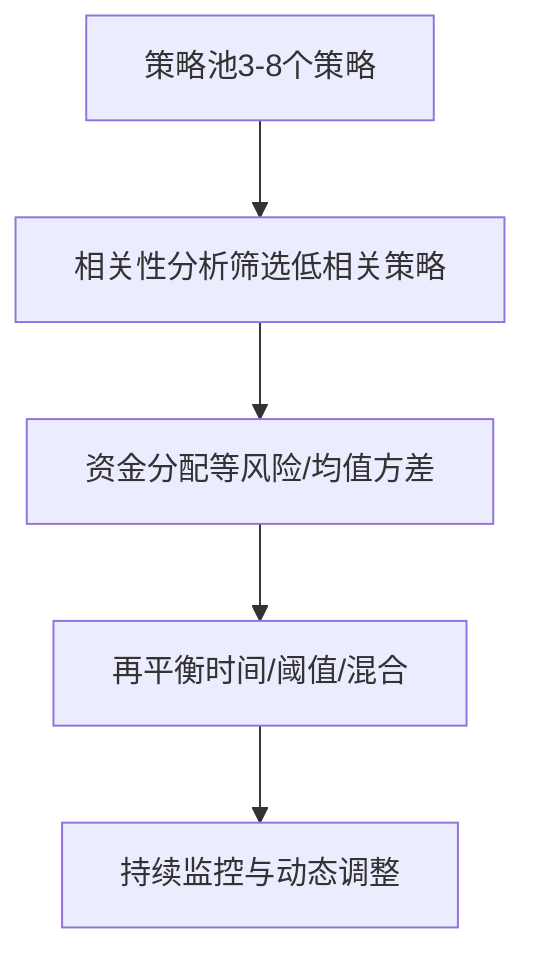

# 多策略组合：从"单打独斗"到"团队作战"

各位同学，咱们今天聊一个实战中绕不开的话题——多策略组合。

做量化时间久了，你会发现一个尴尬的现实：没有哪个策略能永远赚钱。我见过太多人，辛辛苦苦开发出一个年化30%的策略，结果市场风格一变，回撤直接打回原形。说白了，单一策略就像把鸡蛋放在一个篮子里，风险太集中了。

那怎么办？多策略组合。把几个相关性低的策略放在一起，让它们互相补位。今天我就把我在这个方向上的实战经验，掰开了揉碎了讲给你听。

## 一、策略相关性分析：找到"不一起跌"的伙伴

多策略组合的核心，不是找最好的策略，而是找"不一起跌"的策略。

我习惯用**皮尔逊相关系数**来衡量策略之间的相关性。简单说，就是看两个策略的每日收益率是不是"同涨同跌"。

> **核心原则：**
>
> - 相关系数 < 0.3：低相关，组合效果较好
> - 相关系数 0.3 ~ 0.7：中等相关，需要谨慎
> - 相关系数 > 0.7：高相关，组合意义不大

我在项目中遇到过这样的情况：两个趋势跟踪策略，一个做日线级别，一个做小时级别。看起来不一样，但相关系数算出来0.8。为什么？因为市场大趋势来的时候，它们都在追涨杀跌。这种组合，其实没起到分散风险的作用。

真正有效的组合，是趋势策略+均值回归策略，或者股票多空+商品CTA。它们赚钱的逻辑完全不同，市场不好的时候，往往一个亏钱另一个在赚钱。

```python
# 计算策略相关性（Python示例）
import numpy as np
import pandas as pd

# 假设有两个策略的日收益率序列
strategy_a = pd.Series([0.01, -0.005, 0.02, -0.01, 0.015])
strategy_b = pd.Series([-0.008, 0.012, -0.003, 0.018, -0.006])

corr = np.corrcoef(strategy_a, strategy_b)[0, 1]
print(f"策略A与策略B的相关系数: {corr:.2f}")

# 如果corr < 0.3，恭喜你，找到了好搭档
```

> **我的小技巧：** 别只看全样本的相关性。市场波动大的时候和波动小的时候，相关性会变。我建议你滚动计算60天的相关系数，看看它是不是稳定的。如果平时低相关，一遇到大跌就变成高相关，那这个组合其实没啥用。

## 二、资金分配：别平均分，要"看人下菜碟"

找到了低相关的策略，接下来就是怎么分钱。

很多人图省事，直接平均分配。比如4个策略，每个25%。这其实不太对。你想想看，如果其中一个策略明显比其他的强，为什么给它和弱策略一样的钱？

我常用的方法有两种：

### 1. 等风险贡献（Risk Parity）

让每个策略对组合总风险的贡献相等。风险大的策略少分点钱，风险小的多分点钱。这样组合更稳。

```python
# 等风险贡献分配示例
import numpy as np

# 假设三个策略的年化波动率
vols = np.array([0.15, 0.20, 0.25])
# 目标：每个策略的风险贡献相等
# 权重与波动率成反比
weights = 1 / vols
weights = weights / weights.sum()
print(f"策略权重: {weights}")
# 输出: [0.405, 0.304, 0.291]
```

### 2. 均值-方差优化（Mean-Variance）

这个更高级一点，考虑策略的预期收益、波动率和相关性，算出最优权重。但有个坑——预期收益很难估计准。我曾经用历史收益去优化，结果样本外表现一塌糊涂。

> **避坑指南：** 我曾经犯过一个错误——直接用过去3年的夏普比率来分配资金。结果呢？过去表现好的策略，接下来半年就开始回撤。后来我改用"半衰期加权"，给近期的数据更高权重，效果好了不少。

我个人习惯的做法是：先用等风险贡献打个底，然后根据策略近期的表现做微调。比如，某个策略最近3个月夏普比率明显下降，我就适当降低它的权重。但调整幅度不要太大，单次不超过5%。

## 三、再平衡规则：别不动，也别乱动

资金分配好了，不是一劳永逸。随着策略表现的变化，权重会慢慢偏离初始设定。比如一个策略赚钱了，它的权重自动变大，风险也就变大了。这时候就需要再平衡。

再平衡的频率怎么定？我总结了几种常见做法：

| 再平衡方式 | 优点 | 缺点 | 适用场景 |
|-----------|------|------|---------|
| 固定时间（每月/每季） | 简单、可预期 | 可能错过最佳时机 | 策略相关性稳定时 |
| 阈值触发（偏离5%时） | 只在必要时调整 | 频繁触发时交易成本高 | 高波动市场 |
| 混合方式 | 兼顾成本和及时性 | 规则稍复杂 | 大多数情况 |

我个人最常用的是混合方式：每月检查一次，如果某个策略的权重偏离目标超过5%，就调回来；如果没超过，就不动。这样既控制了风险，又不会因为频繁交易吃掉利润。

> **再平衡的一个细节：** 再平衡的时候，别忘了考虑交易成本。尤其是期货策略，滑点和手续费加起来可能吃掉不少收益。我一般会设定一个"最小调整阈值"，比如调整金额低于总资金的1%就跳过。

## 四、一张图看懂多策略组合的核心逻辑

说了这么多，我画了一张流程图，帮你把整个流程串起来。



关键指标：

- 相关系数 < 0.3
- 夏普比率 > 1.0
- 最大回撤 < 15%

常见陷阱：

- 过度优化
- 忽略交易成本
- 再平衡太频繁

## 五、实战中的几个坑

最后，我分享几个自己踩过的坑，希望能帮你少走弯路。

- **坑一：过度追求低相关。** 我曾经为了找低相关策略，硬凑了5个完全不相关的策略。结果呢？每个策略单独看都不错，但组合在一起，收益被平均了，还不如只做两个最好的。记住，低相关是手段，不是目的。组合的最终目标是提高风险调整后收益。
- **坑二：再平衡太频繁。** 有一段时间，我每周都做再平衡。结果交易成本吃掉了一大块利润，而且频繁调整反而让组合不稳定。后来我改成每月一次，效果反而更好。
- **坑三：忽略策略容量。** 有些策略资金容量有限，比如高频策略。你分配了太多资金，结果策略执行不了，或者冲击成本太大。我建议你在分配资金前，先估算每个策略的容量上限。

> **总结一下：** 多策略组合不是简单的"1+1=2"，而是通过低相关策略的搭配，让组合更稳、更抗跌。核心三步走：分析相关性、合理分配资金、制定再平衡规则。每一步都有细节，别偷懒。

好了，今天就聊到这里。多策略组合这块，说起来简单，做起来全是细节。希望今天的分享能给你一些启发。

