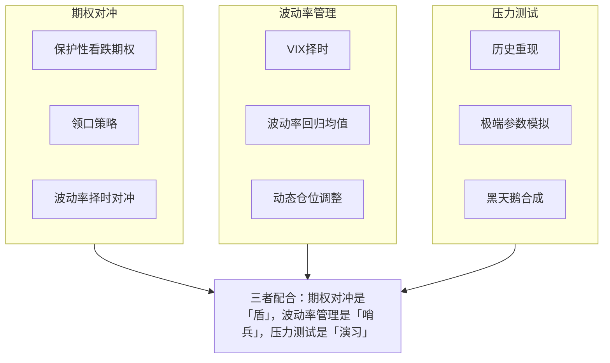

# 改进方向-尾部风险对冲：期权对冲、波动率管理、压力测试

做量化策略这些年，我踩过最大的坑，就是「黑天鹅」。

2015年股灾那会儿，我有个策略回测夏普比高达3.2，实盘前三个月也顺风顺水。结果7月8号那天，千股跌停，策略一天亏了18%。回测里明明最大回撤才8%啊！

后来我才明白：**回测数据里没有「尾部风险」**。你回测十年，可能只遇到一次极端行情，但这一次就能让你爆仓。

所以今天聊的尾部风险对冲，说白了就是——**怎么给策略买「保险」**。

> **核心观点：** 尾部风险无法消除，只能转移或对冲。期权是天然的工具，波动率管理是日常监控，压力测试是最后的防线。

## 一、期权对冲：最直接的「保险单」

我个人习惯把期权对冲分成两类：**保护性对冲**和**收益增强型对冲**。

### 1.1 保护性看跌期权（Protective Put）

这是最朴素的做法。你持有股票多头，就买一份虚值看跌期权。万一暴跌，期权赚的钱能补上股票的亏损。

我在一个CTA策略里试过：持有螺纹钢多头，同时买一份行权价低5%的看跌期权。成本大概是权利金的1.2%。结果那年螺纹钢真跌了12%，期权赚了7%，整体只亏了5%。

> **避坑指南：** 我曾经犯过一个错——买深度虚值期权，觉得便宜。结果行情真来了，期权根本来不及反应。后来我改成买「平值附近」的期权，虽然贵点，但保护效果实在。

### 1.2 领口策略（Collar Strategy）

如果你觉得纯买期权太贵，可以试试领口策略：**买看跌 + 卖看涨**。卖看涨收的权利金，正好补贴买看跌的成本。

举个例子：

```text
// 假设持有100股茅台，当前股价2000元
// 买入行权价1900的看跌期权（成本50元）
// 卖出行权价2100的看涨期权（收入30元）
// 净成本 = 50 - 30 = 20元/股
// 最大亏损 = (2000 - 1900) + 20 = 120元/股
// 最大收益 = (2100 - 2000) - 20 = 80元/股
```

你看，锁死了亏损上限，也牺牲了部分上涨空间。这适合那些「不求暴富，但求不亏」的资金。

## 二、波动率管理：动态调整的「安全带」

期权对冲是静态的，但市场是动态的。你想想看，波动率低的时候期权便宜，波动率高的时候期权贵。如果只在波动率低的时候买保护，成本最低。

我常用的方法是**波动率择时对冲**：

| 波动率状态 | 对冲策略 | 逻辑 |
|-----------|---------|------|
| 低波动（VIX < 15） | 买入虚值看跌期权 | 便宜，买得起 |
| 中等波动（15 < VIX < 25） | 领口策略 | 成本可控 |
| 高波动（VIX > 25） | 卖出波动率（如卖出看跌） | 波动率回归均值 |

嗯，这里要注意：**高波动时别追着买保护**。2020年3月，VIX冲到80，有人恐慌性买入看跌期权，结果权利金贵得离谱，后来波动率回落，期权归零，亏得比股票还惨。

> **警告：** 波动率管理不是万能药。它只能对冲「波动率上升」的风险，对「方向性暴跌」的保护有限。我见过有人用波动率对冲策略，结果遇到闪崩，波动率没来得及反应，照样亏。

## 三、压力测试：模拟「世界末日」

压力测试，说白了就是**假设最坏的情况发生，你的策略能扛多久**。

我一般做三类压力测试：

1. **历史重现**：把2008年、2015年、2020年的行情数据塞进去，看策略表现
2. **极端参数**：比如假设波动率翻倍、相关性全部变成1、流动性下降90%
3. **黑天鹅合成**：人为构造一个「连续跌停+流动性枯竭」的场景

举个例子，我测试过一个多因子选股策略：

```text
# 压力测试：假设市场连续5天跌停
# 策略持仓100只股票，每只仓位1%
# 第一天：全部跌停，净值变成0.9
# 第二天：继续跌停，净值变成0.81
# 第三天：跌停，净值0.729
# 第四天：跌停，净值0.656
# 第五天：跌停，净值0.590
# 结果：最大回撤41%，超过策略设定的30%止损线
```

看到这个结果，我果断把仓位从100%降到70%，留了30%现金应对极端情况。

> **我的经验：** 压力测试别只做一次。我习惯每季度更新一次，因为市场结构在变。比如2020年之后，流动性风险明显上升，压力测试的参数就得调。

## 四、知识体系总览

下面这张图，是我自己梳理的尾部风险对冲框架。你看一眼，基本就明白这三块怎么配合了。



## 五、实战中的取舍

说实话，尾部风险对冲没有完美方案。你保护得越全面，成本越高，策略收益就越低。我见过有人把一半的收益都花在了对冲上，结果策略跑不赢国债。

我的建议是：**根据策略的「脆弱性」来决定对冲力度**。

- **高杠杆策略**（如期货CTA）：必须做期权对冲，成本再高也得做
- **低杠杆策略**（如指数增强）：可以只做压力测试，留现金应对
- **高频策略**：尾部风险影响小，波动率管理就够了

最后说一句：**别等到暴风雨来了才想起买伞**。尾部风险对冲，平时看着是浪费钱，但真用上的时候，它能救你的命。

> **总结：** 期权对冲解决「怎么保」，波动率管理解决「什么时候保」，压力测试解决「保多少」。三管齐下，你的策略才能扛得住黑天鹅。

