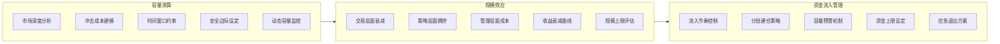

# 改进方向-规模容量管理：容量测算、规模效应、资金流入管理

做量化策略，最怕什么？

不是回测不好看，而是实盘跑起来发现——嗯？怎么跟回测差这么多？

我见过太多团队，回测曲线漂亮得像教科书，一上实盘就崩。崩的原因十有八九跟容量有关。说白了，你的策略能吃下多大的资金量，这是个硬约束。今天我们就聊聊这个。

## 容量测算：你的策略到底能吃下多少钱

先问个问题：一个日频交易策略，回测年化收益30%，你觉得它能管多少钱？

我告诉你，可能连5000万都撑不住。为什么？因为市场深度不够，你的订单一进去，价格就跑了。

容量测算，核心就三个维度：

- **市场深度**：你交易的品种，在目标价位上有多少对手盘
- **冲击成本**：每多交易一股，价格滑点会增加多少
- **时间窗口**：你需要在多长时间内完成交易

我个人习惯用这个公式做快速估算：

```python
# 容量估算示例（Python）
def estimate_capacity(avg_volume, price, max_participation=0.05):
    """
    avg_volume: 日均成交量（股数）
    price: 当前价格
    max_participation: 最大参与率，一般取5%
    """
    daily_capacity = avg_volume * price * max_participation
    # 假设持仓周期为5天
    strategy_capacity = daily_capacity * 5
    return strategy_capacity

# 举个栗子
avg_vol = 10000000  # 1000万股
price = 50.0
cap = estimate_capacity(avg_vol, price)
print(f"策略容量约: {cap/1e8:.2f} 亿元")
```

注意，这只是个粗糙的估算。我在项目中遇到过，有些小盘股看着流动性不错，但实际交易时，5%的参与率已经能把价格打飞了。所以，我建议你至少留出50%的安全边际。

> **核心原则**：容量测算不是算一个数，而是算一个区间。下限是你能安全交易的规模，上限是策略开始明显失效的临界点。

## 规模效应：资金量越大，收益越薄

规模效应，说白了就是边际收益递减。你想想看，一个策略管100万和管10个亿，操作难度完全不是一个量级。

我把它拆成三个层次：

1. **交易层面的规模效应**：资金大了，冲击成本上升，交易执行变慢
2. **策略层面的规模效应**：信号拥挤，同向交易的人多了，你的alpha就被稀释了
3. **管理层面的规模效应**：团队扩张，沟通成本上升，决策效率下降

这里有个我常用的经验曲线：

| 资金规模 | 预期收益衰减 | 主要原因 |
|---------|------------|---------|
| 1000万以下 | 几乎无衰减 | 市场深度充足 |
| 1000万-1亿 | 5%-15% | 冲击成本开始显现 |
| 1亿-10亿 | 15%-40% | 信号拥挤+执行难度 |
| 10亿以上 | 40%-70% | 多重因素叠加 |

嗯，这里要注意：这个表格只是参考，不同策略差异很大。高频策略的容量衰减比中低频策略快得多。我见过一个高频做市策略，管到5000万就开始明显衰减了。

> **我的建议**：在策略设计阶段，就把规模效应纳入考虑。不要等实盘跑大了才发现问题。我曾经吃过这个亏，一个CTA策略管到2个亿时，收益直接腰斩，后来花了三个月才把仓位降下来。

## 资金流入管理：别让钱砸死你的策略

资金流入管理，很多人不重视。觉得有钱进来还不好吗？

其实，资金流入过快，对策略是致命的。为什么？

- 新资金需要时间建仓，建仓过程本身就会推高成本
- 策略的alpha是有限的，资金多了，单位资金的alpha必然下降
- 流动性约束下，大资金进出会留下明显的交易痕迹

我建议你建立一套资金流入管理机制：

```python
# 资金流入管理示例
class CapitalInflowManager:
    def __init__(self, base_capacity, max_capacity):
        self.base_capacity = base_capacity  # 安全容量
        self.max_capacity = max_capacity    # 最大容量
        self.current_aum = 0

    def can_accept_inflow(self, amount):
        """判断是否能接受新资金"""
        new_aum = self.current_aum + amount
        if new_aum > self.max_capacity:
            return False, f"超出最大容量{self.max_capacity}"
        if new_aum > self.base_capacity * 1.2:
            return False, "接近容量上限，建议暂停流入"
        return True, "可以接受"

    def schedule_inflow(self, amount, days=30):
        """分批流入，降低冲击"""
        daily_amount = amount / days
        return [daily_amount] * days
```

你看，核心思路就是：**控制节奏，分批流入**。不要一次性把资金打满，给策略一个适应期。

> **避坑指南**：我曾经见过一个团队，策略回测表现很好，结果一个月内涌入了5倍的资金。基金经理没顶住压力，全仓杀入。结果呢？建仓成本比回测高了30%，后续收益根本覆盖不了。最后不得不清盘。记住：资金管理不是财务问题，是策略问题。

## 知识体系总览

下面这张图，是我对规模容量管理的整体理解。你可以把它当作一个检查清单：



核心目标：在收益、风险、容量之间找到最优平衡点。

容量测算 → 规模效应评估 → 资金流入管理 → 动态调整

关键指标：夏普比率衰减率、冲击成本占比、资金利用率

监控频率：日频监控冲击成本，周频评估容量变化，月频调整资金上限

这张图把三个核心模块串起来了。你从容量测算开始，评估规模效应，最后落到资金流入管理上。三者缺一不可。

最后说一句：规模容量管理不是一劳永逸的事。市场在变，策略在变，你的容量上限也在变。定期复盘，动态调整，才是正道。

