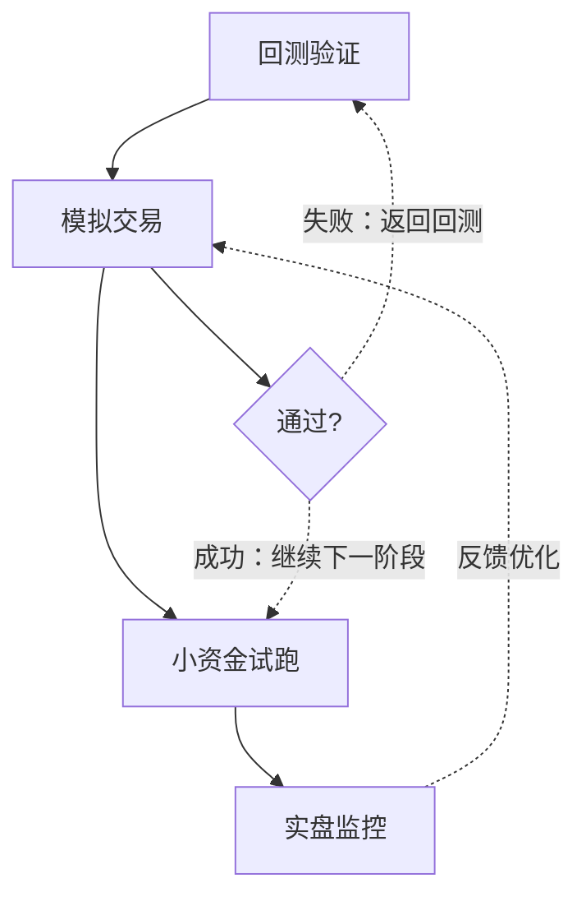

# 改进方向-实盘过渡：模拟交易、小资金试跑、实盘监控

各位同学，今天我们来聊一个非常关键的话题——策略从回测到实盘的过渡。说实话，我见过太多策略在回测里跑得漂亮，一到实盘就崩盘。为什么？因为回测环境太干净了，实盘才是真正的丛林。

我个人习惯把实盘过渡分成三个阶段：模拟交易、小资金试跑、实盘监控。这三个阶段缺一不可，每个阶段都有它独特的价值。下面我逐一展开讲。

### 一、模拟交易：检验策略的"沙盘推演"

模拟交易，说白了就是用虚拟资金跑你的策略。很多人觉得模拟交易没用，因为不是真金白银，心态不一样。但我告诉你，模拟交易最大的价值不是赚钱，而是暴露问题。

> **模拟交易的核心目标：**
>
> - 验证策略逻辑在实时行情下是否有效
> - 检查交易系统的稳定性（比如API连接、数据延迟）
> - 发现回测中无法模拟的细节问题（比如滑点、手续费计算）

我在项目中遇到过一件事：一个CTA策略在回测里年化收益30%，模拟交易跑了两个月，收益只有8%。后来一查，发现是回测时用的tick数据太理想，模拟交易时实际滑点比预期大了3倍。嗯，这个问题如果不暴露，实盘直接上，后果可想而知。

> **我的建议：** 模拟交易至少跑1-3个月，覆盖不同的市场环境（震荡、趋势、高波动）。别急着上实盘，让子弹飞一会儿。

### 二、小资金试跑：用真金白银"试水"

模拟交易没问题了，下一步就是小资金试跑。这一步很关键，因为模拟交易和实盘最大的区别在于——心态和执行力。

我曾经见过一个团队，模拟交易跑得风生水起，结果小资金一上，第一天就亏了5%，团队直接慌了，手动干预策略，结果越改越糟。为什么会这样？因为模拟交易亏的是虚拟数字，实盘亏的是真金白银，心理压力完全不同。

> **小资金试跑的注意事项：**
>
> - 资金量建议：总资金的1%-5%，别超过10%
> - 运行时间：至少1-2个月，或者完成20-30笔交易
> - 监控指标：重点看实际滑点、成交率、延迟
> - 不要手动干预：除非出现极端行情或系统故障

我个人习惯在小资金阶段做一件事：记录每一笔交易的"心理成本"。比如，某笔交易亏了，我当时的情绪是什么？有没有想改参数？这些记录对后续优化很有帮助。

### 三、实盘监控：全天候的"护航系统"

小资金试跑稳定了，就可以逐步加仓到目标资金量。但这不是终点，而是新的起点。实盘监控才是长期稳定盈利的保障。

实盘监控要关注哪些东西？我列一个清单：

| 监控维度 | 具体指标 | 预警阈值 |
| --- | --- | --- |
| 策略表现 | 累计收益、最大回撤、夏普比率 | 回撤超过历史最大回撤的1.5倍 |
| 交易执行 | 成交率、滑点、延迟 | 成交率低于90%，滑点超过预期2倍 |
| 系统状态 | API连接、数据源、服务器负载 | 连接中断超过30秒 |
| 市场环境 | 波动率、流动性、相关性 | 波动率突变超过3个标准差 |

这里我要强调一点：监控不是看热闹，是要有行动预案。比如，当回撤超过阈值时，是减仓、暂停还是直接清仓？这些都要提前想好。

> **实盘监控的"三不"原则：**
>
> - 不轻易改参数：除非有明确的统计证据
> - 不频繁切换策略：给策略足够的时间证明自己
> - 不忽视小问题：小问题往往是系统崩溃的前兆

### 四、核心逻辑：从回测到实盘的完整流程

为了让大家更直观地理解，我画了一张流程图，展示从回测到实盘的完整过渡路径。

这张图的核心逻辑是：每个阶段都有明确的通过标准，不达标就返回上一阶段。比如，模拟交易阶段，如果发现策略逻辑有问题，就返回回测去修改；小资金试跑阶段，如果发现滑点太大，就返回模拟交易去优化执行算法。

### 五、避坑指南：我踩过的那些坑

最后，分享几个我亲身踩过的坑，希望能帮大家少走弯路。

> **坑1：模拟交易时间太短**
>
> 我曾经有一个策略，模拟交易只跑了2周，看起来不错，结果一上实盘就遇到极端行情，直接亏了15%。后来我规定，模拟交易至少跑1个月，覆盖至少一次市场波动事件。

> **坑2：小资金试跑时手动干预**
>
> 我记得有一次，小资金试跑第三天亏了3%，团队里有人建议改参数。我坚持不让改，结果后面两周策略自己回来了。如果当时改了，可能就错过了一波行情。

> **坑3：实盘监控只看收益**
>
> 很多人实盘监控只看赚了多少钱，忽略了系统状态。我有个朋友，策略收益一直很好，结果有一天API断了，他还在傻傻等成交，最后亏了一大笔。现在我的监控系统里，系统状态和策略表现是同等重要的。

好了，关于实盘过渡的内容就讲到这里。记住，从回测到实盘，每一步都要稳扎稳打。别急着赚钱，先保证不亏钱。
