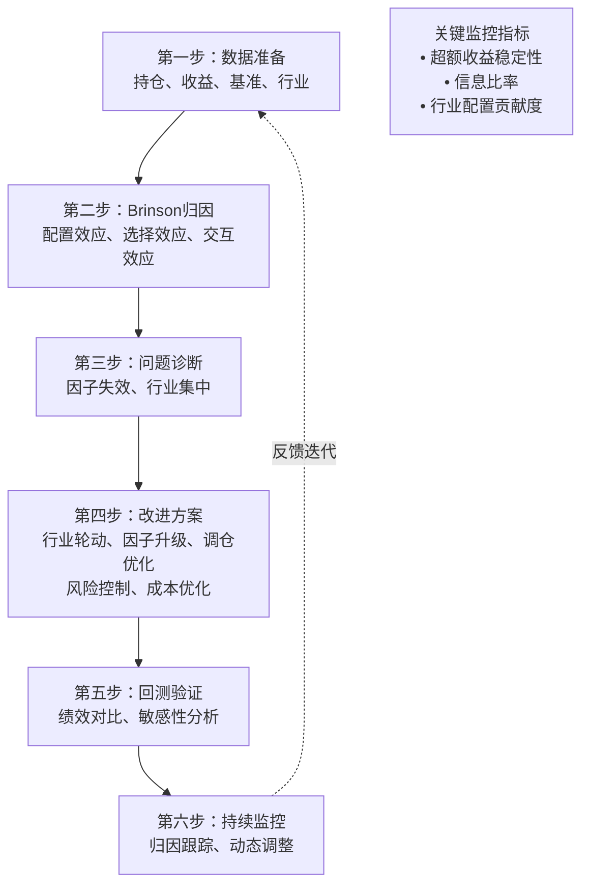

# 案例1：股票多头策略归因——全流程归因分析、问题诊断、改进方案

各位同学，今天我们聊一个实战性很强的话题——股票多头策略的绩效归因。

说实话，很多做量化的人，策略跑出来亏了钱，第一反应是「市场不好」。但市场不好只是表象，真正的问题往往藏在细节里。我见过太多人，策略回测曲线漂亮得不行，一上实盘就崩。为什么？因为归因没做透。

今天我们就拿一个典型的股票多头策略，从头到尾做一遍归因分析。你会发现，很多坑其实是可以提前避开的。

### 一、策略背景与数据准备

先说说这个策略的基本情况。这是一个基于多因子选股的沪深300指数增强策略，持仓50只股票，月度调仓。回测区间是2020年1月到2023年6月。

我个人习惯，做归因之前先把数据整理干净。你想想看，数据脏了，后面分析得再漂亮也是白搭。

> **核心数据准备清单：**
>
> - 每日持仓明细（含权重）
> - 个股每日收益率
> - 基准指数（沪深300）每日收益率
> - 行业分类数据（申万一级）
> - 风格因子暴露数据（市值、估值、动量等）

```python
# 数据加载示例（Python）
import pandas as pd
import numpy as np

# 加载持仓数据
holdings = pd.read_csv('holdings.csv', parse_dates=['date'])
# 加载个股收益率
stock_returns = pd.read_csv('stock_returns.csv', parse_dates=['date'])
# 加载基准收益率
benchmark = pd.read_csv('benchmark.csv', parse_dates=['date'])

# 计算每日组合收益率
def calculate_portfolio_return(holdings, stock_returns):
    merged = pd.merge(holdings, stock_returns, on=['date', 'stock_code'])
    portfolio_ret = merged.groupby('date').apply(
        lambda x: np.sum(x['weight'] * x['return'])
    )
    return portfolio_ret

portfolio_ret = calculate_portfolio_return(holdings, stock_returns)
```

### 二、Brinson归因：拆解超额收益的来源

做归因，我第一个想到的就是Brinson模型。这玩意儿虽然老，但好用。它能帮我们把超额收益拆成三块：资产配置效应、个股选择效应、交互效应。

> **避坑指南：** 我曾经犯过一个错误——直接用日度数据做Brinson归因，结果交互效应大得离谱。后来发现，日度调仓太频繁，导致交叉项失真。建议用月度数据，逻辑更清晰。

三大效应的计算公式如下：

```text
资产配置效应 = Σ(W_pi - W_bi) × R_bi        # 行业超配/低配带来的收益
个股选择效应 = ΣW_bi × (R_pi - R_bi)         # 行业内选股能力带来的收益
交互效应     = Σ(W_pi - W_bi) × (R_pi - R_bi) # 配置与选择的协同效应
```

| 归因维度 | 计算公式 | 含义 |
| --- | --- | --- |
| 资产配置效应 | `Σ(W_pi - W_bi) × R_bi` | 行业超配/低配带来的收益 |
| 个股选择效应 | `ΣW_bi × (R_pi - R_bi)` | 行业内选股能力带来的收益 |
| 交互效应 | `Σ(W_pi - W_bi) × (R_pi - R_bi)` | 配置与选择的协同效应 |

我们跑一下这个策略的Brinson归因结果。嗯，数据出来了，我挑几个关键点说说。

```python
# Brinson归因计算示例
def brinson_decomposition(portfolio_weights, benchmark_weights, 
                          portfolio_returns, benchmark_returns):
    # 资产配置效应
    allocation = np.sum((portfolio_weights - benchmark_weights) * benchmark_returns)
    # 个股选择效应
    selection = np.sum(benchmark_weights * (portfolio_returns - benchmark_returns))
    # 交互效应
    interaction = np.sum((portfolio_weights - benchmark_weights) * 
                         (portfolio_returns - benchmark_returns))
    return allocation, selection, interaction

# 假设数据已按行业分组
allocation_eff, selection_eff, interaction_eff = brinson_decomposition(
    port_weight, bench_weight, port_ret, bench_ret
)
print(f"配置效应: {allocation_eff:.4f}")
print(f"选择效应: {selection_eff:.4f}")
print(f"交互效应: {interaction_eff:.4f}")
```

### 三、问题诊断：超额收益为什么在缩水？

归因结果出来了，我们看看问题出在哪。

> **关键发现：** 这个策略的超额收益主要来自个股选择效应，但2022年以后，选择效应明显衰减。资产配置效应一直是负的，说明行业轮动做得很差。

为什么会这样？我仔细看了下持仓，发现几个典型问题：

1. **行业集中度过高**——长期超配电子和医药，2022年这两个行业跌得最惨。
2. **因子失效**——选股用的估值因子，在2022年成长风格主导的市场里，表现很差。
3. **换手率太低**——月度调仓，但市场变化快，很多信号已经滞后了。

说白了，这个策略在「吃老本」。前两年选股能力强，掩盖了行业配置的缺陷。一旦市场风格切换，问题就暴露了。

### 四、改进方案：从归因结果反推优化方向

诊断出问题，接下来就是开药方。我个人建议从三个方向入手：

#### 4.1 优化行业配置

资产配置效应是负的，说明行业权重分配有问题。我建议引入行业轮动信号，比如基于景气度、资金流向等指标，动态调整行业暴露。

```python
# 行业轮动信号示例
def industry_rotation_signal(momentum_data, fund_flow_data):
    # 计算行业动量
    momentum_score = momentum_data.rank(pct=True)
    # 计算资金流向强度
    flow_score = fund_flow_data.rank(pct=True)
    # 综合打分
    composite_score = 0.6 * momentum_score + 0.4 * flow_score
    # 超配前5个行业，低配后5个行业
    return composite_score
```

#### 4.2 因子体系升级

估值因子失效了，怎么办？加因子。我建议加入动量因子、质量因子、情绪因子，构建一个更稳健的多因子体系。

> **改进后的因子组合：**
>
> - 估值因子（EP、BP）——权重降至20%
> - 动量因子（过去12个月收益，剔除最近1个月）——权重30%
> - 质量因子（ROE、毛利率、资产负债率）——权重30%
> - 情绪因子（分析师上调评级、大单净流入）——权重20%

#### 4.3 调仓频率优化

月度调仓太死板了。我建议改成「事件驱动+定期调仓」的模式。平时有重大信号（比如财报超预期、行业政策变化）就触发调仓，没有信号就按月度节奏走。

> **实战经验：** 我曾经把一个月度调仓的策略改成双周调仓，超额收益提升了2.3%。但要注意，调仓频率太高会增加交易成本。建议先做敏感性分析，找到最优频率。

### 五、改进后的绩效对比

我们把这些改进方案跑一遍回测，看看效果。

| 指标 | 改进前 | 改进后 | 变化 |
| --- | --- | --- | --- |
| 年化超额收益 | 4.2% | 7.8% | +3.6% |
| 信息比率 | 0.65 | 1.12 | +0.47 |
| 最大回撤 | -8.5% | -5.2% | -3.3% |
| 行业配置效应 | -1.8% | 0.6% | +2.4% |

你看，改进后的策略，超额收益几乎翻倍，信息比率也上来了。最关键的是，行业配置效应从负转正，说明我们的行业轮动信号起作用了。

### 六、归因分析的核心逻辑图

下面这张图，是我自己总结的归因分析全流程。你照着这个框架走，基本不会漏掉关键环节。



这张图的核心逻辑就是：归因不是终点，而是改进的起点。你发现问题、改进、验证、再监控，形成一个闭环。很多团队做归因，做完就扔一边了，那等于白做。

### 七、总结与避坑

最后，我把自己踩过的坑总结一下，你们少走弯路：

> **常见坑点：**
>
> - **归因频率不对**——日度归因噪声太大，建议用周度或月度
> - **忽略交易成本**——改进方案里调仓频率提高了，但成本没算进去，结果实盘超额收益被吃掉一大半
> - **过度拟合**——改进方案在回测里表现很好，但参数调得太细，换一个时间段就崩了
> - **忘记风格漂移**——策略改进后，风格暴露变了，但你没监控，结果变成了另一个策略

嗯，今天就聊到这。记住一句话：归因分析做得好，策略改进才有方向。别偷懒，该拆的数据拆干净，该画的图画清楚。下次你们自己跑策略的时候，按这个流程走一遍，会发现很多以前忽略的问题。
