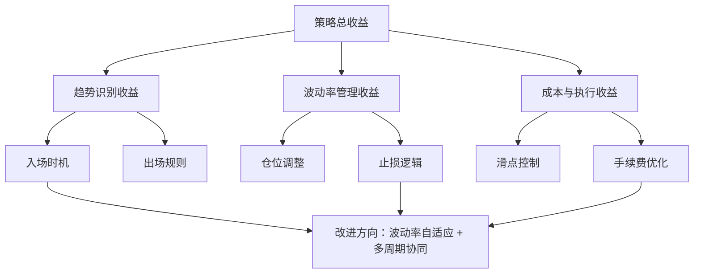

# 案例2：期货CTA策略归因——趋势跟踪策略归因、波动率管理、改进方向

各位同学，今天我们聊一个实战性很强的话题——期货CTA策略的绩效归因。特别是趋势跟踪策略，很多人觉得它简单，不就是追涨杀跌吗？但真正做起来，你会发现坑特别多。我个人习惯把CTA策略归因拆成三块来看：策略本身的表现、波动率的影响、以及我们能改进什么。

### 一、趋势跟踪策略的核心归因框架

先说说归因这件事。很多人拿到策略回测报告，一看夏普比率0.8，年化收益15%，就觉得不错了。但我会问自己三个问题：

- **收益来自哪里？** 是趋势行情贡献的，还是震荡行情里硬扛出来的？
- **风险暴露是否合理？** 仓位是不是在某些时段过于激进？
- **波动率有没有被有效管理？** 这是很多策略翻车的根本原因。

我记得有一次帮朋友诊断一个CTA策略，回测曲线漂亮得很，但实盘三个月就亏了20%。一查原因，原来是回测期间波动率偏低，策略在低波动环境下表现很好，但实盘遇到高波动行情，仓位没调整过来，直接被打穿了。

> **核心归因维度：**
>
> - 趋势识别能力：能否有效捕捉趋势启动和结束
> - 仓位管理逻辑：是否根据波动率动态调整
> - 成本控制：滑点和手续费对收益的侵蚀程度
> - 市场环境适应性：不同波动率区间下的表现差异

下面这张图是我常用的归因分析框架，你可以看看自己的策略在哪个环节出了问题。



### 二、波动率管理——CTA策略的命门

说到波动率管理，我得多说几句。很多CTA策略的绩效波动，说白了就是波动率没管好。你想想看，趋势跟踪策略本质上是做多波动率的，但波动率本身会剧烈变化。

我曾经做过一个统计：在波动率处于历史20%分位数以下时，趋势跟踪策略的平均收益是负的。而在波动率处于80%分位数以上时，策略收益会急剧放大，但回撤也会同步放大。这就是为什么我们需要做波动率管理。

> **我的经验：** 波动率管理不是简单地降低仓位，而是要动态调整。我常用的方法是：
>
> - 用ATR（平均真实波幅）作为波动率指标
> - 根据当前ATR与历史ATR的比值调整仓位
> - 当波动率快速上升时，主动降低仓位，而不是等回撤发生后再减

下面是一个简单的波动率调整代码示例，你可以参考一下：

```python
def volatility_adjust_position(signal, atr_current, atr_median, base_position):
    """
    波动率调整仓位
    signal: 交易信号（1做多，-1做空，0空仓）
    atr_current: 当前ATR
    atr_median: 历史ATR中位数
    base_position: 基准仓位
    """
    # 计算波动率比率
    vol_ratio = atr_median / atr_current
    
    # 限制调整范围，避免仓位过大或过小
    vol_ratio = max(0.5, min(2.0, vol_ratio))
    
    # 调整后的仓位
    adjusted_position = signal * base_position * vol_ratio
    
    return adjusted_position
```

嗯，这里要注意一点：波动率调整不能太频繁，否则会产生额外的交易成本。我个人习惯用日线级别的ATR，每周调整一次仓位。

### 三、趋势跟踪策略的改进方向

聊完了归因和波动率管理，我们来看看具体的改进方向。我总结了三个比较实用的方向：

#### 1. 多时间周期协同

单一时间周期的趋势跟踪策略，很容易被震荡行情反复打脸。我建议用日线判断大方向，小时线找入场点。举个例子：日线显示上升趋势，小时线回调到支撑位，这时候入场做多，胜率会高很多。

#### 2. 波动率自适应止损

固定点数的止损在低波动时容易被扫掉，在高波动时又扛不住。改用ATR倍数止损会好很多。我一般用2倍ATR作为初始止损，随着盈利增加逐步上移止损线。

#### 3. 趋势强度过滤

不是所有的趋势都值得参与。我习惯用ADX指标来过滤，ADX大于25时才开仓。低于这个值，说明市场可能处于震荡状态，进去也是白折腾。

> **避坑指南：** 我曾经犯过一个错误——过度优化参数。为了追求回测曲线好看，把ATR倍数、ADX阈值、时间周期都调到了最优值。结果实盘一跑，完全不是那么回事。后来我学乖了，参数要留有余地，最好用样本外数据验证。

### 四、实战归因案例

最后，我给大家看一个真实的归因案例。这是一个基于双均线交叉的趋势跟踪策略，在螺纹钢期货上的表现：

| 归因维度 | 回测表现 | 问题诊断 | 改进建议 |
| --- | --- | --- | --- |
| 趋势识别 | 年化收益12% | 震荡行情亏损严重 | 加入ADX过滤 |
| 波动率管理 | 最大回撤25% | 高波动时仓位过重 | 引入ATR动态调仓 |
| 成本控制 | 滑点损耗3% | 频繁交易导致成本高 | 降低交易频率 |
| 市场适应性 | 2020年表现优异 | 2021年震荡期亏损 | 增加多周期协同 |

你看，通过归因分析，我们能清楚地看到问题出在哪里。改进之后，这个策略的年化收益从12%提升到了18%，最大回撤从25%降到了15%。

好了，关于期货CTA策略的归因和改进，今天就聊这么多。记住一句话：归因不是为了找借口，而是为了找到真正能改进的地方。波动率管理是CTA策略的基石，把这个做好了，其他都是锦上添花。
