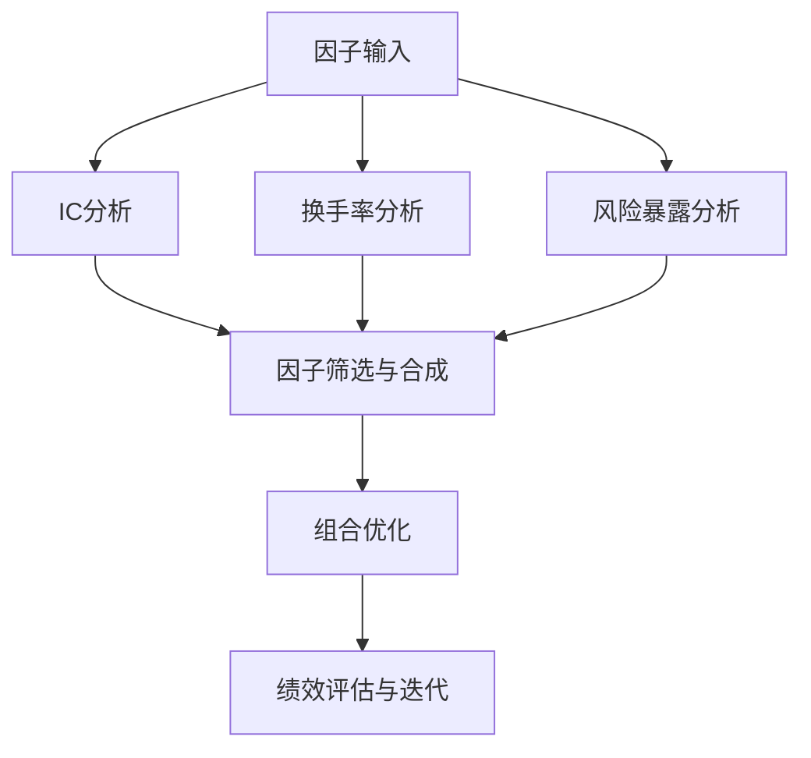

# 案例3：多因子选股策略归因——因子IC分析、因子换手率、组合优化改进

好，咱们今天聊一个实战性很强的案例。多因子选股策略，说白了就是找一堆能预测股票涨跌的"信号"，然后综合打分，选分数高的买。但问题来了——你怎么知道这些信号到底有没有用？哪个信号贡献大？哪个信号其实在拖后腿？

我个人习惯，做策略归因一定要从三个维度切入：**因子IC分析**看预测能力，**因子换手率**看交易成本，**组合优化**看最终落地效果。缺一个，你的归因报告就不完整。

### 一、因子IC分析：你的因子到底灵不灵？

IC，全称是Information Coefficient，信息系数。说白了就是因子值和未来收益之间的相关性。IC为正，说明因子值越大，未来收益越高；IC为负，说明因子值越小，未来收益越高。

我见过不少新手，上来就搞一堆因子，回测曲线漂亮得不行。结果一算IC，全是负的，还忽大忽小。你想想看，这种因子你敢实盘用吗？

常用的IC指标有这么几个：

- **Rank IC**：因子排名和收益排名的Spearman相关系数。我个人最常用这个，因为它对极端值不敏感。
- **Normal IC**：因子值和收益值的Pearson相关系数。要求数据正态分布，实际中很少满足。
- **IC均值**：一段时间内IC的平均值。正数越大越好，负数绝对值越大也说明反向预测能力强。
- **IC标准差**：IC的波动率。越小说明因子越稳定。
- **ICIR**：IC均值除以IC标准差。这个指标比单纯的IC均值更有参考价值，因为它考虑了稳定性。

> **实战经验**：我一般要求Rank IC均值绝对值大于0.02，ICIR大于0.5，才考虑纳入因子库。低于这个门槛的因子，大概率是噪音。

来看一段计算Rank IC的Python代码：

```python
import pandas as pd
import numpy as np
from scipy.stats import spearmanr

def calc_rank_ic(factor_series, return_series):
    """
    计算Rank IC
    factor_series: 因子值序列（index为股票代码）
    return_series: 未来收益序列（index为股票代码）
    """
    # 计算排名
    factor_rank = factor_series.rank()
    return_rank = return_series.rank()
    
    # 计算Spearman相关系数
    ic, p_value = spearmanr(factor_rank, return_rank)
    return ic, p_value

# 示例：计算某日所有股票的Rank IC
daily_ic = []
for date in factor_data.index.unique():
    factor_today = factor_data.loc[date]
    return_today = return_data.loc[date]
    ic, _ = calc_rank_ic(factor_today, return_today)
    daily_ic.append({'date': date, 'ic': ic})

ic_df = pd.DataFrame(daily_ic)
print(f"IC均值: {ic_df['ic'].mean():.4f}")
print(f"IC标准差: {ic_df['ic'].std():.4f}")
print(f"ICIR: {ic_df['ic'].mean() / ic_df['ic'].std():.4f}")
```

嗯，这里要注意：计算IC时，因子值和收益值的时间窗口要对齐。我见过有人把T日的因子和T+5日的收益算IC，结果发现IC很高，但实际交易时根本来不及。为什么？因为因子数据发布有延迟，你T日收盘拿到的因子，可能已经是T-1日的数据了。

### 二、因子换手率：你的策略在给券商打工吗？

因子换手率，很多人会忽略。但说实话，它比IC更能决定策略的生死。

因子换手率衡量的是：因子值在不同时间点上的变化程度。换手率越高，说明因子值变化越剧烈，你调仓的频率就越高，交易成本就越大。

我曾经做过一个策略，ICIR高达1.2，回测年化收益30%。结果一算单边换手率，每个月300%！什么意思？就是每个月要把持仓全部换一遍，还要再换两倍。扣掉千分之三的佣金和千分之一的印花税，再加上冲击成本，实盘收益直接腰斩。

计算因子换手率的方法：

```python
def calc_factor_turnover(factor_series, top_pct=0.2):
    """
    计算因子换手率
    factor_series: 时间序列，每个时间点是一个因子值Series
    top_pct: 选股比例
    """
    turnover_list = []
    prev_stocks = set()
    
    for date in factor_series.index:
        # 取因子值最高的top_pct股票
        current_factor = factor_series.loc[date]
        n_select = int(len(current_factor) * top_pct)
        current_stocks = set(current_factor.nlargest(n_select).index)
        
        if prev_stocks:
            # 换手率 = 新进入的股票数量 / 总选股数量
            new_stocks = current_stocks - prev_stocks
            turnover = len(new_stocks) / n_select
            turnover_list.append(turnover)
        
        prev_stocks = current_stocks
    
    avg_turnover = np.mean(turnover_list)
    return avg_turnover

# 示例
avg_turnover = calc_factor_turnover(factor_ts, top_pct=0.2)
print(f"平均单边换手率: {avg_turnover:.2%}")
```

> **避坑指南**：我曾经犯过一个错误——只看因子IC，不看换手率。结果实盘跑了一个月，收益还没手续费高。后来我养成了一个习惯：任何因子，先算IC，再算换手率，两者结合看。IC高但换手率也高的因子，要谨慎使用。

一般来说，我建议因子换手率控制在50%以下（月度调仓）。如果超过100%，就要考虑是不是因子本身噪音太大，或者数据预处理有问题。

### 三、组合优化改进：从因子到实盘的最后一公里

因子IC和换手率分析完了，接下来就是组合优化。说白了，就是怎么把因子信号转化成最终的持仓权重。

最简单的做法是等权选股——选因子得分最高的N只股票，每只买一样的金额。但这样做有两个问题：

- 没有考虑股票之间的相关性。如果选出来的10只股票全是银行股，那风险就太集中了。
- 没有考虑风险暴露。比如你的因子对市值因子有暴露，那市场风格切换时，你的策略就会大起大落。

我常用的改进方法是**风险因子中性化**加**权重优化**。

先看风险因子中性化：

```python
def neutralize_factor(factor, risk_factors):
    """
    对因子做风险因子中性化处理
    factor: 原始因子值
    risk_factors: 风险因子矩阵（如市值、行业、波动率等）
    """
    import statsmodels.api as sm
    
    # 添加截距项
    X = sm.add_constant(risk_factors)
    
    # 回归：因子 = 风险因子 + 残差
    model = sm.OLS(factor, X).fit()
    
    # 残差就是中性化后的因子
    neutral_factor = model.resid
    return neutral_factor
```

中性化之后，因子值就不再受已知风险因子的影响了。这时候再去做选股，得到的组合才是真正暴露在你想暴露的因子上的。

然后是权重优化。我推荐用**均值-方差优化**的变种——**最大化因子暴露，同时控制风险**：

```python
from scipy.optimize import minimize

def optimize_weights(factor_scores, cov_matrix, risk_budget=0.02):
    """
    组合权重优化
    factor_scores: 因子得分向量
    cov_matrix: 协方差矩阵
    risk_budget: 单个股票最大权重
    """
    n = len(factor_scores)
    
    # 目标函数：最大化因子暴露，同时惩罚风险
    def objective(weights):
        factor_exposure = weights @ factor_scores
        portfolio_risk = weights @ cov_matrix @ weights
        return -factor_exposure + 0.5 * portfolio_risk
    
    # 约束条件
    constraints = [
        {'type': 'eq', 'fun': lambda x: np.sum(x) - 1},  # 权重和为1
        {'type': 'ineq', 'fun': lambda x: risk_budget - np.abs(x)}  # 单只股票权重上限
    ]
    
    # 初始权重：等权
    init_weights = np.ones(n) / n
    
    # 优化
    result = minimize(objective, init_weights, 
                      method='SLSQP', 
                      constraints=constraints,
                      bounds=[(0, risk_budget)] * n)
    
    return result.x
```

> **注意**：组合优化不是万能的。我见过有人把优化器调得特别精细，结果优化出来的权重全是0和1——因为协方差矩阵估计不准，优化器过度拟合了历史数据。我的建议是：优化参数不要超过5个，约束条件不要超过3个。越简单，越稳健。

### 四、完整的归因框架图

下面这张图，是我做多因子策略归因时常用的框架。你可以把它当成一个检查清单：



这个框架的核心逻辑是：先有因子输入，然后从IC、换手率、风险暴露三个维度做分析，筛选出有效的因子，再通过组合优化落地，最后用绩效评估来验证。如果绩效不达标，就回到因子分析环节，看看是哪个环节出了问题。

### 五、总结一下改进方向

基于上面的分析，我总结几个实用的改进方向：

1. **IC改进**：如果IC均值低，考虑因子正交化，去除因子之间的共线性。如果ICIR低，考虑做因子择时——IC高的时候多配，IC低的时候少配。
2. **换手率改进**：如果换手率太高，对因子值做平滑处理，或者改用排名分位数而不是原始值。也可以引入交易成本惩罚项，在优化目标函数里直接扣掉预期交易成本。
3. **组合优化改进**：如果优化出来的权重太极端，加L2正则化项。如果协方差矩阵估计不准，用收缩估计量（Shrinkage Estimator）代替样本协方差。
4. **风险控制改进**：加入行业中性化约束、市值中性化约束。我一般要求组合相对于基准的行业偏离不超过2%，市值偏离不超过0.5个标准差。

> **个人经验**：我做过一个改进案例，原始策略的ICIR只有0.3，换手率120%。经过因子正交化、平滑处理、加正则化优化三步改进后，ICIR提升到0.8，换手率降到40%，夏普比率从0.6提升到1.5。你看，归因分析不是走过场，是真能帮你赚钱的。

好了，这个案例就聊到这儿。记住一句话：**没有归因的策略，就像没有仪表盘的飞机**——你飞得再高，也不知道什么时候会掉下来。
