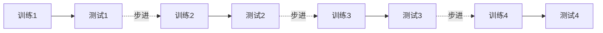
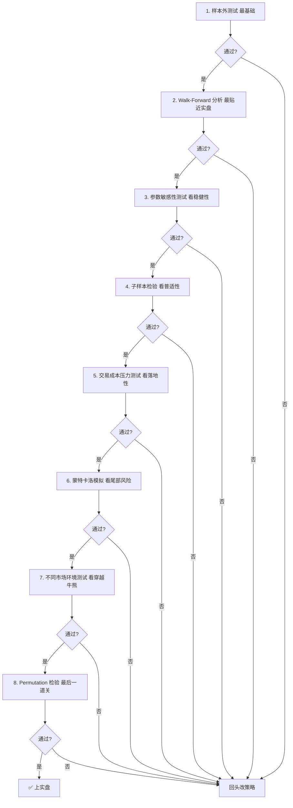

# 策略稳定性与鲁棒性检验：业界常用方法

业界检验策略稳定性和鲁棒性，主要有以下八种主流方法，按"由轻到重"排列。

## 1. 样本内/样本外切分（In-Sample / Out-of-Sample）

**最基础的检验**。把数据切成两段：

- **训练集**（如 2015-2019）：用来调参、构建策略
- **测试集**（如 2020-2024）：完全不动，只跑一次

**判断标准**：测试集的收益/夏普/最大回撤是否与训练集在同一量级。

> ⚠️ 常见陷阱：测试集表现好就反复调参，等于把测试集"污染"成了训练集。**正确做法是测试集只跑一次**。

## 2. 滚动前推分析（Walk-Forward Analysis）

样本内/外切分的进阶版：

- 每次用最近 N 天训练，预测接下来 M 天
- 把所有测试段的收益拼起来，看累计表现
- **最贴近实盘**：模拟了"定期用最新数据重新训练"的真实流程

## 3. 参数敏感性测试

挑一两个**关键参数**，小幅扰动看结果变化：

| 参数 | 基准值 | 扰动 |
| --- | --- | --- |
| 调仓周期 | 20 天 | 15 / 18 / 22 / 25 |
| 选股数量 | 50 只 | 30 / 50 / 70 / 100 |
| 因子阈值 | 0.5 | 0.4 / 0.5 / 0.6 |

**判断标准**：参数小幅变化，绩效不剧烈波动。如果 ±20% 的参数变化导致年化收益从 30% 跌到 5%，**这策略废了**。真正稳健的策略，参数-绩效曲线应该是平缓的山丘。

## 4. 子样本检验（Sub-Sample Analysis）

按不同维度切分数据，看策略是否"在所有子集上都稳健"：

| 维度 | 切分方式 |
| --- | --- |
| **时间** | 牛市区间 / 熊市区间 / 震荡市 |
| **市值** | 大盘股 / 中盘股 / 小盘股 |
| **行业** | 银行 / 科技 / 消费 ... |
| **流动性** | 日均成交 > 5亿 / 1-5亿 / < 1亿 |

**判断标准**：所有子集都盈利（≥ 8 成的子集盈利 + 整体盈利）才算稳健。某子集暴跌说明策略对该子集不适用——可能是数据泄漏或过拟合。

## 5. 因子/特征置换检验（Permutation Test）

**最严格的统计检验**：

- 把因子值的日期或股票**随机打乱**（破坏预测能力）
- 跑 N 次（通常 1000+），记录"打乱后"的策略收益分布
- 看真实策略的收益在这个分布中的分位数

**判断标准**：真实收益要显著超过 95% 的打乱结果（p < 0.05）。如果打乱后收益差不多，说明策略捕获的"信号"只是噪声。

> 💡 这是论文发表的标配检验，实盘前必做。

## 6. 蒙特卡洛模拟（Monte Carlo）

把策略的历史收益**随机重排**（bootstrap），生成上千条"模拟"收益曲线：

- 看最大回撤的分布（5% 分位的最大回撤是多少？）
- 看年化夏普的分布
- 看"运气最差"情况下策略的表现

**判断标准**：即使在最差的 5% 模拟路径下，策略夏普仍 > 1.0、最大回撤仍可接受。

## 7. 交易成本与滑点压力测试

**很多回测漂亮的策略，死在交易成本上**。在回测中加大成本假设：

| 项目 | 基准 | 压力测试 |
| --- | --- | --- |
| 佣金 | 万2.5 | 万5 |
| 滑点 | 0.1% | 0.3% |
| 冲击成本 | 0% | 0.2% |

**判断标准**：成本翻倍后策略仍盈利、且夏普 > 1.0。

## 8. 不同市场环境测试（Regime Test）

策略不能只在一个市场环境下工作：

- **2008 全球金融危机**（极端下跌）
- **2015 A 股股灾**（流动性枯竭、连续跌停）
- **2018 贸易战**（阴跌）
- **2020 疫情**（急跌后急涨）
- **2021-2022 风格切换**（小盘股崩、价值股涨）

**判断标准**：在每个历史极端环境下，策略最大回撤 < 20%、能在合理时间内恢复净值。

## 实战检验清单（综合版）

把上面的方法组合起来用：

## 一句话总结

**真正稳健的策略 = 样本外稳健 + 参数不敏感 + 各子集都赚 + 成本翻倍仍盈 + 牛熊穿越 + 统计显著。**

实战经验：**至少跑前 4 项才能进小资金实盘，跑完 8 项才能上规模**。跑完 4 项就上规模的策略，99% 会在 6 个月内被打脸。
