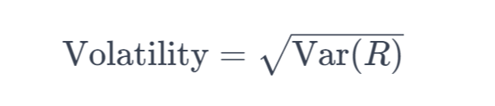
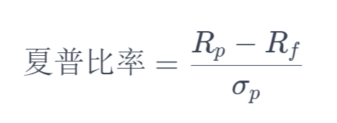
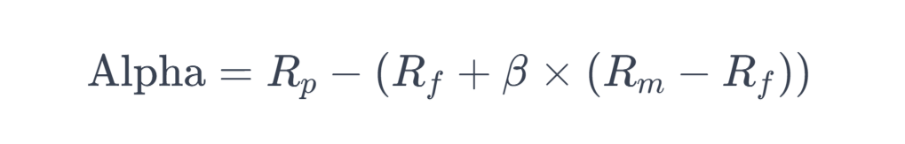
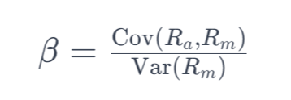

## 每日收益

今天的收益率 = (今天的收盘价 - 昨天的收盘价) / 昨天的收盘价

```python
# returns 是收益率
def daily_return(returns: pd.Series):
    return returns["price"].pct_change().dropna()
```

## 累计收益率

累计收益率 = (1 + 今天的收益率) *(1 + 昨天的收益率)* ... * (1 + 最初的收益率) - 1

```python
# returns 是收益率
def cumulative_returns(df: pd.DataFrame):
    return (1 + df["return"]).cumprod() - 1
```

## 年化收益率

比如算了5天的累积收益率，年化收益率就是今年的交易天数/5为n，收益率做n次方即年化收益率

```python
# 复利计算
def annualized_returns(df: pd.DataFrame, periods_per_year=252):
    cumulative = (1 + df["return"]).prod() - 1
    n_periods = len(df["return"])
    return (1 + cumulative) ** (periods_per_year / n_periods) - 1
```

## 最大回测

最大回撤是指在选定的时间周期内，投资组合或资产价格从峰值跌至谷底的最大跌幅。最大回撤通常用于衡量投资组合或资产在下跌过程中的风险。最大回撤越大，表示投资组合或资产在下跌过程中损失的幅度越大，风险越高。

```python
# returns 是收益率
def max_drawdown(df: pd.DataFrame):
    peak = df["assets"].cummax()
    drawdown = (df["assets"] - peak) / peak
    return drawdown.min()
```

## 波动率

波动率是收益率的标准差，用于衡量投资的风险。



其中：

- Var(R) 是资产收益率的方差。

```python
def volatility(df: pd.DataFrame, periods_per_year):
    return df["returns"].std() * (periods_per_year ** 0.5)
```

### 波动率解析

#### 年波动率5%-低

适合低风险投资者，比如退休者或对市场波动敏感的投资者。

倾向于投资债券、货币市场基金或大盘蓝筹股。

回报可能较低；比如年均回报率为3%，在5%波动率下，回报可能在-2%到8%之间。

#### 年波动率15%-中等

适合中等风险承受能力的投资者，如长期增值型投资者。

可能会均衡投资于股票和债券，或选择指数基金和部分成长股。

回报中等；假设年均回报率为6%，在15%的波动率情况下，最终回报有可能在-9%到21%。

#### 年波动率30%-高

适合高风险承受能力的投资者，比如那些很积极的增值型投资者。

可能喜欢大量投资于成长股、小盘股或某些替代投资（如私募股权）。

回报比较高，如果年均回报率为8%，在30%波动率下回报可能在-22%到38%之间。

## 夏普比率

夏普比率（Sharpe Ratio）是衡量投资组合或资产风险调整后收益的指标。它由诺贝尔经济学奖获得者威廉·夏普（William Sharpe）于1966年提出，用于评估投资组合的风险与收益之间的平衡。夏普比率越高，表示在承担相同风险的情况下，投资组合或资产的收益越高，投资效果越好。



其中：

- Rp​ 是投资组合的预期回报率。
- Rf​ 是无风险利率，通常可以用短期政府债券的利率作为代理。
- σp​ 是投资组合的标准差，代表投资的波动性或风险。

### 夏普比率解析

- 夏普比率能够帮助投资者了解在承担每单位风险时，投资组合带来了多少超额回报。数值越高意味着风险调整后的回报越好。
- 在比较多个投资组合时，夏普比率高的通常更受青睐，因为承担相同风险能获得更高的超额回报。
- 通过监控夏普比率，投资者可以评估他们的投资是否适当地平衡了风险和回报。

#### 非常低：小于0

投资组合的超额回报非常低，甚至可能为负，意味着投资组合的表现不足以补偿其所承担的风险。

当前投资风险可能过高，回报不足，从而避免投资或寻求更佳的投资选择。

#### 低到中等：0-1

投资组合提供了一定的超额回报，但风险相对较高。 可能适合那些愿意承担中等水平风险的投资者，也可以继续寻求提高回报或降低风险的策略。

#### 中等到高：1-2

投资组合为每单位风险提供了较高的超额回报。 通常是积极的信号，表示投资组合管理得当，适合风险容忍度较高的投资者。

#### 非常高：大于2

超额回报非常高，尤其是相对于其承担的风险。 可能看起来非常吸引人，但投资者应谨慎对待异常高数值的夏普比率。可能是由于非正常市场条件、数据计算错误或风险被低估导致的。

```python
def sharpe_ratio(df: pd.DataFrame, risk_free_rate, periods_per_year):
    # risk_free_rate 是无风险收益率
    # return 是收益率
    excess_returns = df["return"] - risk_free_rate / periods_per_year
    annualized_excess_returns = annualized_returns(excess_returns, periods_per_year)
    annualized_volatility = volatility(df["return"], periods_per_year)
    return annualized_excess_returns / annualized_volatility
```

## 信息比率

信息比率（Information Ratio）是衡量投资组合或资产相对于基准的超额收益与跟踪误差的比率。它用于评估投资组合相对于基准的绩效，特别是当基准是市场指数时。信息比率越高，表示投资组合在承担相同风险的情况下，超额收益越高，投资效果越好。

```python
def information_ratio(df: pd.DataFrame):
    active_return = df["return"] - df["benchmark"]
    tracking_error = active_return.std()
    return active_return.mean() / tracking_error
```

## 阿尔法 (Alpha)

阿尔法是投资组合相对于基准的超额收益，表示投资组合的主动管理收益。

Alpha = Rp​−(Rf​+β×(Rm​−Rf​))

- Rp​ 是投资组合的实际回报率。
- Rf​ 是无风险利率。
- β 是投资组合的贝塔系数，反映了其相对于市场基准的波动性。
- Rm​ 是市场基准的回报率。



### 阿尔法（Alpha）解析

阿尔法（Alpha）是衡量投资绩效的一个重要指标，用于评估投资或投资经理相对于基准指数的超额回报。阿尔法值是资本资产定价模型（CAPM）的一个组成部分，代表了在考虑了市场风险（贝塔）之后，投资的实际回报与预期回报的差异。一般有以下几种情况：

#### 正阿尔法解析

意味着投资的表现超过了其风险调整后的预期回报。一个阿尔法值为+3%的投资表明它在考虑了市场风险后，比基准指数多出3%的回报。

正阿尔法通常被视为投资经理或策略的良好表现，表明他们能够通过优越的市场分析、选股或其他投资策略实现超额回报。

投资者通常寻找正阿尔法的投资机会，可以获得比平均市场水平更高的回报。

#### 负阿尔法解析

表示投资的表现低于其风险调整后的预期回报。阿尔法值为-2%表明投资在考虑市场风险后，比基准指数少了2%的回报。

原因分析：可能是由于投资决策不佳、市场判断错误或高成本等因素造成的。

投资者一般应该避免负阿尔法的投资，因为这表示着回报低于承担相同风险的市场平均水平。

#### 适用范围

阿尔法是衡量主动管理投资策略绩效的重要指标。它对于评估基金经理、投资顾问或任何采用主动投资策略的投资者非常有用。

对于采用被动投资策略的指数基金来说，阿尔法的意义不大，因为它们的目标是复制基准指数的表现，而不是超越它。

#### 局限性

阿尔法依赖于适当的基准指数来衡量超额回报。如果选择了不恰当的基准指数，阿尔法值可能会失真。

它是基于历史数据计算的，不能保证未来表现。市场条件变化可能影响投资策略的有效性。

投资者应该结合其他指标和分析方法来评估投资机会，包括贝塔、夏普比率、基本面分析等。

## 贝塔 (Beta)

贝塔是投资组合相对于基准的系统性风险，表示投资组合对市场变动的敏感度。

贝塔的公式：


其中：

- Cov(Ra​,Rm​) 是资产回报率Ra​ 与市场回报率 Rm​ 之间的协方差。
- Var(Rm​) 是市场回报率的方差。

### 贝塔系数解析

#### 贝塔系数 < 1（例如0.5）

当小于1时，表示该股票或投资组合的价格波动性低于市场平均水平。

以0.5为例，如果市场上涨10%，这类股票可能只上涨5%；相反，下跌10%，它可能只下跌5%。

比较适合风险厌恶型投资者，可以减少投资的波动性和潜在的损失。

#### 贝塔系数 > 1（比如1.5）

当大于1时意味着股票或投资组合的价格波动性要高于市场。

以1.5为例，如果市场上涨10%，这类股票有可能上涨15%；下跌10%，它可能下跌更多达到15%。

这种类型的资产适合风险偏好型投资者，他们寻求高于市场平均的回报，但要承受更高的风险。

#### 贝塔系数 = 1

如果等于1意味着该股票或投资组合的价格波动性与市场整体相同。

例如，如果市场上涨10%的话贝塔系数为1的股票也会上涨10%。

适合希望投资组合表现与市场保持一致的投资者。

#### 贝塔系数 = 0

贝塔系数为0的资产与市场波动无关，如固定收益证券或某些类型的另类投资。

喜欢避免市场波动的投资者可以考虑这类机会。

#### 贝塔系数 < 0

为负数的情况较少见，表示资产价格与市场走势相反。

可能是某些对冲策略或特殊投资工具，适合想在市场下跌时保护资产的投资者。

贝塔系数是投资者评估投资组合或个股相对于市场风险的一个重要工具。

#### 总结

高贝塔资产在牛市中可能表现良好，熊市中可能跌得更狠；低贝塔资产则相反，牛市涨幅可能有限，熊市也不怎么跌。

## 胜率

胜率是指在一段时间内，投资组合或资产的收益为正的概率。胜率越高，表示投资组合或资产的收益为正的概率越大，投资效果越好。

```python
def win_rate(df: pd.DataFrame):
    # 胜率 = 盈利交易次数 / 总交易次数
    win_rate = (returns > 0).sum() / returns.count()
    return win_rate
```

## 波动率

波动率是收益率的标准差，用于衡量投资的风险

## ATR

近多少天TR的算术平均值

### TR

TR = max(high - low, abs(high - close), abs(low - close))

```python
def ATR(df: pd.DataFrame, period=14):
    # 计算TR
    tr1 = df['high'] - df['low']
    tr2 = abs(df['high'] - df['close'].shift())
    tr3 = abs(df['low'] - df['close'].shift())
    tr = pd.concat([tr1, tr2, tr3], axis=1).max(axis=1)
    
    # 计算ATR（简单算术平均）
    atr = tr.rolling(window=period).mean()
    return atr
```

## 翻盘年数

最大回测 / 年化收益率
表示达到最大回测后,需要多久能回本

## 心里因子

盈利天数/亏损天数
