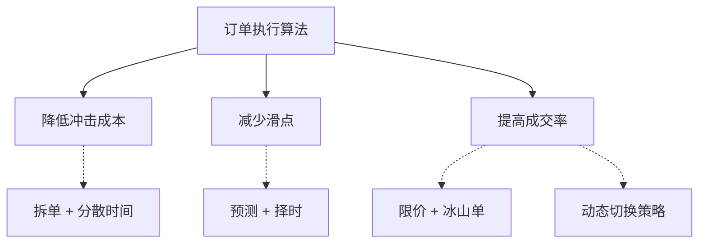

## 一、订单执行算法概述

做量化交易这些年，我见过太多人把精力全放在策略信号上，觉得只要预测准了价格，赚钱就是水到渠成的事。结果呢？信号对了，单子没成交；或者成交了，成本比预期高出一大截。说白了，从信号到成交，中间还隔着一条河——订单执行算法就是帮你过河的船。

### 什么是订单执行算法

订单执行算法，简单讲就是一套自动化的交易指令执行方案。它告诉你：什么时候下单、下多少、以什么价格、走哪个交易通道。我习惯把它比作一个智能调度员——你告诉它"我要买100万股"，它不会傻乎乎地一笔砸进去，而是拆成小单，瞅准时机分批进场。

举个例子。你有个信号要买入10万股某股票。手动操作的话，你可能直接挂个市价单。但算法会怎么做？它会先看看盘口深度，算算流动性，然后决定：是拆成1000股的小单慢慢吃，还是用TWAP（时间加权平均价格）均匀分布到全天，或者用VWAP（成交量加权平均价格）跟着大部队走。

> **核心定义：** 订单执行算法是一组规则和数学模型，用于在最小化市场影响的前提下，完成大额订单的交易执行。

### 为什么需要优化

你可能会问：直接市价单成交不就行了？嗯，这里有个坑。我刚开始做程序化交易时也这么想，直到有一次回测跑得漂漂亮亮，实盘一跑直接亏了2%。为什么？因为回测用的是收盘价，实盘成交价却滑了老远。

需要优化的原因其实就三个：

- **市场冲击成本**——你买得急，价格就被你推高了。你卖得猛，价格就被你砸低了。这可不是小数目，大单冲击成本能占到总成本的0.5%-1%。
- **时间成本**——慢慢等吧，价格可能已经变了。快刀斩乱麻吧，冲击又大。这是个两难选择。
- **信息泄露风险**——大单挂在那里，别人一看就知道有机构在动手，分分钟被狙击。

我在一个项目中遇到过这种情况：某私募朋友用裸奔的市价单执行，一天下来冲击成本吃掉了他策略收益的30%。后来我帮他优化了执行算法，同样的策略，收益直接翻倍。你说优化重不重要？

### 核心目标

订单执行算法的优化，说白了就是三个目标：

#### 1. 降低冲击成本

冲击成本就是你交易时对市场价格造成的影响。你买100股和买10万股，对市场的冲击完全不是一个量级。算法要做的是把大单拆小，分散到不同时间点、不同交易通道，让市场感觉不到你的存在。

我习惯用这个公式估算冲击成本：

```text
冲击成本 = (实际成交均价 - 决策时市场价格) / 决策时市场价格 × 100%
```

一般来说，冲击成本控制在0.1%以内算合格，0.05%以内算优秀。超过0.2%就要反思执行策略了。

#### 2. 减少滑点

滑点和冲击成本有点像，但侧重点不同。滑点是你期望的成交价和实际成交价之间的差值。比如你看到买一价是10.00元，挂单买入，结果成交在10.02元，这0.02元就是滑点。

滑点产生的原因很多：网络延迟、交易所撮合规则、对手盘不足等等。算法优化的思路就是通过预测短期价格走势、选择合适的下单时机来减少滑点。

> **我的经验：** 滑点优化有个"三七法则"——30%靠算法参数调优，70%靠交易通道和硬件设施。别光盯着代码，网络延迟降1毫秒，效果可能比调参一个月都好。

#### 3. 提高成交率

成交率就是你的订单最终成交的比例。限价单成交率低，但成本可控；市价单成交率高，但成本不可控。算法要在这两者之间找平衡。

我曾经做过一个统计：

| 订单类型 | 平均成交率 | 平均滑点 | 适用场景 |
| --- | --- | --- | --- |
| 市价单 | 99%+ | 0.05%-0.2% | 流动性好的品种、急单 |
| 限价单 | 60%-80% | 0%-0.05% | 流动性差的品种、不着急 |
| 冰山订单 | 85%-95% | 0.02%-0.1% | 大单、不想暴露意图 |
| TWAP/VWAP | 95%+ | 0.01%-0.08% | 全天均匀执行 |

你看，没有完美的订单类型，只有最适合当前场景的选择。算法优化的本质就是根据市场状态动态切换策略。

### 知识体系总览

说了这么多，我画了张图帮你理清思路。订单执行算法的核心就是围绕这三个目标展开的：



> **避坑指南：** 我曾经犯过一个错误——只盯着冲击成本优化，把单子拆得太碎，结果成交率掉到50%以下，信号来了半天没买进去，价格直接飞了。记住，三个目标是相互制约的，别走极端。

好了，这一章我们理清了订单执行算法是什么、为什么需要优化、以及三个核心目标。说白了，这就是个"既要又要还要"的难题——既要成本低，又要成交快，还要不暴露意图。后面的章节，我会带你一步步拆解这些目标怎么落地实现。

