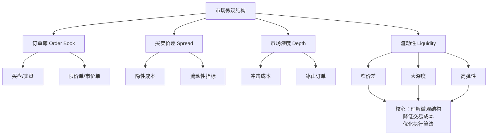

## 市场微观结构基础：订单簿、价差、深度与流动性

各位同学，今天我们来聊聊程序化交易里最底层的那些事儿——市场微观结构。说白了，就是市场到底是怎么运作的。我刚开始做量化的时候，觉得只要会写策略、会算因子就够了，结果第一次实盘就被市场狠狠教育了一顿。嗯，从那以后我才明白，不懂微观结构，你的算法就像在盲人摸象。

### 订单簿（Order Book）——市场的实时快照

订单簿是什么？你可以把它想象成一个实时更新的买卖挂单清单。交易所里所有交易者挂出的限价单，都按价格排队，买价从高到低排，卖价从低到高排。我习惯把它叫做「市场的骨架」。

举个例子，假设某只股票当前的订单簿长这样：

| 买价（Bid） | 买量 | 卖价（Ask） | 卖量 |
| --- | --- | --- | --- |
| 10.01 | 200 | 10.02 | 150 |
| 10.00 | 500 | 10.03 | 300 |
| 9.99 | 800 | 10.04 | 600 |

你看，买一价10.01，卖一价10.02。这意味着如果你想立刻买入，得按10.02成交；想立刻卖出，只能按10.01成交。这个差价，就是我们要说的买卖价差。

> **我的小经验：** 实盘中，订单簿是动态变化的。我曾经遇到过一个策略，它只看了第一档的挂单量就决定下单，结果被一个隐藏订单直接打穿。所以，我建议至少看三档深度。

### 买卖价差（Bid-Ask Spread）——你的隐形交易成本

买卖价差，就是买一价和卖一价之间的差值。它直接决定了你每笔交易的隐性成本。你想想看，如果你在10.01买入，下一秒市场没动，你想平仓只能按10.01卖出，这一来一回你就亏了1分钱。这就是价差成本。

价差的大小，反映了市场的几个关键信息：

- **流动性越好，价差越小。** 像茅台、腾讯这种热门股，价差可能只有1-2个tick。
- **波动越大，价差往往越大。** 市场恐慌时，做市商不敢挂太窄的价差。
- **交易时间不同，价差也不同。** 开盘和收盘时段，价差通常比盘中大。

> **避坑指南：** 我曾经在回测时忽略了价差成本，结果策略看起来年化30%，实盘一跑直接亏手续费。记住，价差成本在回测中一定要算进去，尤其是高频策略。

### 市场深度（Market Depth）——你能吃下多少单子

市场深度，说白了就是订单簿上各个价位的挂单总量。它告诉你：如果你想买1000股，会不会把价格打飞？

还是刚才那个例子，如果你要买入500股：

- 卖一档只有150股，你吃掉后价格会跳到10.03
- 卖二档有300股，再吃掉后价格跳到10.04
- 卖三档有600股，你才能买够500股

最终你的成交均价是：(150×10.02 + 300×10.03 + 50×10.04) / 500 = 10.028。比最初的卖一价10.02贵了0.008元。这就是市场深度不足带来的冲击成本。

> **注意：** 有些市场存在「冰山订单」，只显示一部分挂单量。我见过一个案例，某只股票表面深度很好，结果一个大单进来直接打穿五档，因为下面全是冰山单。所以，只看表面深度是不够的。

### 流动性（Liquidity）——市场的血液

流动性是个综合概念，它衡量的是你能否快速、低成本地完成大额交易。一个流动性好的市场，应该具备三个特征：

1. **窄价差**——买卖成本低
2. **大深度**——能吃下大单子
3. **高弹性**——大单成交后价格能快速恢复

我个人习惯用「流动性比率」来量化它：

```python
# 一个简单的流动性比率计算
def liquidity_ratio(trade_volume, price_change, order_book_depth):
    """
    流动性比率 = 成交量 / 价格变动幅度
    比率越高，说明流动性越好
    """
    if price_change == 0:
        return float('inf')
    return trade_volume / abs(price_change)

# 示例：成交10000股，价格变动0.01元
ratio = liquidity_ratio(10000, 0.01, None)
print(f"流动性比率: {ratio}")  # 输出 1000000
```

这个比率越大，说明同样的成交量对价格的冲击越小，流动性越好。

### 知识体系总览

下面这张图，是我自己整理的市场微观结构知识框架，你可以把它当作本章的思维导图：



### 四个概念的内在联系

这四个概念不是孤立的。我总结了一个简单的逻辑链：

**订单簿**是基础，它展示了所有挂单信息。从订单簿里，我们直接算出**买卖价差**和**市场深度**。而这两者共同决定了市场的**流动性**水平。流动性越好，你的算法执行成本就越低，滑点就越小。

反过来，如果你的算法不尊重流动性，比如在深度不足的价位上挂大单，就会造成价格冲击，扩大价差，进一步恶化流动性。这是一个恶性循环。

> **实战建议：** 我写执行算法时，会先拉取过去5分钟的订单簿快照，计算平均价差和深度分布。如果发现价差突然扩大，我会暂停主动下单，转为被动挂单。这个习惯帮我躲过了好几次闪崩。

好了，这一章的内容就到这里。记住，市场微观结构不是理论，是你每天实盘都要面对的现实。多花点时间研究订单簿，比多写几个策略更有用。

