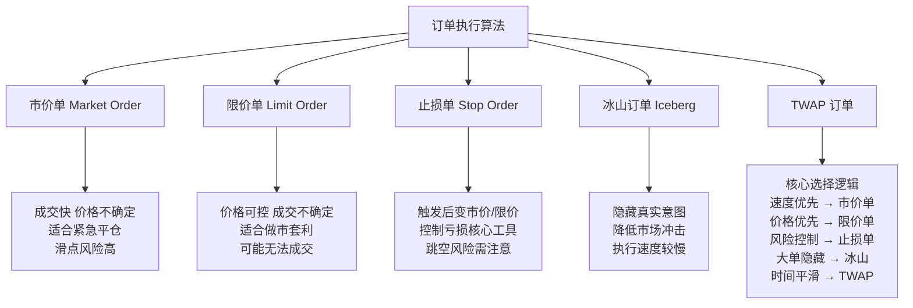

## 常见订单类型：从基础到实战

订单类型这东西，说白了就是你和交易所之间的「交易指令」。你告诉交易所：按什么价格、什么数量、什么方式去买卖。我做了这么多年量化，发现很多人对订单类型的理解停留在表面，结果实盘时吃了不少亏。

今天咱们就把五种最常见的订单类型掰开揉碎了讲。嗯，每个我都会结合自己的踩坑经历来说。

### 1. 市价单（Market Order）

市价单，就是「不管价格，立刻成交」。你下单时只指定数量，不指定价格。交易所会以当前市场上最优的可成交价格帮你吃掉对手盘。

**优点：** 成交速度快，几乎100%成交。
**缺点：** 价格不可控，尤其在流动性差的时候，滑点能让你怀疑人生。

> **核心要点：** 市价单适合对成交速度要求极高、对价格不敏感的场景。比如止损平仓、大单拆小后的最后一笔。

我在项目中遇到过一件事：有一次做股指期货的日内策略，行情突然跳水，我用了市价单平仓。结果因为流动性瞬间枯竭，成交价比预期差了0.3%。那一单亏了将近2万。从那以后，我对市价单就多了一份敬畏。

> **避坑指南：** 我曾经在流动性差的品种上使用市价单，结果被吃掉了深度盘口的好几档价格。建议：市价单只用于流动性好的品种，或者作为最后的保底手段。

### 2. 限价单（Limit Order）

限价单，就是「指定价格，不保证成交」。你告诉交易所：我只愿意以某个价格或更好的价格成交。买的时候价格不能高于限价，卖的时候不能低于限价。

**优点：** 价格可控，可以吃到盘口的价差收益。
**缺点：** 可能无法成交，尤其在单边行情中。

| 对比维度 | 市价单 | 限价单 |
| --- | --- | --- |
| 成交确定性 | 高 | 低 |
| 价格确定性 | 低 | 高 |
| 适用场景 | 紧急平仓、流动性好 | 做市、套利、降低冲击成本 |

我个人习惯在策略中这样搭配：用限价单做主要交易，用市价单做应急处理。你想想看，如果一笔大单全部用市价单，那冲击成本会非常恐怖。但全部用限价单，又可能半天成交不了。所以需要平衡。

> **小技巧：** 限价单可以挂在买一或卖一的位置，也可以挂在更远的位置。挂得越远，成交概率越低，但一旦成交，价格优势越大。我一般会结合订单簿的深度数据来动态调整挂单价格。

### 3. 止损单（Stop Order）

止损单，也叫触发单。它本身不直接成交，而是当市场价格触及你设定的触发价时，自动变成市价单或限价单。

止损单有两种变体：

- **止损市价单：** 触发后变成市价单，保证成交，价格不确定。
- **止损限价单：** 触发后变成限价单，价格确定，但不保证成交。

为什么会这样设计？因为止损单的核心目的是「控制亏损」。你设一个止损价，一旦价格跌破，说明你的判断错了，赶紧跑。但跑的时候是用市价跑还是限价跑，这就看你的取舍了。

我记得有一次做商品期货的跨期套利，设了止损限价单。结果行情跳空低开，直接穿过了我的止损价，但因为是限价单，根本没成交。那一波亏损直接翻倍。嗯，从那以后，对于关键止损，我坚决用止损市价单。

> **避坑指南：** 我曾经在夜盘交易中设了止损限价单，结果流动性不足，触发后一直没成交。第二天开盘直接低开，亏损扩大了一倍。建议：关键止损位用止损市价单，别为了省那点滑点而冒更大风险。

### 4. 冰山订单（Iceberg Order）

冰山订单，顾名思义，只露出水面的一小部分，大部分藏在下面。你实际要买10万股，但盘口只显示1000股。成交完1000股后，再露出新的1000股，直到全部成交。

为什么要用冰山订单？说白了就是为了隐藏真实意图。如果你直接挂一个大单，别人一看就知道你要买很多，可能会拉高价格等你。用冰山订单，可以降低市场冲击。

> **核心要点：** 冰山订单的核心参数有两个：总数量和显示数量。显示数量越小，隐藏效果越好，但成交速度越慢。我一般设置显示数量为总数量的5%-10%。

我在项目中遇到过一个大单执行的问题：当时要买入50万股某股票，如果直接挂单，盘口肯定会被打穿。我用冰山订单，每次只显示5000股，配合限价单，花了将近2个小时才完成。虽然慢，但平均成交价比直接市价买便宜了0.15%。

```python
# 冰山订单的简单模拟
class IcebergOrder:
    def __init__(self, total_qty, display_qty, price):
        self.total_qty = total_qty
        self.display_qty = display_qty
        self.price = price
        self.remaining = total_qty
    
    def get_next_order(self):
        if self.remaining <= 0:
            return None
        qty = min(self.display_qty, self.remaining)
        self.remaining -= qty
        return {'price': self.price, 'qty': qty}
    
    def is_completed(self):
        return self.remaining <= 0
```

> **小技巧：** 冰山订单的显示数量不要固定，可以随机化。比如每次显示500-1500股之间随机，这样更难被对手盘识别出规律。

### 5. TWAP订单

TWAP，全称Time-Weighted Average Price，时间加权平均价格。它的逻辑很简单：把一个大单拆成若干个小单，在指定时间内均匀执行。

比如你要在1小时内买入10万股，TWAP会把它拆成60份，每分钟买入约1667股。这样做的目的是让成交价格接近这段时间的平均价，避免因为一次性大单造成价格冲击。

TWAP的核心参数：

- **总时间：** 从开始到结束的时间长度
- **切片数量：** 拆成多少个小单
- **执行策略：** 每个切片用市价单还是限价单

我个人习惯用TWAP来处理那些「不着急、但必须完成」的大单。比如指数基金的调仓、定投策略的建仓。你想想看，如果一次性买入，万一买在日内高点，那得多难受。

```python
# TWAP订单的简单实现
def twap_executor(total_qty, total_seconds, slices=60):
    qty_per_slice = total_qty // slices
    interval = total_seconds / slices
    
    for i in range(slices):
        # 这里可以换成实际的交易接口
        print(f"第{i+1}片: 买入{qty_per_slice}股")
        time.sleep(interval)
    
    # 处理余数
    remainder = total_qty % slices
    if remainder > 0:
        print(f"最后余数: 买入{remainder}股")
```

> **避坑指南：** 我曾经在波动剧烈的行情中使用TWAP，结果因为每个切片都用市价单，导致整体成交价远高于预期。建议：TWAP的每个切片最好用限价单，或者结合VWAP（成交量加权平均价格）来动态调整。

### 知识体系总览

下面这张图，是我梳理的这五种订单类型的核心逻辑。你可以把它当作一个快速参考。



这五种订单类型，是程序化交易中最基础也最重要的工具。你不需要一开始就全部精通，但至少要理解每种订单的「适用场景」和「潜在风险」。我建议你从市价单和限价单开始练手，慢慢再接触止损单和冰山订单。TWAP可以等你有大单执行需求时再深入研究。

记住一点：没有完美的订单类型，只有合适的场景。选对了，你的策略执行成本会大幅降低；选错了，再好的策略也可能被滑点吃掉利润。

