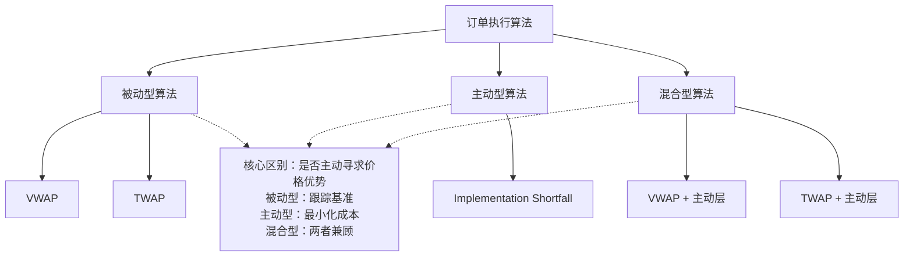

## 4. 执行算法分类：被动型、主动型与混合型

做量化交易这些年，我接触过形形色色的订单执行算法。说实话，刚入行那会儿，我也以为算法越复杂越好。后来踩过坑才明白——**选对类型，比写对代码更重要**。

执行算法按策略逻辑，大致分三类：被动型、主动型、混合型。咱们一个一个聊。

### 4.1 被动型算法：VWAP 与 TWAP

被动型算法，说白了就是「不跟市场对着干」。它不主动寻求价格优势，而是尽量让成交价格贴近某个基准。最常见的两个代表：**VWAP** 和 **TWAP**。

#### 4.1.1 VWAP（成交量加权平均价格）

VWAP 的核心思想很简单：**把大单拆成小单，按历史成交量分布去喂单**。比如某只股票上午成交量占全天 60%，那算法就在上午执行 60% 的订单量。

我个人习惯用 VWAP 处理流动性好的股票。为什么？因为这类股票成交量分布相对稳定，历史数据有参考价值。

> **核心公式：**
>
> ```text
> VWAP = Σ(价格 × 成交量) / Σ(成交量)
> ```

来看一个简化版的 VWAP 切片逻辑：

```python
def vwap_schedule(total_shares, volume_profile, total_volume):
    """
    volume_profile: list of expected volume per time slice
    total_volume: sum of volume_profile
    """
    schedule = []
    for slice_vol in volume_profile:
        ratio = slice_vol / total_volume
        slice_shares = int(total_shares * ratio)
        schedule.append(slice_shares)
    return schedule
```

嗯，这里要注意：**VWAP 依赖历史数据，遇到突发行情容易翻车**。我曾经在财报发布日用 VWAP 执行一个大单，结果成交量分布完全偏离历史模式，执行成本比预期高了 0.3%。从那以后，我遇到事件驱动行情，都会切换到主动型算法。

#### 4.1.2 TWAP（时间加权平均价格）

TWAP 比 VWAP 更「佛系」。它不管成交量分布，只管**按时间均匀拆分**。比如 1 小时完成 10000 股，那就每分钟 166 股左右。

TWAP 适合什么场景？流动性差、或者你不想暴露交易意图的时候。你想想看，如果一只股票一天就成交几百万，你用 VWAP 按历史比例拆单，可能某个时段根本吃不到那么多量。TWAP 反而更稳妥。

```python
def twap_schedule(total_shares, num_slices):
    base = total_shares // num_slices
    remainder = total_shares % num_slices
    schedule = [base] * num_slices
    # 把余数分配到前几个切片
    for i in range(remainder):
        schedule[i] += 1
    return schedule
```

> **我的经验：** TWAP 在盘前和尾盘效果较差，因为这两个时段成交量波动大。我一般只在盘中时段用 TWAP。

### 4.2 主动型算法：Implementation Shortfall

主动型算法，核心目标是**最小化交易成本**。它不满足于「跟住基准」，而是主动寻找更好的价格。

**Implementation Shortfall（IS）** 是主动型算法的代表。它把交易成本拆成几个部分：

- **延迟成本**：决策到下单之间的价格变动
- **执行成本**：实际成交价与决策价的偏差
- **机会成本**：未成交部分带来的潜在损失

IS 算法的核心逻辑是：**在「快速执行」和「减少市场冲击」之间找平衡**。它会实时计算一个「最优执行路径」，动态调整下单节奏。

我记得有一次做 IS 策略回测，发现它在高波动市场里表现特别好。为什么？因为 IS 算法会主动利用短期价格反弹——价格跌了，它多买点；价格涨了，它等等再买。说白了，它像个聪明的猎手，而不是机械的搬运工。

> **避坑指南：** 我曾经在流动性极差的股票上跑 IS 算法，结果因为频繁调整订单，反而增加了市场冲击。IS 算法对流动性敏感，建议只在日均成交额 5000 万以上的品种使用。

### 4.3 混合型算法

混合型算法，就是**把被动和主动结合起来**。它通常有一个「基准策略」作为底仓，再叠加一个「主动调整层」来优化执行。

举个例子：

1. **底层**：用 VWAP 或 TWAP 做基础切片
2. **上层**：根据实时市场信号，动态调整切片大小或时机

比如，当检测到买盘压力大时，主动层会「踩刹车」，减少当前切片量；当出现流动性充裕时，主动层会「踩油门」，加速执行。

我目前在实盘中最常用的就是混合型算法。为什么？因为它**既有被动型的稳定性，又有主动型的灵活性**。你想想看，纯被动型遇到大单容易「吃暗亏」，纯主动型又可能「过度交易」。混合型刚好取了个折中。

> **混合型算法的典型结构：**
>
> ```text
> 执行量 = 基准切片量 × (1 + 主动调整系数)
> 主动调整系数 ∈ [-0.5, 0.5]，根据市场冲击模型实时计算
> ```

### 4.4 三类算法的对比

我整理了一张对比表，方便你快速决策：

| 维度 | 被动型（VWAP/TWAP） | 主动型（IS） | 混合型 |
| --- | --- | --- | --- |
| 核心目标 | 跟踪基准 | 最小化成本 | 平衡跟踪与成本 |
| 市场冲击 | 低 | 中高 | 中 |
| 执行速度 | 慢 | 快 | 中 |
| 适用场景 | 大单、低波动 | 小单、高波动 | 大多数场景 |
| 实现复杂度 | 低 | 高 | 中高 |

### 4.5 知识体系结构图

下面这张图，帮你理清三类算法的关系：



这张图把三类算法的关系理得很清楚。被动型是「跟着走」，主动型是「找机会」，混合型是「边走边看」。实际项目中，我建议你**先评估自己的需求**：

- 如果目标是「不跑偏」，选被动型
- 如果目标是「省成本」，选主动型
- 如果两者都想要，选混合型

> **一个小建议：** 刚开始做执行算法，可以从 TWAP 入手。它逻辑简单，不容易出 bug。等跑通了，再逐步升级到 VWAP 和 IS。我当年就是这么过来的。

好了，三类算法就聊到这儿。记住一句话：**没有最好的算法，只有最合适的场景**。选对类型，你的执行成本就已经赢了一半。

