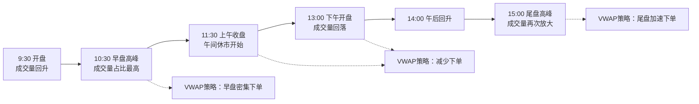

## VWAP算法原理：成交量加权平均价格

做程序化交易的朋友，对VWAP肯定不陌生。我最早接触这个指标，是在2015年做A股算法交易系统的时候。当时团队接了一个大单，几千万的资金要在一天内买完，直接挂单肯定把价格打飞了。嗯，VWAP就是解决这类问题的经典方案。

说白了，VWAP就是「成交量加权平均价格」。它衡量的是：在某个时间段内，你的成交价格相对于市场平均水平的偏离程度。如果我的成交价比VWAP低，说明我买得便宜；反之就是买贵了。

### VWAP的定义与计算公式

先看数学定义，其实很简单：

```text
VWAP = Σ(价格 × 成交量) / Σ(成交量)
```

举个例子你就明白了。假设某只股票在一天内发生了三笔交易：

| 时间 | 价格 | 成交量 | 价格×成交量 |
| --- | --- | --- | --- |
| 9:30 | 10.00 | 1000 | 10000 |
| 10:00 | 10.05 | 2000 | 20100 |
| 10:30 | 9.98 | 1500 | 14970 |
| **合计** |  | **4500** | **45070** |

VWAP = 45070 / 4500 = 10.0156元。这个价格就是市场在这段时间内的平均成交成本。

> **关键点**：VWAP不是简单的价格平均，而是用成交量做权重。成交量大的价格，对VWAP的影响更大。这很合理——因为大部分交易都发生在那个价格附近。

### VWAP算法的核心逻辑

VWAP算法的目标很简单：让我的订单执行价格尽可能接近市场VWAP。怎么做呢？核心思路是「跟随成交量分布」。你想想看，如果市场在某个时间段成交量很大，那我也应该在那段时间多交易；成交量小的时候，我就少交易甚至不交易。

具体执行时，算法会做这几件事：

1. **预测全天成交量分布**——根据历史数据估算每个时间段的成交量占比
2. **计算目标成交量曲线**——把总订单量按预测的成交量比例分配到各个时间段
3. **实时调整**——根据实际成交情况，动态修正后续的订单量

我习惯把VWAP算法分成两种模式：

- **静态VWAP**：开盘前就把全天的交易计划定好，中间不调整。简单粗暴，但遇到市场突变容易跑偏。
- **动态VWAP**：每过一个时间段，根据实际成交量和价格偏差，重新计算剩余订单的分配方案。更灵活，也是目前主流的做法。

> **我的经验**：做动态VWAP时，千万别把调整频率设得太高。我曾经试过每秒都重新计算，结果订单被拆得七零八落，反而增加了交易成本。一般5-15分钟调整一次就够了。

### 历史成交量分布预测

这是VWAP算法里最核心、也最头疼的部分。为什么？因为未来的成交量分布，我们只能靠猜。猜得准不准，直接决定了算法的表现。

常用的预测方法有几种：

- **简单平均法**：取过去N天的同一时间段成交量，求平均。比如用过去20天上午10:00-10:05的成交量均值，作为今天的预测值。
- **加权平均法**：给近期的数据更高的权重。比如昨天权重0.3，前天0.2，大前天0.1...这样能更快地反映市场变化。
- **机器学习法**：用LSTM、XGBoost等模型，结合价格、波动率、新闻情绪等特征来预测。效果可能更好，但实现成本也高。

我个人比较推荐加权平均法。原因很简单——它够用，而且不容易过拟合。我在一个项目中试过LSTM，结果模型在测试集上表现很好，上线后遇到一次突发利空，预测完全失效。反倒是简单的加权平均，虽然不够惊艳，但胜在稳定。

> **避坑指南**：我曾经犯过一个错误——直接用全天的历史成交量分布来做预测。结果发现早盘和尾盘的预测误差特别大。后来才意识到，早盘的成交量受隔夜消息影响很大，尾盘则受机构调仓影响。正确的做法是分时段建模，或者至少对异常时段做特殊处理。

下面这张图展示了典型的A股日成交量分布形态：



你看，A股市场有明显的「双峰」特征——早盘和尾盘成交量最大，午盘相对清淡。做VWAP算法时，必须把这个形态考虑进去。如果按均匀分布来分配订单，早盘和尾盘就会跟不上市场节奏。

### VWAP的优缺点

聊完了原理，咱们客观地看看VWAP算法的好与不好。

#### 优点

- **执行成本可控**：只要算法设计得当，最终成交价大概率会落在VWAP附近。对于大资金来说，这比直接市价单安全得多。
- **市场冲击小**：把大单拆成小单，跟着成交量走，不容易被市场察觉。我见过一些机构用VWAP算法，几千万的订单做下来，对盘口几乎没影响。
- **评价标准清晰**：VWAP本身就是一个天然的基准。跑赢了VWAP就是好执行，跑输了就是差执行。不用纠结用什么benchmark。
- **实现相对简单**：相比TWAP、POV等算法，VWAP的逻辑更直观，代码实现也不复杂。一个初级量化工程师，花一两天就能写出可用的版本。

#### 缺点

- **依赖预测准确性**：这是最大的痛点。如果历史成交量分布预测不准，算法表现就会大打折扣。遇到财报日、政策发布日，历史规律基本失效。
- **不适合小单**：如果你的订单量很小，用VWAP反而画蛇添足。拆单太细会增加交易成本，而且小单本身对市场冲击就不大。
- **无法应对极端行情**：2015年股灾的时候，很多VWAP算法都崩了。因为市场流动性枯竭，成交量分布完全扭曲，算法还在按历史数据分配订单，结果可想而知。
- **容易被博弈**：如果市场上有其他交易者知道你在跑VWAP，他们可能会在你集中交易的时间段提前挂单，让你买在高位。嗯，这就是所谓的「VWAP狙击」。

> **总结一下**：VWAP算法适合大资金、低换手率、市场流动性充足的情况。它不是一个万能药，但在合适的场景下，确实能帮我们省下不少交易成本。我个人建议，在实际使用前，先用历史数据做回测，看看你的标的和交易量是否适合VWAP。

好了，VWAP的原理就聊到这里。下一节我们会深入代码层面，看看如何用Python实现一个完整的VWAP算法。到时候我会分享一些我在实盘中踩过的坑，以及怎么优化执行效果。

