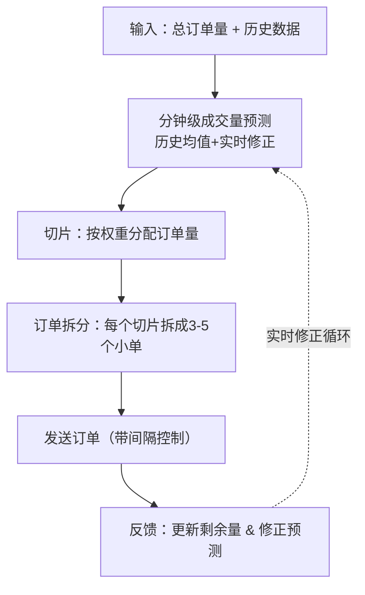

## 6、VWAP算法实现：Python实现VWAP切片逻辑、基于分钟级数据的成交量预测、订单拆分与发送

VWAP，全称是Volume Weighted Average Price，成交量加权平均价格。说白了，就是让我们的成交均价尽量贴近全市场的均价。机构大单如果一股脑砸进去，价格肯定被推高或砸低，VWAP就是为了解决这个问题的。

我个人习惯把VWAP算法拆成三个核心模块：**切片逻辑**、**成交量预测**、**订单拆分与发送**。咱们一个一个来啃。

### 6.1 VWAP切片逻辑

切片，就是把一整天的交易时间切成一个个小片段。比如A股一天4小时，240分钟，切成240个一分钟切片。每个切片分配一个成交量权重，然后按照这个权重去下单。

我刚开始做的时候，以为切片越细越好。后来发现，切片太细会导致订单太碎，反而增加交易所的负载和延迟。嗯，这里要注意：**切片粒度通常选1分钟或5分钟**，太细了没意义。

核心逻辑其实就一句话：**每个时间片内，按该片预测成交量占总成交量的比例，分配订单量**。

> **核心公式：**
>
> ```text
> Slice_Volume = Total_Order_Volume × (Predicted_Volume_in_Slice / Total_Predicted_Volume)
> ```

举个例子：今天要买100万股，预测全天成交1000万股。9:30-9:31这一分钟预测成交20万股，那这一分钟就分配 100万 × (20万/1000万) = 2万股。

### 6.2 基于分钟级数据的成交量预测

这是VWAP算法里最玄学的部分。预测准了，VWAP就成功了一半。我踩过最大的坑就是直接用历史均值做预测——遇到突发行情，预测值完全失效。

我的做法是：**用过去N天的分钟级成交量数据，结合当日已成交数据，做加权平均**。

具体来说，我常用两种方法：

- **历史均值法**：取过去5-20个交易日同一分钟成交量的均值。简单，但遇到节假日效应会偏差很大。
- **实时修正法**：用当日已成交数据，动态调整后续预测。比如上午成交量比历史均值高了20%，那下午的预测也相应上调。

我曾经在实盘中只用历史均值，结果那天出了个突发利好，上午成交量暴增，我的预测完全跟不上，导致前半段下单太少，后半段被迫追单。从那以后，我强制要求自己必须加入实时修正逻辑。

> **避坑指南：** 我曾经犯过一个低级错误——直接用前一天的分钟数据做预测。结果第二天是除权除息日，成交量结构完全变了。记得要剔除异常交易日的数据，比如分红、配股、停复牌的日子。

### 6.3 订单拆分与发送

预测完每个时间片的成交量，接下来就是把订单拆碎，发出去。这里有个关键点：**不能在一个时间片刚开始就把所有量都发出去**，那样会暴露意图。

我通常的做法是：

1. 把每个时间片的订单量再拆成3-5个小单
2. 每个小单之间间隔几秒到几十秒
3. 根据市场流动性动态调整发送速度

举个例子，9:30-9:31这一分钟要下2万股，我会拆成4个5000股的单子，每隔15秒发一个。如果发现市场深度不够，就再拆小一点，或者拉长间隔。

下面是我写的一个简化版VWAP实现，核心逻辑都在里面了：

```python
import pandas as pd
import numpy as np
import time
from datetime import datetime

class VWAPExecutor:
    def __init__(self, total_volume, history_data, n_days=20):
        """
        total_volume: 要执行的总订单量
        history_data: DataFrame，包含日期、分钟、成交量三列
        n_days: 取多少天的历史数据做预测
        """
        self.total_volume = total_volume
        self.history_data = history_data
        self.n_days = n_days
        self.remaining_volume = total_volume
        self.executed_volume = 0
        self.executed_value = 0
        
    def predict_minute_volume(self, current_minute, current_date=None):
        """预测当前分钟的成交量"""
        # 取过去n_days同一分钟的数据
        mask = self.history_data['minute'] == current_minute
        recent_data = self.history_data[mask].tail(self.n_days)
        
        if len(recent_data) == 0:
            # 如果没有历史数据，用全天均值
            avg_daily = self.history_data.groupby('date')['volume'].sum().mean()
            return avg_daily / 240  # 假设240个交易分钟
        
        # 加权平均，越近的权重越大
        weights = np.linspace(0.5, 1.0, len(recent_data))
        weights = weights / weights.sum()
        
        predicted = (recent_data['volume'].values * weights).sum()
        return predicted
    
    def calculate_slice_volume(self, current_minute, total_predicted_volume):
        """计算当前时间片应分配的订单量"""
        minute_pred = self.predict_minute_volume(current_minute)
        
        if total_predicted_volume == 0:
            return self.remaining_volume / 10  # 保底策略
        
        slice_ratio = minute_pred / total_predicted_volume
        slice_vol = self.total_volume * slice_ratio
        
        # 不能超过剩余量
        return min(slice_vol, self.remaining_volume)
    
    def split_order(self, slice_volume, num_splits=4):
        """将一个时间片的订单拆成多个小单"""
        base = slice_volume // num_splits
        remainder = slice_volume % num_splits
        
        orders = [base] * num_splits
        for i in range(remainder):
            orders[i] += 1
        
        return orders
    
    def send_order(self, volume, price=None):
        """模拟发送订单"""
        # 实际中这里会调用交易接口
        self.executed_volume += volume
        self.remaining_volume -= volume
        if price:
            self.executed_value += volume * price
        return True
    
    def execute(self, market_data_stream):
        """
        主执行逻辑
        market_data_stream: 模拟的实时行情流，每个元素是 (minute, price)
        """
        # 先预测全天总成交量
        all_minutes = range(0, 240)  # 假设240个交易分钟
        total_predicted = sum(self.predict_minute_volume(m) for m in all_minutes)
        
        print(f"预测全天成交量: {total_predicted:.0f} 股")
        print(f"目标成交量: {self.total_volume:.0f} 股")
        
        for minute, price in market_data_stream:
            if self.remaining_volume <= 0:
                break
            
            # 计算当前时间片应下多少
            slice_vol = self.calculate_slice_volume(minute, total_predicted)
            
            # 拆成小单
            sub_orders = self.split_order(slice_vol, num_splits=4)
            
            # 逐个发送
            for i, vol in enumerate(sub_orders):
                if vol == 0:
                    continue
                self.send_order(vol, price)
                print(f"[{minute}分] 发送子单 {i+1}: {vol} 股 @ {price:.2f}")
                time.sleep(0.1)  # 模拟间隔
            
            # 实时修正：用实际成交量更新预测
            actual_minute_vol = sum(sub_orders)
            if total_predicted > 0:
                # 调整剩余预测
                remaining_minutes = 240 - minute - 1
                if remaining_minutes > 0:
                    remaining_pred = sum(
                        self.predict_minute_volume(m) for m in range(minute+1, 240)
                    )
                    total_predicted = actual_minute_vol + remaining_pred
        
        print(f"\n执行完成: 共成交 {self.executed_volume} 股")
        if self.executed_volume > 0:
            avg_price = self.executed_value / self.executed_volume
            print(f"成交均价: {avg_price:.2f}")

# 使用示例
if __name__ == "__main__":
    # 模拟历史数据
    np.random.seed(42)
    dates = pd.date_range('2024-01-01', periods=20, freq='D')
    minutes = range(240)
    
    data = []
    for d in dates:
        # 模拟U型成交量分布
        base_vol = np.random.normal(10000, 2000)
        for m in minutes:
            # 开盘和收盘成交量较大
            if m < 30:
                factor = 1.5 - m/60
            elif m > 210:
                factor = 1.0 + (m-210)/60
            else:
                factor = 1.0
            vol = int(base_vol * factor * (0.8 + 0.4*np.random.random()))
            data.append({'date': d, 'minute': m, 'volume': vol})
    
    hist_df = pd.DataFrame(data)
    
    # 创建执行器
    executor = VWAPExecutor(total_volume=100000, history_data=hist_df)
    
    # 模拟实时行情
    mock_stream = [(m, 10.0 + 0.01*np.random.randn()) for m in range(240)]
    
    executor.execute(mock_stream)
```

> **注意事项：** 上面的代码是教学演示版，实际生产环境要考虑：
>
> - 交易所的订单频率限制（比如每秒最多发多少笔）
> - 滑点模型：不能假设按当前价成交
> - 异常处理：行情中断、接口超时等
> - 实时数据更新：分钟级预测需要不断用最新数据修正

### 6.4 核心逻辑流程图

下面这张图把VWAP的整个流程串起来了，从数据输入到最终成交，每一步都离不开：



你看，整个流程其实就是一个闭环。从输入开始，到预测、切片、拆分、发送，最后反馈回来修正预测。我当年第一次实现这个闭环时，忽略了反馈修正这一步，结果前半段跑得挺好，后半段偏差越来越大。后来加上实时修正，VWAP的跟踪误差直接降了一半。

> **个人经验：** 实盘中，我建议把预测模型做成可插拔的。今天用历史均值，明天想换机器学习模型，改一行配置就行。别把预测逻辑写死在代码里，否则改起来想死的心都有。

好了，VWAP的核心实现就这些。代码虽然不长，但每个环节都有坑。你想想看，从预测到切片到拆分，哪一步出了问题，最终成交均价都会偏离VWAP。我的建议是：先跑模拟，用历史数据回测，确认逻辑没问题再上实盘。

