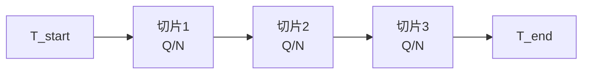

## 7、TWAP算法原理：时间加权平均价格

TWAP，全称是Time-Weighted Average Price。说白了，就是把一个大单子，按照时间均匀地拆成小单子，然后分批执行。我刚开始做程序化交易那会儿，觉得这玩意儿太简单了，不就是定时定点下单嘛。后来踩过坑才发现，里面的门道其实不少。

咱们先搞清楚一个核心问题：TWAP到底在算什么？

### 时间加权平均价格的定义

时间加权平均价格，就是把整个交易时间段分成N个等长的小区间。每个区间内，价格乘以这个区间的时间权重，然后求和。公式长这样：

```text
TWAP = (P₁ + P₂ + ... + Pₙ) / N
```

其中P₁、P₂...Pₙ是每个时间点的价格。注意，这里每个时间点的权重是一样的。你想想看，这和VWAP那种按成交量加权的方式，思路完全不同。

我个人习惯把TWAP理解成「时间上的均匀分布」。不管市场成交量大不大，我就在每个时间切片里扔固定数量的单子。嗯，这里要注意，TWAP并不关心成交量，它只关心时间。

### TWAP与VWAP的区别

很多新手容易把TWAP和VWAP搞混。我当年也犯过这个错，有一次回测时把两个算法混着用，结果实盘跑出来滑点大得吓人。咱们用一张表说清楚：

| 对比维度 | TWAP | VWAP |
|---------|------|------|
| 权重依据 | 时间 | 成交量 |
| 执行策略 | 均匀时间切片 | 跟随成交量分布 |
| 市场冲击 | 中等，固定节奏 | 较低，跟随流动性 |
| 适用场景 | 流动性一般、不想暴露意图 | 流动性好、追求成交均价 |
| 计算复杂度 | 低 | 中 |

说白了，TWAP是「到点就干」，VWAP是「看量下菜」。我曾经在某个流动性较差的期货品种上跑VWAP，结果因为成交量分布不均匀，后半段单子根本出不去。后来换成TWAP，虽然滑点稍微大了一点，但至少能保证在指定时间内完成交易。

### 均匀时间切片策略

这是TWAP的核心实现方式。咱们直接看代码：

```python
class TWAPExecutor:
    def __init__(self, total_quantity, start_time, end_time, num_slices):
        self.total_qty = total_quantity
        self.start = start_time
        self.end = end_time
        self.num_slices = num_slices
        
        # 每个切片的时间间隔（秒）
        self.slice_interval = (end_time - start_time) / num_slices
        # 每个切片的委托量
        self.slice_qty = total_quantity / num_slices
    
    def generate_orders(self):
        orders = []
        for i in range(self.num_slices):
            order_time = self.start + i * self.slice_interval
            orders.append({
                'time': order_time,
                'quantity': self.slice_qty,
                'order_type': 'limit'  # 我习惯用限价单
            })
        return orders
```

你看，逻辑就这么简单。但实际跑起来，有几个坑要注意：

> ⚠️ **我曾经踩过的坑：**
>
> - 切片数量太多会导致频繁下单，增加系统延迟和手续费
> - 切片数量太少又失去了分散风险的意义
> - 限价单如果挂得太死，可能一直成交不了

我个人建议，对于A股市场，切片间隔不要小于30秒。对于期货市场，可以适当缩短到10秒左右。具体数值，你最好根据自己交易品种的流动性来调。

### TWAP的适用场景

不是所有场景都适合用TWAP。我总结了几种典型情况：

- **流动性一般的品种**：比如某些冷门期货、小盘股。VWAP可能因为成交量不足而执行失败，TWAP反而更靠谱。
- **不想暴露交易意图**：TWAP的节奏固定，对手盘很难判断你的真实意图。我记得有一次做对冲，用TWAP分批建仓，三天下来几乎没引起市场注意。
- **时间约束严格的交易**：比如必须在收盘前完成减仓。TWAP能保证在指定时间内均匀执行完毕。
- **回测和基准计算**：很多量化策略用TWAP作为基准来评估执行效果。

> 💡 **一个小技巧：**
> 如果你发现TWAP执行时滑点太大，可以试试「带偏移的TWAP」。就是在每个时间切片上，根据当前市场深度微调委托价格。我管这叫「TWAP+」，效果还不错。

下面这张图，是我自己画的TWAP执行流程。你可以看到，整个逻辑就是一条直线：从开始时间到结束时间，均匀地切分，然后逐个执行。



最后说一句，TWAP虽然简单，但别小看它。很多复杂的执行算法，底层逻辑都是从TWAP衍生出来的。你把这个吃透了，后面学VWAP、POV、Implementation Shortfall都会轻松很多。

### 核心要点回顾

- TWAP按时间均匀分配委托量，每个时间点权重相同
- 与VWAP最大的区别：TWAP看时间，VWAP看成交量
- 均匀时间切片策略实现简单，但要注意切片数量和限价单设置
- 适合流动性一般、不想暴露意图、时间约束严格的场景
