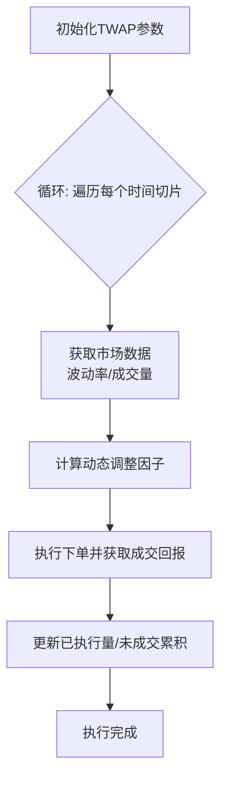

## 8、TWAP算法实现：Python实现TWAP切片逻辑、固定时间间隔下单、处理市场波动时的调整策略

TWAP，全称Time-Weighted Average Price，时间加权平均价格算法。说白了，就是把一个大单子切成很多小块，然后按照固定的时间间隔慢慢喂给市场。我刚开始做程序化交易那会儿，觉得这玩意儿太简单了，不就是个定时器加个除法嘛。结果真上了实盘，才发现坑比想象的多。

今天我们就来聊聊，怎么用Python把TWAP做扎实。从最基础的切片逻辑，到应对市场波动的动态调整，一步步拆开来看。

### 8.1 基础TWAP切片逻辑

先看最朴素的想法。假设我要在1小时内买入10000股，交易时段是连续的。最简单的做法：把1小时切成N个时间片，每个时间片下单10000/N股。

代码实现起来其实很直接：

```python
import datetime
import time
import pandas as pd

class BasicTWAP:
    """基础TWAP执行器"""
    
    def __init__(self, total_quantity, start_time, end_time, slices=12):
        self.total_qty = total_quantity          # 总委托量
        self.start_time = start_time             # 开始时间
        self.end_time = end_time                 # 结束时间
        self.slices = slices                     # 切片数量
        self.executed_qty = 0                    # 已执行量
        
        # 计算每个切片的时间间隔（秒）
        total_seconds = (end_time - start_time).total_seconds()
        self.interval = total_seconds / slices
        
        # 每个切片的目标量
        self.slice_qty = total_quantity / slices
        
        print(f"切片数量: {slices}")
        print(f"时间间隔: {self.interval:.2f}秒")
        print(f"每片目标量: {self.slice_qty:.2f}股")
    
    def run(self):
        """执行TWAP"""
        current_time = self.start_time
        
        for i in range(self.slices):
            # 计算当前切片应下单量
            order_qty = self.slice_qty
            
            # 模拟下单（这里替换为真实下单接口）
            print(f"[{current_time}] 第{i+1}片: 下单{order_qty:.2f}股")
            
            # 更新已执行量
            self.executed_qty += order_qty
            
            # 等待到下一个时间点
            current_time += datetime.timedelta(seconds=self.interval)
            time.sleep(self.interval)  # 实际中应使用精确计时
        
        print(f"执行完成，总执行量: {self.executed_qty:.2f}股")
```

嗯，这个版本能跑，但问题很明显。它假设市场是静止的，下单就能成交。我在实盘中吃过这个亏——有一次遇到流动性枯竭，一个切片挂出去半小时没成交，后面的切片全乱套了。

> ⚠️ **注意：** 基础TWAP没有考虑未成交部分的处理。如果某个切片没有完全成交，后面的切片需要把剩余量补上。否则最终执行量会偏离目标。

### 8.2 固定时间间隔下单的改进

实际交易中，我们需要处理未成交的累积。我个人习惯的做法是：每个切片开始时，先检查上一片还有多少没成交，然后把剩余量加到当前切片里。

改进后的代码：

```python
class ImprovedTWAP:
    """改进版TWAP - 处理未成交累积"""
    
    def __init__(self, total_quantity, start_time, end_time, slices=12):
        self.total_qty = total_quantity
        self.start_time = start_time
        self.end_time = end_time
        self.slices = slices
        
        total_seconds = (end_time - start_time).total_seconds()
        self.interval = total_seconds / slices
        self.slice_qty = total_quantity / slices
        
        self.executed_qty = 0
        self.pending_qty = 0  # 未成交累积
    
    def get_order_qty(self, slice_index):
        """计算当前切片应下单量"""
        # 基础量 + 上一片未成交的累积
        order_qty = self.slice_qty + self.pending_qty
        return order_qty
    
    def update_after_execution(self, filled_qty):
        """更新执行状态"""
        self.executed_qty += filled_qty
        # 计算未成交部分
        self.pending_qty = max(0, self.slice_qty - filled_qty)
    
    def run(self):
        current_time = self.start_time
        
        for i in range(self.slices):
            order_qty = self.get_order_qty(i)
            
            # 模拟下单并获取成交回报
            filled_qty = self.place_order(order_qty)
            
            # 更新状态
            self.update_after_execution(filled_qty)
            
            print(f"[{current_time}] 第{i+1}片: 下单{order_qty:.2f}股, "
                  f"成交{filled_qty:.2f}股, 累积未成交{self.pending_qty:.2f}股")
            
            current_time += datetime.timedelta(seconds=self.interval)
            time.sleep(self.interval)
    
    def place_order(self, qty):
        """模拟下单（实际中替换为真实接口）"""
        # 假设成交率为90%
        import random
        fill_rate = 0.9 + random.uniform(-0.1, 0.1)
        return qty * fill_rate
```

你看，这里加了个 `pending_qty` 来追踪未成交的量。每次下单前，先把上一片欠的账还上。这样即使某一片成交不好，后面的切片也会自动补回来。

> 💡 **小技巧：** 我建议在实盘中使用 `asyncio` 或者事件驱动框架来处理时间间隔，而不是简单的 `time.sleep()` 。因为sleep会阻塞整个线程，如果同时运行多个TWAP策略，就会互相影响。

### 8.3 处理市场波动时的调整策略

固定时间间隔的TWAP有个致命弱点：它不关心市场状态。如果市场突然剧烈波动，它还是按部就班地下单。我曾经在2015年股灾时见过一个TWAP策略，市场暴跌它还在匀速买入，结果买在了半山腰。

所以我们需要引入动态调整机制。核心思路是：根据市场波动率、成交量、买卖盘口等信息，动态调整每个切片的下单量。

我常用的几种调整策略：

- **波动率调整**：市场波动大时，减少下单量；波动小时，增加下单量
- **成交量调整**：当前成交量低于平均水平时，降低下单频率或减少单量
- **价格偏离调整**：当前价格偏离TWAP目标价格太远时，暂停或加速执行

来看一个结合波动率和成交量的动态TWAP实现：

```python
class DynamicTWAP:
    """动态TWAP - 根据市场状态调整"""
    
    def __init__(self, total_quantity, start_time, end_time, slices=12):
        self.total_qty = total_quantity
        self.start_time = start_time
        self.end_time = end_time
        self.slices = slices
        
        total_seconds = (end_time - start_time).total_seconds()
        self.base_interval = total_seconds / slices
        self.base_slice_qty = total_quantity / slices
        
        self.executed_qty = 0
        self.pending_qty = 0
        
        # 市场状态缓存
        self.market_data = {
            'volatility': 0.0,      # 当前波动率
            'volume_ratio': 1.0,    # 成交量比率（当前/平均）
            'price': 0.0            # 当前价格
        }
    
    def fetch_market_data(self):
        """获取市场数据（模拟）"""
        import random
        self.market_data['volatility'] = random.uniform(0.001, 0.05)
        self.market_data['volume_ratio'] = random.uniform(0.3, 2.0)
        self.market_data['price'] = 100 + random.uniform(-2, 2)
    
    def calculate_adjustment_factor(self):
        """计算调整因子"""
        vol = self.market_data['volatility']
        vol_ratio = self.market_data['volume_ratio']
        
        # 波动率调整：波动越大，因子越小
        vol_factor = 1.0 / (1.0 + vol * 100)
        
        # 成交量调整：成交量低时，因子也低
        vol_ratio_factor = min(1.0, vol_ratio / 0.8)
        
        # 综合因子
        factor = vol_factor * vol_ratio_factor
        
        # 限制范围，防止极端值
        factor = max(0.2, min(2.0, factor))
        
        return factor
    
    def get_dynamic_order_qty(self, slice_index):
        """计算动态下单量"""
        factor = self.calculate_adjustment_factor()
        order_qty = (self.base_slice_qty + self.pending_qty) * factor
        return order_qty, factor
    
    def run(self):
        current_time = self.start_time
        
        for i in range(self.slices):
            # 先获取市场数据
            self.fetch_market_data()
            
            # 计算动态下单量
            order_qty, factor = self.get_dynamic_order_qty(i)
            
            # 模拟下单
            filled_qty = self.place_order(order_qty)
            
            # 更新状态
            self.executed_qty += filled_qty
            self.pending_qty = max(0, order_qty - filled_qty)
            
            print(f"[{current_time}] 第{i+1}片: "
                  f"调整因子{factor:.2f}, "
                  f"下单{order_qty:.2f}股, "
                  f"成交{filled_qty:.2f}股")
            
            # 动态调整等待时间
            wait_time = self.base_interval * (1.0 / factor)
            wait_time = min(wait_time, self.base_interval * 3)  # 限制最大等待
            
            current_time += datetime.timedelta(seconds=wait_time)
            time.sleep(wait_time)
    
    def place_order(self, qty):
        """模拟下单"""
        import random
        fill_rate = 0.9 + random.uniform(-0.1, 0.1)
        return qty * fill_rate
```

这个版本的核心在 `calculate_adjustment_factor` 方法里。它把波动率和成交量比率综合成一个因子。波动率高了，因子变小，下单量减少；成交量低了，因子也变小，相当于在市场不活跃时放慢节奏。

> 📊 **关键点：** 调整因子的范围要限制好。我一般设在0.2到2.0之间。太小的因子会导致执行时间过长，太大的因子又可能冲击市场。这个范围需要根据具体品种和流动性来调。

### 8.4 整体架构与流程

下面这张图展示了TWAP算法的整体执行流程，从初始化到动态调整的完整链路：



流程其实不复杂，但每一步都有细节。比如获取市场数据这块，实际中要考虑数据延迟、异常值处理。我遇到过行情源突然断流的情况，那时候需要有个降级策略——如果拿不到市场数据，就退回到基础TWAP的逻辑。

### 8.5 避坑指南与实战经验

最后分享几个我在实战中踩过的坑：

- **时间精度问题**：Python的 `time.sleep()` 精度不够，尤其在Windows上。我建议用 `time.perf_counter()` 做高精度计时，或者直接用 `asyncio.sleep()` 。
- **订单状态同步**：下单后要等交易所返回成交确认，不能假设立即成交。我曾经因为没等回报就继续下一片，结果重复下单了。
- **极端行情处理**：当市场出现熔断、涨跌停时，TWAP应该暂停执行。我一般会设置一个价格偏离阈值，超过阈值就自动暂停。
- **回测与实盘的差异**：回测时成交率设得很理想，实盘才发现滑点和部分成交的问题。建议回测时加入随机成交模型，模拟真实情况。

> 💡 **个人建议：** 刚开始做TWAP时，先用模拟盘跑一个月。观察每个切片的成交情况，看看调整因子是否合理。我自己的经验是，参数调优至少需要两周的实盘数据才能稳定下来。

TWAP算法看起来简单，但要做好其实不容易。核心在于平衡执行速度和市场冲击。固定时间间隔是基础，动态调整是进阶。从基础版本开始，逐步加入市场感知能力，你的TWAP会越来越聪明。
