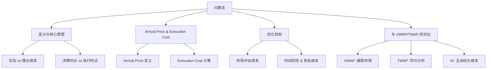

## 9、Implementation Shortfall算法：定义与核心思想、Arrival Price与Execution Cost、IS算法的优化目标、与VWAP/TWAP的对比

### 9.1 什么是Implementation Shortfall？

Implementation Shortfall，简称IS，中文叫"执行缺口"。

说白了，它就是衡量你下单时"理想很丰满，现实很骨感"的那部分差距。

我刚开始做算法交易时，对IS的理解很浅。总觉得能跑赢VWAP就是胜利。直到有一次，我帮一个机构客户拆单，明明VWAP跑得不错，客户却很不满意。后来复盘才发现，问题出在"决策时点"和"执行时点"之间的价格漂移上。

嗯，从那以后，我才真正理解了IS的价值。

IS的核心定义很简单：

> **IS = 实际执行成本 - 理论执行成本**
> 其中，理论执行成本通常以"决策时刻的市价"为基准。

你想想看，如果你在10:00决定买入100万股，当时股价是10元。结果你花了一整天慢慢买，平均成交价是10.05元。那这0.05元的差价，就是你的执行缺口。

这个缺口里，包含了市场冲击、时间风险、机会成本等等。IS算法要做的，就是把这些成本压到最低。

### 9.2 Arrival Price与Execution Cost

理解IS，必须先搞懂两个概念：Arrival Price和Execution Cost。

**Arrival Price**，就是订单到达市场那一刻的参考价格。我个人习惯用订单进入交易系统时的最新成交价，或者买卖中间价。

为什么选这个时间点？因为它是你"决策"和"执行"的分界线。在Arrival Price之前，价格波动属于投资决策的范畴；之后，才属于执行算法的范畴。

**Execution Cost**，就是实际成交价与Arrival Price之间的差异。

公式长这样：

```text
Execution Cost = (实际成交均价 - Arrival Price) × 成交数量
```

如果买股票，实际成交价比Arrival Price高，那就是正成本，亏了。反之就是负成本，赚了。

我在项目中遇到过一种情况：客户说"我不管Arrival Price，我只看VWAP"。结果呢？市场开盘后突然拉升，Arrival Price已经很高了，VWAP却还在低位。算法为了追VWAP，反而买在了更高的位置。这就是典型的"指标选错，满盘皆输"。

> 💡 **避坑指南：** 我曾经犯过一个错误——把Arrival Price设成了前一日收盘价。结果第二天跳空高开，算法一上来就显示巨额亏损。后来我改成"订单到达时的实时价格"，才解决了这个问题。

### 9.3 IS算法的优化目标

IS算法的优化目标，说白了就是一句话：**在给定的时间和风险约束下，最小化执行缺口**。

但这个目标拆开来看，其实包含三个互相矛盾的部分：

- **市场冲击成本**：你下单越急，冲击越大，成本越高
- **时间风险**：你拖得越久，价格越可能朝不利方向跑
- **机会成本**：如果没成交，错过的收益也算成本

这三者就像三角恋，你不可能同时讨好所有人。

IS算法的核心，就是在这三者之间找一个最优平衡点。具体来说：

1. **冲击模型**：预测不同下单速度下的市场冲击成本
2. **波动模型**：预测价格在等待期间可能发生的波动
3. **优化求解**：用数学方法（比如动态规划、随机控制）找到最优下单路径

我见过最极端的案例，是一个做市商客户。他们要求IS算法在30秒内完成1000万股的交易。你想想看，这冲击得有多大？最后我们不得不把订单拆成微秒级的小单，配合暗池和冰山订单，才勉强把IS控制在可接受范围内。

> ⚠️ **注意：** IS算法不是万能的。如果市场流动性极差，或者订单规模远超日均成交量，任何算法都救不了你。这时候，老老实实降低交易规模才是正道。

### 9.4 与VWAP/TWAP的对比

很多新手会问：IS和VWAP、TWAP到底有什么区别？

我打个比方你就明白了：

- **VWAP**：像个跟屁虫，市场怎么走我就怎么走。目标是"不跑偏"
- **TWAP**：像个机器人，到点就干活。目标是"均匀分布"
- **IS**：像个精明的商人，算清楚每一笔账。目标是"少亏钱"

下面这张表，是我自己总结的对比：

| 维度 | VWAP | TWAP | IS |
|------|------|------|-----|
| **基准** | 市场成交量加权均价 | 时间均匀分布 | 决策时刻的Arrival Price |
| **优化目标** | 跟踪误差最小化 | 时间偏差最小化 | 执行缺口最小化 |
| **风险偏好** | 低风险，被动跟随 | 低风险，机械执行 | 可调，主动管理风险 |
| **适用场景** | 大单拆小单，不暴露意图 | 流动性均匀的品种 | 对时机敏感的交易 |
| **复杂度** | 中等 | 低 | 高 |

我个人习惯这样选：

- 如果客户说"别搞砸了，跟着市场走就行"，我用VWAP
- 如果客户说"慢慢买，别着急"，我用TWAP
- 如果客户说"我要在10:30之前买完，成本越低越好"，我用IS

你想想看，IS算法其实是最"聪明"的，因为它会主动预测市场、管理风险。但代价就是模型复杂，参数多，调起来很费劲。

我曾经在一个项目中，把VWAP和IS做了背靠背测试。同样的订单，VWAP的跟踪误差只有0.02%，但IS的执行缺口比VWAP低了0.15%。对于大资金来说，这0.15%可能就是几百万的差距。

所以，别迷信任何一个算法。选哪个，取决于你的交易目标是什么。

### 9.5 知识体系总览

下面这张图，是我自己画的IS算法知识体系。你可以把它当作本章的"地图"：



这张图把IS算法的核心脉络都串起来了。从上到下，从左到右，你可以看到：定义、关键概念、优化目标，以及和VWAP/TWAP的对比关系。

我个人建议，初学者先盯着"Arrival Price & Execution Cost"这块看。搞懂了这两个概念，IS算法的大门就打开了一半。
