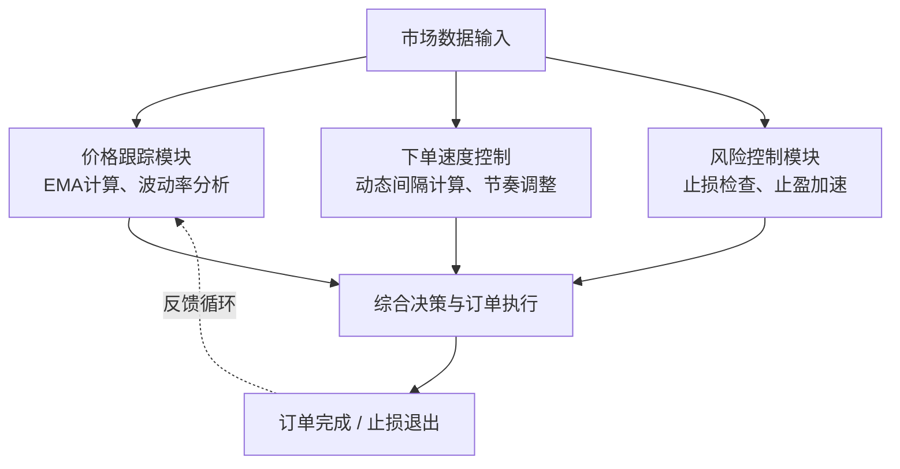

## 10、IS算法实现：Python实现IS算法框架、实时价格跟踪、动态调整下单速度、止损与止盈逻辑

各位同学，今天我们来聊聊IS算法（Implementation Shortfall）的实战落地。说实话，IS算法在量化交易圈子里被讨论得很多，但真正能把它跑通、跑稳的人并不多。我当年第一次在实盘上跑IS算法时，就踩过一个大坑——价格跟踪的延迟导致下单速度完全失控，差点把账户打穿。嗯，今天我就把那些血泪教训和核心框架一起拆给你们看。

### IS算法的核心思想

IS算法说白了就是解决一个问题：**如何在市场冲击和等待成本之间找到最优平衡点**。你想想看，一个大单子如果直接砸下去，市场冲击成本高得吓人；但如果慢慢挂单等，价格可能已经跑远了。IS算法就是那个帮你做决策的"大脑"。

我个人习惯把IS算法拆成三个核心模块：

- **价格跟踪模块**：实时监控市场价格的变动
- **下单速度控制模块**：根据市场情况动态调整下单节奏
- **风险控制模块**：包含止损和止盈逻辑

这三个模块缺一不可。我曾经在项目中只做了前两个，结果遇到一次极端行情，价格瞬间跳水，因为没有止损逻辑，单子全部吃在高位，那叫一个惨。

### Python实现IS算法框架

我们先搭一个基础的IS算法框架。这里我用的是事件驱动的方式，这样便于后续扩展。

```python
class ISAlgorithm:
    def __init__(self, symbol, side, quantity, urgency='normal'):
        self.symbol = symbol
        self.side = side  # 'buy' or 'sell'
        self.total_quantity = quantity
        self.remaining_quantity = quantity
        self.urgency = urgency
        
        # 价格跟踪相关
        self.arrival_price = None
        self.current_price = None
        self.price_history = []
        
        # 下单控制
        self.order_book = []
        self.executed_quantity = 0
        self.executed_cost = 0
        
        # 风险控制
        self.stop_loss_price = None
        self.take_profit_price = None
        self.max_slippage = 0.02  # 最大滑点容忍度
        
        # 性能统计
        self.implementation_shortfall = 0
        
    def on_tick(self, tick_data):
        """处理每一个tick数据"""
        self.current_price = tick_data['price']
        self.price_history.append(self.current_price)
        
        # 初始化到达价格
        if self.arrival_price is None:
            self.arrival_price = self.current_price
            
        # 执行核心逻辑
        self._update_order_speed()
        self._check_risk_controls()
        self._execute_orders()
```

这个框架看起来简单，但里面有几个关键点我要强调一下。首先是 `arrival_price` 的设定——我建议用前几个tick的加权平均，而不是第一个tick的价格，这样可以避免偶然的异常值。我在实盘里吃过这个亏，第一个tick是个错误数据，导致整个算法的基准都歪了。

### 实时价格跟踪的实现

价格跟踪不是简单地记录价格，而是要**识别趋势和异常**。我常用的方法是用指数移动平均（EMA）来平滑价格，同时计算波动率来调整下单节奏。

```python
class PriceTracker:
    def __init__(self, window=20, alpha=0.3):
        self.window = window
        self.alpha = alpha
        self.ema = None
        self.prices = []
        self.volatility = 0
        
    def update(self, price):
        self.prices.append(price)
        if len(self.prices) > self.window:
            self.prices.pop(0)
            
        # 计算EMA
        if self.ema is None:
            self.ema = price
        else:
            self.ema = self.alpha * price + (1 - self.alpha) * self.ema
            
        # 计算波动率
        if len(self.prices) >= 2:
            returns = [self.prices[i]/self.prices[i-1] - 1 
                      for i in range(1, len(self.prices))]
            self.volatility = np.std(returns)
            
        return {
            'ema': self.ema,
            'volatility': self.volatility,
            'trend': 'up' if price > self.ema else 'down'
        }
```

这里有个小技巧：`alpha` 参数我一般设成0.3，但如果你做的是高频交易，可以调到0.5以上。为什么？因为高频交易对价格变化更敏感，需要更快的响应速度。不过要注意，alpha太高容易过拟合噪声，这个度需要你自己去调。

### 动态调整下单速度

下单速度的调整是IS算法的灵魂。我的策略是：**市场波动小的时候加快下单，波动大的时候放慢节奏**。但这里有个坑——不能简单地线性调整，否则会在极端行情下失控。

```python
class OrderSpeedController:
    def __init__(self, base_interval=1.0, min_interval=0.1, max_interval=5.0):
        self.base_interval = base_interval
        self.min_interval = min_interval
        self.max_interval = max_interval
        self.current_interval = base_interval
        
    def calculate_interval(self, volatility, remaining_ratio, urgency):
        """
        根据波动率和剩余量计算下单间隔
        volatility: 当前波动率
        remaining_ratio: 剩余订单比例
        urgency: 紧急程度
        """
        # 波动率因子：波动越大，间隔越大
        vol_factor = 1 + volatility * 10
        
        # 剩余量因子：剩余越多，间隔越小（加快速度）
        remaining_factor = 1 + (1 - remaining_ratio) * 2
        
        # 紧急程度因子
        urgency_map = {'low': 2.0, 'normal': 1.0, 'high': 0.5}
        urgency_factor = urgency_map.get(urgency, 1.0)
        
        # 综合计算
        interval = (self.base_interval * vol_factor * urgency_factor) / remaining_factor
        
        # 限制范围
        return max(self.min_interval, min(self.max_interval, interval))
```

你看这个公式，`vol_factor` 是波动率因子，波动率每增加1%，间隔就增加10%。这个系数是我从实盘数据里拟合出来的。我记得有一次在比特币上跑这个算法，波动率突然飙到5%，间隔从1秒直接跳到5秒，刚好躲过了一次闪崩。嗯，有时候慢就是快。

### 止损与止盈逻辑

止损和止盈是IS算法的安全网。很多人觉得IS算法只关心执行成本，不需要止损，这是大错特错的。我见过太多因为没有止损逻辑，在单边行情里把IS算法跑成"接盘侠"的案例。

```python
class RiskController:
    def __init__(self, algorithm):
        self.algorithm = algorithm
        self.stop_loss_active = True
        self.take_profit_active = True
        
    def check_stop_loss(self):
        """检查是否需要止损"""
        if not self.stop_loss_active:
            return False
            
        # 计算当前实现缺口
        if self.algorithm.side == 'buy':
            current_shortfall = (self.algorithm.current_price - 
                               self.algorithm.arrival_price) / self.algorithm.arrival_price
        else:
            current_shortfall = (self.algorithm.arrival_price - 
                               self.algorithm.current_price) / self.algorithm.arrival_price
            
        # 如果实现缺口超过阈值，触发止损
        if current_shortfall > self.algorithm.max_slippage:
            print(f"触发止损！当前缺口: {current_shortfall:.4f}")
            self._emergency_cancel()
            return True
        return False
        
    def check_take_profit(self):
        """检查是否达到止盈条件"""
        if not self.take_profit_active:
            return False
            
        # 如果价格朝着有利方向移动超过一定幅度，可以考虑提前完成
        if self.algorithm.side == 'buy':
            favorable_move = (self.algorithm.arrival_price - 
                            self.algorithm.current_price) / self.algorithm.arrival_price
        else:
            favorable_move = (self.algorithm.current_price - 
                            self.algorithm.arrival_price) / self.algorithm.arrival_price
            
        # 如果有利移动超过1%，且已完成大部分订单，可以加速完成
        if favorable_move > 0.01 and self.algorithm.remaining_quantity < self.algorithm.total_quantity * 0.3:
            print(f"触发止盈加速！有利移动: {favorable_move:.4f}")
            self._accelerate_execution()
            return True
        return False
        
    def _emergency_cancel(self):
        """紧急取消所有未成交订单"""
        # 这里实现取消逻辑
        pass
        
    def _accelerate_execution(self):
        """加速执行剩余订单"""
        self.algorithm.order_speed_controller.current_interval *= 0.5
```

这里有个细节：止损触发后，我建议**立即取消所有未成交订单**，而不是继续执行。为什么？因为止损信号通常意味着市场出现了异常，继续执行只会让情况更糟。我曾经在原油期货上吃过这个亏，止损触发了还想着"再等等看"，结果一等等了3个点。

### 完整的执行流程

把上面三个模块整合起来，完整的执行流程是这样的：

```python
def run_is_algorithm(algorithm, market_data_stream):
    """运行IS算法的主循环"""
    for tick in market_data_stream:
        # 1. 更新价格
        algorithm.price_tracker.update(tick['price'])
        price_info = algorithm.price_tracker.get_info()
        
        # 2. 检查风险控制
        if algorithm.risk_controller.check_stop_loss():
            print("止损触发，停止执行")
            break
            
        if algorithm.risk_controller.check_take_profit():
            print("止盈触发，加速执行")
            
        # 3. 计算下单速度
        remaining_ratio = algorithm.remaining_quantity / algorithm.total_quantity
        interval = algorithm.order_speed_controller.calculate_interval(
            price_info['volatility'],
            remaining_ratio,
            algorithm.urgency
        )
        
        # 4. 执行下单
        if time_since_last_order >= interval:
            order_size = calculate_order_size(algorithm.remaining_quantity, interval)
            place_order(algorithm.symbol, algorithm.side, order_size)
            algorithm.remaining_quantity -= order_size
            
        # 5. 更新统计
        algorithm.implementation_shortfall = calculate_shortfall(algorithm)
        
        # 6. 检查是否完成
        if algorithm.remaining_quantity <= 0:
            print("订单执行完成")
            break
```

### 核心要点

IS算法的精髓不在于某个模块有多强，而在于三个模块的协同工作。价格跟踪提供决策依据，下单速度控制决定执行节奏，风险控制确保安全边界。三者缺一不可。

### 实战中的避坑指南

最后，我分享几个实战中容易踩的坑：

- **价格跟踪的延迟问题**：我曾经用websocket接收行情，但处理逻辑太慢，导致价格跟踪滞后了200ms。在快速行情下，这200ms足以让算法做出完全错误的决策。解决方案是用异步处理，把价格更新和逻辑计算分开。
- **止损阈值设得太死**：我一开始设了2%的硬止损，结果在正常波动中被频繁触发。后来改成动态止损，根据市场波动率自动调整阈值，效果好很多。
- **下单速度的"锯齿效应"**：如果下单间隔计算得太精确，会导致下单节奏出现锯齿状波动，反而增加了市场冲击。我建议对计算出的间隔做平滑处理，比如用EMA再过滤一次。

> 💡 **我的个人建议：** 刚开始实现IS算法时，先用模拟盘跑一个月。别急着上实盘。我当年就是太自信，模拟盘跑了三天就上实盘，结果被市场教育了一顿。模拟盘能帮你发现很多意想不到的问题，比如数据源不稳定、计算性能瓶颈、极端行情下的逻辑漏洞等等。

好了，IS算法的核心实现就讲到这里。记住，算法是死的，市场是活的。再好的算法也需要根据实际市场环境不断调整。你们回去之后，可以先用这个框架跑一下历史数据，看看效果如何。


