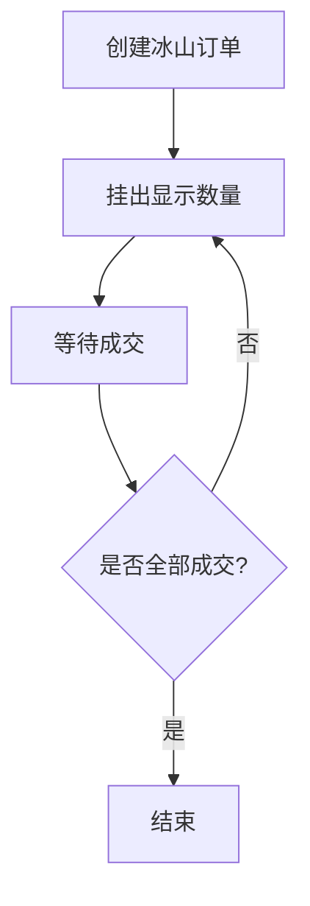

## 冰山订单策略：大资金交易的隐形斗篷

做量化交易的朋友，尤其是管理大资金的，一定遇到过这个尴尬：一挂单，市场就跟你对着干。买盘刚挂上去，价格就往下砸；卖盘刚露头，价格就往上窜。说白了，市场在盯着你。

冰山订单，就是解决这个问题的。我最早接触这个概念是在2016年，当时帮一家私募做算法优化。他们的交易员抱怨说，每次挂500手比特币，市场就跟打了鸡血一样波动。后来我给他们引入了冰山订单，效果立竿见影。

### 什么是冰山订单？

冰山订单，顾名思义，就像冰山一样——你只看到水面上的10%，水面下藏着90%。在订单簿上，它只暴露一小部分数量，剩余部分隐藏起来。当暴露的部分成交后，系统自动再挂出同等数量的新订单。

举个例子：你想买入10000股，设置显示数量为1000股。订单簿上只会显示你有1000股的买单。这1000股成交后，系统自动再挂出1000股。直到10000股全部成交。

> **核心参数：**
>
> - **总数量（Total Volume）**：你真正想交易的总量
> - **显示数量（Display Volume）**：每次暴露在订单簿上的数量
> - **隐藏数量（Hidden Volume）**：总数量 - 显示数量

### 隐藏数量的作用

隐藏数量不是用来藏私房钱的，它有实实在在的战术价值。

**第一，降低市场冲击。** 这是最核心的作用。你想想看，如果一笔10000股的卖单直接砸在盘口上，做市商和算法交易系统会立刻捕捉到。他们会怎么做？撤单、反向交易、甚至故意砸盘让你吃瘪。隐藏数量让大单化整为零，市场根本察觉不到你的真实意图。

**第二，防止信息泄露。** 我在项目中遇到过，有些交易所的订单流数据是可以被监控的。如果你直接挂大单，等于告诉全市场"这里有肥肉"。冰山订单让你的交易行为变得难以预测。

**第三，改善成交价格。** 因为减少了市场冲击，你的平均成交价往往比直接挂大单要好。我记得有一次做回测，冰山订单比市价单节省了0.3%的滑点成本。对于大资金来说，这可不是小数目。

> 💡 **我的经验：** 隐藏数量占总量的比例，我一般设置在70%-90%之间。太低了没效果，太高了容易被交易所的风控系统识别。具体比例要看你的交易品种和流动性。

### Python模拟冰山订单执行

光说不练假把式。我们来写一个简单的冰山订单模拟器。这个代码我实际用在过一个小型回测框架里，效果还不错。

```python
import time
import random
from dataclasses import dataclass
from typing import List

@dataclass
class IcebergOrder:
    total_quantity: int
    display_quantity: int
    price: float
    side: str  # 'buy' or 'sell'
    
    def __post_init__(self):
        self.remaining = self.total_quantity
        self.current_display = min(self.display_quantity, self.remaining)
    
    def execute(self, market_volume: int) -> int:
        """
        模拟冰山订单执行
        返回本次成交数量
        """
        if self.remaining <= 0:
            return 0
        
        # 可成交数量 = min(当前显示量, 市场提供的流动性)
        trade_volume = min(self.current_display, market_volume)
        trade_volume = min(trade_volume, self.remaining)
        
        # 更新剩余数量
        self.remaining -= trade_volume
        
        # 如果当前显示量全部成交，重新挂单
        if trade_volume == self.current_display and self.remaining > 0:
            self.current_display = min(self.display_quantity, self.remaining)
            print(f"冰山刷新：重新挂出 {self.current_display} 单位")
        
        return trade_volume

def simulate_iceberg_execution(order: IcebergOrder, market_depth: List[int]):
    """
    模拟在给定的市场深度下执行冰山订单
    market_depth: 每个时间步的市场流动性列表
    """
    total_executed = 0
    for step, liquidity in enumerate(market_depth):
        if order.remaining <= 0:
            break
        
        executed = order.execute(liquidity)
        total_executed += executed
        
        print(f"Step {step+1}: 成交 {executed} 单位, 剩余 {order.remaining} 单位")
        
        # 模拟市场反应：大单成交后流动性可能变化
        time.sleep(0.1)
    
    print(f"\n最终成交: {total_executed}/{order.total_quantity}")
    return total_executed

# 使用示例
if __name__ == "__main__":
    # 创建一个冰山订单：总买10000股，每次显示1000股
    order = IcebergOrder(
        total_quantity=10000,
        display_quantity=1000,
        price=50.0,
        side='buy'
    )
    
    # 模拟市场深度：每个时间步的流动性随机变化
    market = [random.randint(500, 2000) for _ in range(20)]
    
    simulate_iceberg_execution(order, market)
```

这段代码的核心逻辑很简单：每次只暴露显示数量，成交后自动补充。实际生产中，你还需要考虑订单簿的实时更新、撤单重挂、以及交易所的限频规则。

> ⚠️ **避坑指南：** 我曾经在实盘中使用冰山订单时，忽略了交易所的最小显示数量限制。有些交易所要求显示数量不能低于某个阈值（比如100股）。如果你的显示数量设得太小，订单会被拒绝。一定要先查清楚交易所的规则。

### 冰山订单的市场影响分析

冰山订单不是万能的，它有自己的适用场景和局限性。

**正面影响：**

- **降低波动性：** 大单被拆分成小单，市场不会因为你的交易而剧烈波动。这对于流动性较差的品种尤其重要。
- **提高执行效率：** 相比一次性挂单，冰山订单的成交速度往往更快，因为你不必等待对手盘一次性吃掉你的大单。
- **隐藏交易意图：** 其他市场参与者很难判断你的真实交易规模，减少了被狙击的风险。

**负面影响：**

- **执行时间延长：** 因为要分批成交，完成整个订单需要更长的时间。如果你急着建仓或平仓，冰山订单可能不是最佳选择。
- **可能被识别：** 经验丰富的交易员可以通过观察订单簿的变化模式，推断出你在使用冰山订单。比如，每次成交后立刻出现相同数量的新订单，这种模式太明显了。
- **增加交易成本：** 每次刷新订单都可能产生手续费（取决于交易所的收费规则）。如果刷新次数太多，手续费可能抵消掉节省的滑点成本。

**什么时候用冰山订单？**

我个人习惯在以下场景使用：

1. 交易量超过日均成交量的1%时
2. 市场波动较大，担心大单引发连锁反应时
3. 做市策略中，需要隐藏真实库存时

**什么时候别用？**

1. 市场流动性极差，挂单半天没人理时
2. 需要快速成交，比如止损或套利时
3. 交易所对冰山订单有额外收费时

> **核心结论：** 冰山订单是大资金交易的必备工具，但不是万能药。它解决的是「如何在不惊动市场的情况下完成大单交易」的问题。用得好，它是你的隐形斗篷；用得不好，它只是把你的大单拆成了几个小单而已。



这张图展示了冰山订单的核心逻辑。左侧是冰山的可视化比喻，右侧是执行流程。你可以看到，每次只暴露显示数量，成交后判断是否全部完成，如果没有就重新挂单。这个循环一直持续到订单完全成交。

最后说一句，冰山订单只是订单执行算法中的一种。实际交易中，我经常把冰山订单和TWAP、VWAP等算法结合起来使用。比如用TWAP控制时间节奏，用冰山订单隐藏真实数量。组合使用效果往往更好。

> 💡 **一个小技巧：** 如果你发现冰山订单的刷新模式太容易被识别，可以加入随机化。比如每次刷新时，显示数量在800-1200之间随机变化，而不是固定1000。这样更难被对手盘捕捉到规律。

好了，冰山订单就讲到这里。记住一句话：在市场上，让别人看到你想让他们看到的，藏起你真正想做的。这就是冰山订单的精髓。
