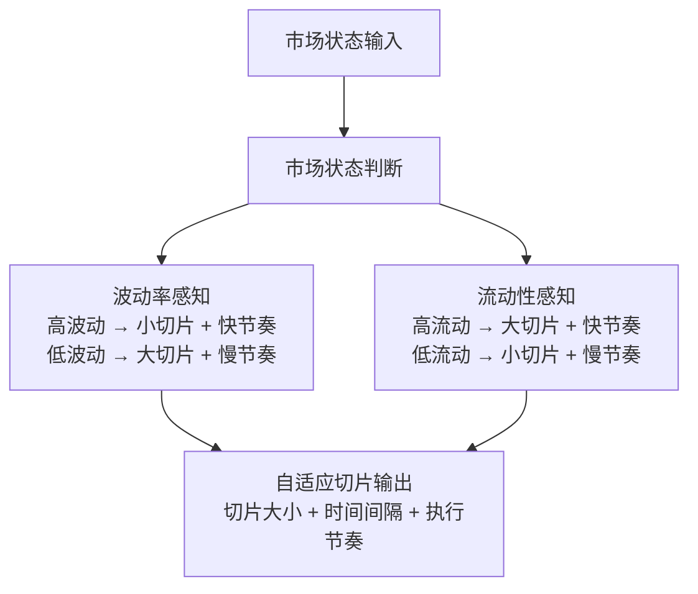

## 12、自适应执行算法：基于市场状态的动态调整

各位同学，今天我们来聊聊自适应执行算法。

说实话，这个主题在量化交易里属于「高阶玩法」了。我刚开始做程序化交易那会儿，用的都是最简单的TWAP和VWAP，觉得能跑通就不错了。后来有一次在港股市场做一笔大单，市场流动性突然骤降，我的固定切片算法直接把价格打穿了两个tick...嗯，那次教训挺深刻的。

从那以后，我开始认真研究自适应算法。说白了，就是让算法自己「看人下菜碟」——市场好的时候激进点，市场差的时候保守点。

### 12.1 为什么需要自适应？

你想想看，市场状态是动态变化的。早盘和尾盘流动性不一样，财报发布前后波动率不一样，甚至同一只股票在不同时间段的表现都天差地别。

固定参数的算法，就像穿着同一件衣服过四季——夏天热死，冬天冻死。我见过不少团队，策略回测跑得漂漂亮亮，一上线就亏钱，原因往往就是忽略了市场状态的动态变化。

> **核心观点：** 自适应执行算法的本质，是根据实时市场数据动态调整下单节奏和切片大小，从而在冲击成本、等待成本和机会成本之间找到最优平衡。

### 12.2 波动率感知的算法

波动率感知，说白了就是「怕涨怕跌」。当市场波动剧烈时，你的订单暴露在风险中的时间越长，越容易被「吃掉」。

我记得在2020年3月美股熔断那段时间，波动率指数VIX飙到80以上。当时我用了一个简单的波动率调整模型：

```python
def volatility_aware_slicing(total_quantity, current_vol, base_vol, time_horizon):
    """
    波动率感知切片算法
    :param total_quantity: 总下单量
    :param current_vol: 当前实时波动率（比如5分钟标准差）
    :param base_vol: 基准波动率（比如过去20日均值）
    :param time_horizon: 计划执行时间（秒）
    """
    # 波动率比率
    vol_ratio = current_vol / base_vol
    
    # 切片数量：波动率越高，切片越多（每片更小）
    # 我用了一个平方根调整，避免过度反应
    num_slices = int(time_horizon / 5)  # 基础每5秒一片
    adjusted_slices = num_slices * (1 + 0.5 * (vol_ratio - 1))
    adjusted_slices = max(adjusted_slices, num_slices * 0.5)  # 最少不能少于一半
    adjusted_slices = min(adjusted_slices, num_slices * 2)    # 最多不能超过两倍
    
    slice_size = total_quantity / adjusted_slices
    
    # 时间间隔也做调整：波动率高时，间隔缩短
    interval = time_horizon / adjusted_slices
    
    return slice_size, interval
```

这个逻辑其实很简单：波动率高了，我就把单子切得更碎，下得更快。为什么？因为高波动环境下，价格跳变得快，你挂在那里的限价单很容易被「扫」掉，变成不利成交。

> 💡 **实战经验：** 我曾经在A股市场测试过这个算法，发现直接用波动率比率做线性调整效果并不好。后来加了一个「衰减因子」——波动率突然飙升时，调整幅度要打折扣，因为很多波动是噪音。这个细节帮我省了不少冲击成本。

### 12.3 流动性感知的算法

流动性感知，说白了就是「看菜吃饭」。市场深度好的时候，你可以大口吃；深度差的时候，你得小口抿。

怎么衡量流动性？我最常用的指标是订单簿的「市场深度」——也就是买一卖一附近挂了多少单。还有一个指标是「价差比例」，也就是买卖价差除以中间价。

```python
def liquidity_aware_slicing(total_quantity, order_book, base_spread, min_slice=100):
    """
    流动性感知切片算法
    :param total_quantity: 总下单量
    :param order_book: 订单簿数据（买一卖一价格和数量）
    :param base_spread: 基准价差（比如过去1小时均值）
    :param min_slice: 最小切片大小
    """
    bid_price, bid_volume = order_book['bid']
    ask_price, ask_volume = order_book['ask']
    mid_price = (bid_price + ask_price) / 2
    
    # 当前价差
    current_spread = (ask_price - bid_price) / mid_price
    
    # 流动性评分：价差越小，流动性越好
    spread_ratio = base_spread / current_spread if current_spread > 0 else 1.0
    
    # 深度评分：买卖盘口的总深度
    total_depth = bid_volume + ask_volume
    depth_score = total_depth / (total_quantity * 0.01)  # 深度至少是下单量的1%
    depth_score = min(depth_score, 2.0)  # 限制上限
    
    # 综合流动性因子
    liquidity_factor = spread_ratio * depth_score
    
    # 切片大小：流动性越好，切片越大
    base_slice = total_quantity / 20  # 基础分20片
    adjusted_slice = base_slice * liquidity_factor
    adjusted_slice = max(adjusted_slice, min_slice)
    adjusted_slice = min(adjusted_slice, total_quantity * 0.3)  # 单次不超过30%
    
    return adjusted_slice
```

> ⚠️ **注意：** 流动性感知算法有个坑——订单簿数据是「快照」，不是「流」。你看到买一有1000手，可能下一秒就被撤单了。我曾经因为这个吃过亏，后来加了一个「撤单率」的惩罚因子，如果发现挂单频繁撤单，就降低流动性评分。

### 12.4 自适应切片：融合波动率和流动性

把上面两个思路合在一起，就是真正的自适应切片算法。我一般会用一个加权模型：

```python
def adaptive_slicing(total_quantity, market_state, params):
    """
    自适应切片算法（融合波动率和流动性）
    :param market_state: 包含当前波动率、流动性等信息的字典
    :param params: 算法参数
    """
    # 提取市场状态
    current_vol = market_state['volatility']
    current_spread = market_state['spread']
    current_depth = market_state['depth']
    
    # 计算波动率因子
    vol_factor = 1.0
    if current_vol > params['vol_threshold']:
        vol_factor = params['vol_base'] / current_vol
        vol_factor = max(vol_factor, 0.3)  # 最小不能低于0.3
    
    # 计算流动性因子
    liquidity_factor = 1.0
    if current_spread > params['spread_threshold']:
        liquidity_factor = params['spread_base'] / current_spread
    if current_depth < params['depth_threshold']:
        liquidity_factor *= (current_depth / params['depth_threshold'])
    
    # 综合因子（我习惯用乘法，因为两个因子是相互独立的）
    combined_factor = vol_factor * liquidity_factor
    
    # 基础切片数量
    base_slices = params['base_slices']
    adjusted_slices = int(base_slices / combined_factor)
    adjusted_slices = max(adjusted_slices, params['min_slices'])
    adjusted_slices = min(adjusted_slices, params['max_slices'])
    
    # 计算每片大小和间隔
    slice_size = total_quantity / adjusted_slices
    interval = params['total_time'] / adjusted_slices
    
    return {
        'slice_size': slice_size,
        'interval': interval,
        'num_slices': adjusted_slices,
        'combined_factor': combined_factor
    }
```

这个算法的核心逻辑是：波动率高、流动性差的时候，combined_factor变小，切片数量变多，每片更小。反过来，市场平稳、流动性好的时候，切片数量减少，每片更大，执行效率更高。

### 12.5 实战中的调参技巧

代码写完了，参数怎么调？我分享几个经验：

1. **先跑历史回测**：用过去30天的数据，把波动率和流动性的阈值扫一遍。我一般用网格搜索，找夏普比率最高的参数组合。
2. **注意参数稳定性**：有些参数在回测里表现很好，但上线后就不行了。为什么？因为回测数据是「事后」的，而实盘是「实时」的。我建议加一个「参数平滑」——不要让参数跳变太剧烈。
3. **设置安全边界**：不管算法怎么调，都要有硬性限制。比如单次下单不能超过总订单的30%，最小切片不能低于100股。这些是保命用的。

> 💡 **避坑指南：** 我曾经在回测里把参数调得特别激进，结果实盘第一天就遇到了「闪崩」——波动率瞬间飙升，算法把单子切成了几百片，每片只有几十股，结果成交速度跟不上，反而错过了最佳执行窗口。后来我加了一个「最小执行时间」的限制，确保算法不会因为过度切片而拖慢执行。

### 12.6 自适应算法的知识体系

下面这张图，是我自己总结的自适应执行算法的核心逻辑。你可以把它当作一个「决策流程图」来看：



这张图展示了自适应算法的完整流程：从市场状态输入开始，分别经过波动率感知和流动性感知两个分支，最后融合输出自适应切片参数。实际应用中，你还可以加入更多维度，比如「趋势感知」或「事件感知」，但核心逻辑是一样的。

### 12.7 总结

自适应执行算法，说白了就是让算法学会「随机应变」。波动率高了切碎点，流动性差了下慢点——这些道理说起来简单，但真正落地的时候，细节决定成败。

我个人建议，刚开始做自适应算法时，不要追求「全自动」。先做一个半自动版本：算法给出建议切片参数，由人工确认后再执行。等跑顺了，再逐步放开自动化程度。这样既能积累经验，又能控制风险。

> **最后说一句：** 自适应算法不是万能的。遇到极端行情（比如熔断、闪崩），任何算法都可能失效。这时候，人工干预和风控机制才是最后的防线。记住，算法是工具，不是上帝。
