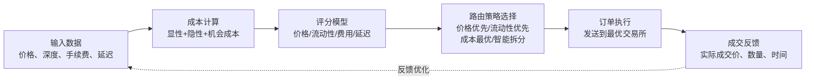

# 订单路由优化：多交易所路由逻辑、最优执行场所选择、路由成本计算、Python实现简单路由策略

订单路由，说白了就是帮你的订单找个最合适的去处。我刚开始做程序化交易那会儿，以为只要把订单扔给交易所就行了。后来发现，同一个股票可能在好几个交易所都有交易，每个地方的价格、深度、手续费都不一样。选错了地方，可能多花不少钱。

今天我们就聊聊这个。我会结合自己踩过的坑，把多交易所路由的逻辑、成本计算，还有怎么用Python写个简单的路由策略，都掰开揉碎了讲清楚。

## 为什么需要订单路由？

你想想看，现在很多品种都是跨交易所上市的。比如某只股票，可能在A交易所、B交易所、C交易所都有交易。每个交易所的流动性、买卖价差、交易费用都不一样。

举个例子：

- A交易所：深度好，但手续费高
- B交易所：深度一般，但手续费低
- C交易所：偶尔有价格优势，但流动性差

如果你一股脑全发到A交易所，可能多付了手续费。如果你全发到B交易所，可能因为深度不够，大单成交不理想。所以，我们需要一个聪明的路由策略，帮我们做决策。

### 核心目标

在多个交易场所中，选择那个能让你以最优价格、最低成本、最快速度成交的场所。

## 路由成本计算：不只是手续费

很多人以为路由成本就是手续费。其实没那么简单。我个人习惯把成本拆成三块：

1. **显性成本**：交易所手续费、结算费、过户费等。这些是明码标价的。
2. **隐性成本**：买卖价差、市场冲击成本。这个容易被忽略，但往往是大头。
3. **机会成本**：因为没成交而错过的收益。比如你挂单没成交，价格却涨上去了。

我记得有一次，我为了省手续费，把订单全发到了手续费最低的交易所。结果那个交易所深度太差，我的大单直接把价格打穿了，反而多亏了好几个点。嗯，这就是典型的只看显性成本，忽略了隐性成本。

所以，计算路由成本时，我建议用这个公式：

```text
总成本 = 手续费 + 滑点成本 + 未成交风险成本
```

其中滑点成本可以用预期成交价格与当前最优价的差值来估算。未成交风险成本，则取决于你的订单类型和市场的流动性。

## 最优执行场所选择：一个动态决策问题

最优场所不是固定的。它取决于很多因素：

- 订单规模：小单和大单的策略完全不同
- 市场状态：波动大还是波动小
- 时间要求：是立即成交还是可以慢慢等
- 各交易所的实时状态：深度、价差、延迟

我一般会建一个评分模型。给每个交易所打分，然后选分数最高的。打分维度包括：

| 维度 | 权重 | 说明 |
|------|------|------|
| 价格优势 | 40% | 当前最优买卖价与目标价的差距 |
| 流动性 | 30% | 订单簿深度，能吃掉多少量而不影响价格 |
| 手续费 | 20% | 各交易所的费率差异 |
| 延迟 | 10% | 订单到交易所的往返时间 |

当然，权重可以根据你的交易风格调整。做高频的，延迟权重可能更高。做低频大单的，流动性权重更高。

## 多交易所路由逻辑：几种常见策略

路由逻辑说白了就是一套规则。我总结了几种常见的：

1. **价格优先策略**：哪个交易所的价格好，就去哪个。适合小单。
2. **流动性优先策略**：哪个交易所深度好，就去哪个。适合大单。
3. **成本最优策略**：综合考虑价格、手续费、滑点，选总成本最低的。
4. **智能拆分策略**：把大单拆成小单，分到不同交易所。这个最复杂，也最实用。

我曾经做过一个项目，需要同时处理三个交易所的订单。一开始用的价格优先策略，结果发现A交易所价格好但深度差，B交易所价格差但深度好。后来改成了智能拆分，把订单按比例分配到两个交易所，效果好了很多。

## Python实现：一个简单的路由策略

下面我写一个简单的路由策略。它根据各交易所的实时数据，计算综合评分，然后选择最优场所。

```python
import pandas as pd
import numpy as np

class SimpleRouter:
    def __init__(self, fee_rates, latency_ms):
        """
        fee_rates: dict, 各交易所手续费率
        latency_ms: dict, 各交易所延迟(毫秒)
        """
        self.fee_rates = fee_rates
        self.latency_ms = latency_ms

    def score_exchange(self, exchange, best_bid, best_ask, depth_volume, order_side, order_qty):
        """
        给单个交易所打分
        """
        # 1. 价格优势得分
        if order_side == 'buy':
            price_spread = best_ask - best_bid
            # 价格越好(价差越小)得分越高
            price_score = 1.0 / (1.0 + price_spread * 100)
        else:
            price_spread = best_ask - best_bid
            price_score = 1.0 / (1.0 + price_spread * 100)

        # 2. 流动性得分
        # 深度越深，得分越高
        liquidity_score = min(depth_volume / (order_qty + 1), 1.0)

        # 3. 手续费得分
        fee = self.fee_rates.get(exchange, 0.001)
        fee_score = 1.0 - fee * 10  # 手续费越低得分越高

        # 4. 延迟得分
        latency = self.latency_ms.get(exchange, 100)
        latency_score = 1.0 - latency / 200.0  # 延迟越低得分越高

        # 综合评分
        total_score = (0.4 * price_score +
                       0.3 * liquidity_score +
                       0.2 * fee_score +
                       0.1 * latency_score)

        return total_score

    def route(self, market_data, order_side, order_qty):
        """
        market_data: dict, 各交易所的实时数据
        返回最优交易所和评分
        """
        best_exchange = None
        best_score = -np.inf

        for exchange, data in market_data.items():
            score = self.score_exchange(
                exchange,
                data['best_bid'],
                data['best_ask'],
                data['depth_volume'],
                order_side,
                order_qty
            )

            if score > best_score:
                best_score = score
                best_exchange = exchange

        return best_exchange, best_score

# 使用示例
router = SimpleRouter(
    fee_rates={'exchange_A': 0.0003, 'exchange_B': 0.0005, 'exchange_C': 0.0001},
    latency_ms={'exchange_A': 10, 'exchange_B': 20, 'exchange_C': 50}
)

market_data = {
    'exchange_A': {'best_bid': 100.0, 'best_ask': 100.1, 'depth_volume': 5000},
    'exchange_B': {'best_bid': 99.9, 'best_ask': 100.0, 'depth_volume': 10000},
    'exchange_C': {'best_bid': 100.05, 'best_ask': 100.15, 'depth_volume': 2000}
}

best_ex, score = router.route(market_data, 'buy', 1000)
print(f"最优交易所: {best_ex}, 评分: {score:.4f}")
```

这个代码很简单，但已经能跑起来了。实际项目中，你还需要考虑更多细节，比如订单簿的实时更新、多线程处理、异常处理等。

### 小提示

评分模型的权重不是一成不变的。我建议定期回测，根据历史表现调整权重。比如，如果最近市场波动大，可以适当提高价格优势的权重。

## 避坑指南：我曾经踩过的坑

做路由优化，有几个坑特别容易踩：

- **数据延迟**：你看到的交易所价格，可能已经是几百毫秒前的了。我曾经因为用了过时的数据，把订单发到了已经没优势的交易所。解决方案是，尽量用低延迟的数据源，或者对数据做时间戳校验。
- **订单簿快照 vs 增量**：如果每次都用全量快照，数据量太大。我建议用增量更新，只处理变化的部分。
- **过度优化**：有时候，简单的策略反而更稳定。不要为了追求一点点理论上的最优，把系统搞得太复杂。

### 警告

路由策略一定要做充分的回测和模拟交易。别直接上实盘。我见过有人策略写错了，把买单发到了卖单的交易所，结果瞬间亏了一大笔。

## 知识体系图：订单路由优化核心逻辑

下面这张图，我把整个路由优化的核心逻辑画出来了。你可以看到，从输入数据到最终决策，每一步都很关键。



从这张图你可以看到，整个流程是闭环的。成交反馈会用来优化评分模型和路由策略。这也是为什么我强调要做回测和持续优化。

好了，关于订单路由优化，今天就聊这么多。核心就是：别只看价格，也别只看手续费。综合考虑，动态决策，才是正道。

