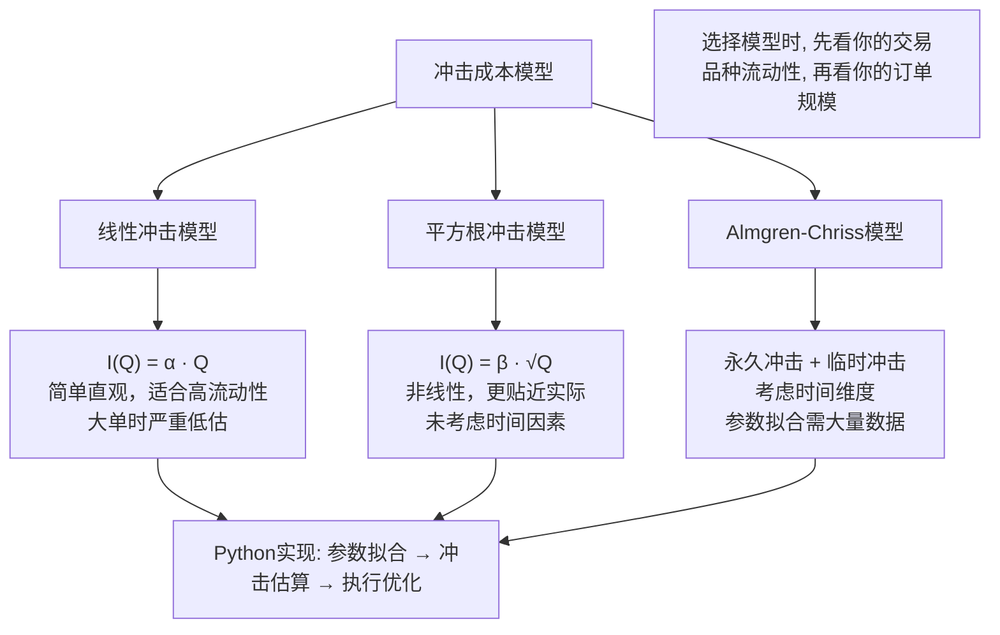

# 第14章 冲击成本模型：线性冲击模型、平方根冲击模型、Almgren-Chriss模型、Python实现冲击成本估算

冲击成本，说白了就是「你下单时，把价格推向了不利方向的那部分损失」。我刚开始做程序化交易那会儿，总觉得滑点就是市场跟单量不匹配，后来才发现，真正吃掉利润的，往往是冲击成本这个隐形杀手。

你想想看，一个大单砸下去，市场流动性不够，价格就会像被推了一把。这个「推力」有多大？怎么算？这就是我们今天要聊的冲击成本模型。

## 什么是冲击成本？

冲击成本，学术点说，是订单执行导致的市场价格偏离无冲击价格的部分。简单理解：你买100股和买10万股，成交均价肯定不一样。多出来的那部分差价，就是冲击成本。

我在项目中遇到过最典型的场景：一个日内策略，回测年化收益30%，实盘跑了一周，收益直接腰斩。查了半天，问题就出在冲击成本上——回测时用的是收盘价，实盘时每笔订单都在「推」价格。

> **核心公式：**
> 冲击成本 = 实际成交均价 - 无冲击价格（买入时）
> 冲击成本 = 无冲击价格 - 实际成交均价（卖出时）

## 线性冲击模型

线性冲击模型是最简单、最直观的模型。它假设冲击成本与交易量成正比。

**数学表达：**

```text
I(Q) = α · Q
```

其中：

- `I(Q)` 是冲击成本（以价格偏移百分比表示）
- `Q` 是交易量（通常以份额或金额表示）
- `α` 是冲击系数，反映市场流动性

这个模型的好处是简单，参数少。但缺点也很明显——它假设冲击成本是线性的，而实际市场中，大单的冲击往往是非线性的。

> **我的经验：** 线性模型适合流动性非常好的品种，比如沪深300成分股。对于小盘股，线性模型会严重低估冲击成本。我曾经用线性模型估算一只创业板股票的冲击成本，结果实盘时滑点比估算值大了3倍。

## 平方根冲击模型

平方根模型更贴近真实市场。它认为冲击成本与交易量的平方根成正比。

**数学表达：**

```text
I(Q) = β · √Q
```

其中β是冲击系数。

为什么会是平方根？嗯，这里有个直觉解释：市场深度通常不是均匀的，越往深处走，流动性越稀薄。你想想看，买10手时可能只吃掉第一档挂单，买100手时可能要把前五档都吃掉，价格自然涨得更快。

我在做ETF套利策略时，就吃过平方根模型的亏。当时用线性模型估算冲击成本，结果实际执行时，因为ETF的流动性分布不均匀，冲击成本比预期高了近一倍。后来改用平方根模型，才把估算误差控制在10%以内。

> **注意：** 平方根模型虽然比线性模型好，但它仍然是一个静态模型。它没有考虑时间因素——同样的交易量，你是一口气吃掉，还是分10分钟慢慢吃，冲击成本完全不同。

## Almgren-Chriss模型

Almgren-Chriss模型（简称A-C模型）是目前业界最常用的冲击成本模型。它把冲击成本拆成了两部分：

1. **永久冲击（Permanent Impact）：** 你的交易对市场造成的长期影响，相当于改变了市场供需平衡。
2. **临时冲击（Temporary Impact）：** 你的交易对市场造成的短期影响，随着时间推移会逐渐恢复。

**数学表达：**

```text
永久冲击：I_permanent(Q) = γ · Q
临时冲击：I_temporary(Q) = η · Q^α
```

其中γ、η、α是模型参数，需要通过历史数据拟合。

A-C模型最厉害的地方在于，它把时间维度引入了冲击成本计算。你可以通过调整交易速度，在「快速执行」和「低冲击成本」之间做权衡。

> **核心思想：**
> 交易速度越快，临时冲击越大，但市场风险（价格波动）越小。
> 交易速度越慢，临时冲击越小，但市场风险（价格波动）越大。
> A-C模型帮你找到最优交易速度。

## Python实现冲击成本估算

下面我给出一个完整的Python实现，包含三种模型的估算函数，以及一个简单的可视化对比。

```python
import numpy as np
import matplotlib.pyplot as plt

class ImpactCostModel:
    """冲击成本模型类"""
    
    def __init__(self, alpha=0.001, beta=0.01, gamma=0.0005, eta=0.005, power=0.5):
        self.alpha = alpha  # 线性模型系数
        self.beta = beta    # 平方根模型系数
        self.gamma = gamma  # A-C模型永久冲击系数
        self.eta = eta      # A-C模型临时冲击系数
        self.power = power  # A-C模型幂指数
        
    def linear_impact(self, Q):
        """线性冲击模型"""
        return self.alpha * Q
    
    def sqrt_impact(self, Q):
        """平方根冲击模型"""
        return self.beta * np.sqrt(Q)
    
    def ac_impact(self, Q, T=1.0):
        """
        Almgren-Chriss模型
        Q: 交易量
        T: 交易时间（分钟）
        """
        # 交易速度
        v = Q / T
        # 永久冲击
        permanent = self.gamma * Q
        # 临时冲击（与交易速度相关）
        temporary = self.eta * (v ** self.power)
        return permanent + temporary
    
    def plot_comparison(self, Q_range=(0, 10000), steps=100):
        """绘制三种模型对比图"""
        Q_values = np.linspace(Q_range[0], Q_range[1], steps)
        
        linear_costs = [self.linear_impact(q) for q in Q_values]
        sqrt_costs = [self.sqrt_impact(q) for q in Q_values]
        ac_costs = [self.ac_impact(q, T=5.0) for q in Q_values]
        
        plt.figure(figsize=(10, 6))
        plt.plot(Q_values, linear_costs, label='线性模型', linestyle='--')
        plt.plot(Q_values, sqrt_costs, label='平方根模型', linestyle='-.')
        plt.plot(Q_values, ac_costs, label='A-C模型', linewidth=2)
        plt.xlabel('交易量')
        plt.ylabel('冲击成本（基点）')
        plt.title('冲击成本模型对比')
        plt.legend()
        plt.grid(True, alpha=0.3)
        plt.show()

# 使用示例
model = ImpactCostModel(alpha=0.0002, beta=0.015, gamma=0.0001, eta=0.003, power=0.6)

# 估算1000股的冲击成本
Q = 1000
print(f"线性模型冲击成本: {model.linear_impact(Q):.4f} 基点")
print(f"平方根模型冲击成本: {model.sqrt_impact(Q):.4f} 基点")
print(f"A-C模型冲击成本: {model.ac_impact(Q, T=5.0):.4f} 基点")

# 对比不同交易时间的影响
for T in [1, 5, 10, 30]:
    cost = model.ac_impact(Q, T)
    print(f"交易时间{T}分钟，A-C冲击成本: {cost:.4f} 基点")
```

## 模型参数拟合

实际应用中，模型参数不能拍脑袋定。我建议用历史交易数据做回归拟合。

**拟合步骤：**

1. 收集历史订单数据：交易量、成交均价、无冲击价格（通常用VWAP或开盘价）
2. 计算实际冲击成本：实际成交均价 - 无冲击价格
3. 用最小二乘法拟合模型参数

> **避坑指南：** 我曾经直接用全量历史数据拟合参数，结果模型在极端行情下完全失效。后来我学乖了——按市场状态（正常、高波动、低流动性）分别拟合参数，效果好了很多。

## 三种模型对比总结

| 模型 | 复杂度 | 适用场景 | 局限性 |
| --- | --- | --- | --- |
| 线性模型 | 低 | 高流动性品种、小单交易 | 大单时严重低估冲击 |
| 平方根模型 | 中 | 中等流动性品种 | 未考虑时间因素 |
| A-C模型 | 高 | 大单交易、算法执行优化 | 参数拟合需要大量数据 |

## 知识体系结构图



嗯，以上就是冲击成本模型的全部内容。我个人习惯在实盘前，先用历史数据跑一遍三种模型，看看哪个最贴合实际。毕竟，模型再漂亮，不贴合市场也是白搭。

> **一句话总结：** 线性模型适合小单，平方根模型适合中等规模，A-C模型是大单执行优化的标配。选对模型，你的策略收益至少能提升10-20%。

