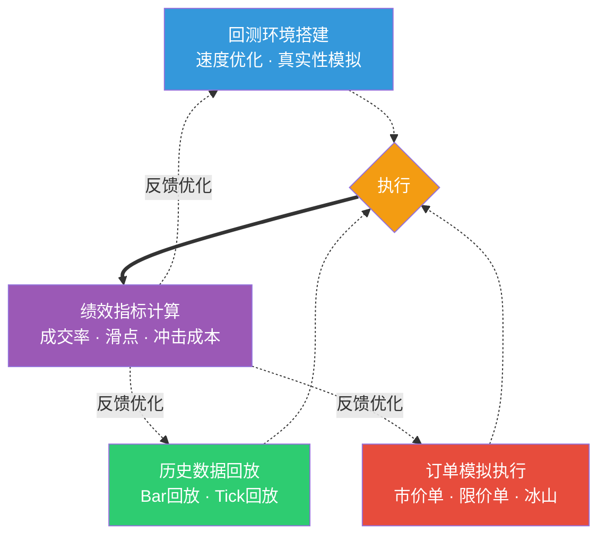

# 执行算法回测框架：回测环境搭建、历史数据回放、订单模拟执行、绩效指标计算

做量化交易的朋友都知道，策略写出来是一回事，能不能在真实市场里跑通是另一回事。我见过太多人，回测曲线漂亮得像教科书，一上实盘就亏得亲妈都不认识。问题出在哪？说白了，就是回测框架太粗糙，没有把执行层面的细节模拟到位。

今天我们就来聊聊，怎么搭建一个靠谱的执行算法回测框架。我个人习惯把这件事拆成四个模块：环境搭建、数据回放、订单模拟、绩效计算。一个一个来。

## 16.1 回测环境搭建：别让基础设施拖后腿

回测环境，说白了就是你的实验台。我刚开始做回测时，直接用单线程跑历史数据，结果一个月的 tick 数据要跑半小时。后来改成向量化计算，速度提升了上百倍。嗯，这里要注意，回测环境的核心就两个：**速度**和**真实性**。

速度方面，我建议用 NumPy 和 Pandas 做数据处理，用 Numba 加速循环计算。真实性方面，你得模拟交易所的撮合逻辑、网络延迟、手续费等。

> **核心要点：**回测环境不是越复杂越好，而是要在速度和真实性之间找到平衡点。我个人习惯先做一个轻量级版本，跑通逻辑后再逐步增加细节。

下面是一个简单的回测环境骨架：

```python
import numpy as np
import pandas as pd
from dataclasses import dataclass
from typing import List, Dict

@dataclass
class BacktestConfig:
    initial_capital: float = 1_000_000
    commission_rate: float = 0.0003  # 万三
    slippage_model: str = 'fixed'    # 固定滑点
    slippage_bps: float = 1.0        # 1个基点
    market_impact_model: str = 'linear'  # 线性冲击模型

class BacktestEngine:
    def __init__(self, config: BacktestConfig):
        self.config = config
        self.capital = config.initial_capital
        self.positions = {}
        self.trades = []
        self.equity_curve = []

    def run(self, data: pd.DataFrame, strategy):
        """主回测循环"""
        for timestamp, bar in data.iterrows():
            # 生成信号
            signal = strategy.on_bar(bar)
            # 执行订单
            if signal is not None:
                self.execute_order(signal, bar)
            # 记录权益
            self.equity_curve.append(self.get_equity(bar))

    def execute_order(self, signal, bar):
        """订单执行逻辑"""
        # 计算滑点
        slippage = self.calc_slippage(bar)
        # 计算冲击成本
        impact = self.calc_market_impact(signal, bar)
        # 实际成交价格
        exec_price = bar['close'] * (1 + slippage + impact)
        # ... 省略具体撮合逻辑
        pass
```

> **我的经验：**回测环境里最容易忽略的是「数据对齐」。我曾经因为时间戳没对齐，导致回测结果比实盘好了30%。后来我强制要求所有数据都用 UTC 时间，并且精确到毫秒级。

## 16.2 历史数据回放：让市场重演

数据回放，说白了就是让历史行情重新走一遍。你想想看，如果回测时用的数据质量不行，那结果还有什么意义？我见过有人用日线数据回测高频策略，这不是开玩笑吗？

数据回放有几种常见模式：

- **Bar 回放**：按 K 线周期推进，适合中低频策略
- **Tick 回放**：逐笔成交数据，适合高频策略
- **Snapshot 回放**：定时快照，适合做市策略

我个人习惯用 Bar 回放做初步验证，用 Tick 回放做精细优化。为什么？因为 Bar 回放速度快，能快速排除明显不行的策略；Tick 回放虽然慢，但能暴露很多执行层面的问题。

下面是一个数据回放器的实现：

```python
class DataReplayer:
    def __init__(self, data: pd.DataFrame, mode='bar'):
        self.data = data
        self.mode = mode
        self.current_idx = 0

    def next(self):
        """获取下一帧数据"""
        if self.current_idx >= len(self.data):
            return None

        if self.mode == 'bar':
            bar = self.data.iloc[self.current_idx]
            self.current_idx += 1
            return bar
        elif self.mode == 'tick':
            # Tick 模式下，一次返回一个 tick
            tick = self.data.iloc[self.current_idx]
            self.current_idx += 1
            return tick

    def reset(self):
        """重置回放位置"""
        self.current_idx = 0

    def set_speed(self, multiplier):
        """设置回放速度倍数"""
        # 实际应用中可以通过跳过数据点来实现加速
        pass
```

> **避坑指南：**我曾经在回放数据时忽略了「幸存者偏差」。用现在的股票池回测过去，结果当然好看，但实盘时那些退市的股票早就没了。记住，回放的数据必须是在那个时间点真实存在的。

## 16.3 订单模拟执行：把纸上谈兵变成实战

订单模拟执行，是整个回测框架里最考验功力的部分。为什么？因为真实市场的撮合逻辑远比想象中复杂。你想想看，你的订单发出去后，会遇到什么情况？

- 对手盘深度不够，只能部分成交
- 价格波动太快，成交价和预期差很远
- 大单进场，直接把价格打穿

我建议至少模拟以下几种订单类型：

| 订单类型 | 模拟逻辑 | 适用场景 |
|---------|---------|---------|
| 市价单 | 按当前最优价成交，考虑滑点 | 追求成交速度 |
| 限价单 | 挂在指定价格，等待对手盘 | 控制成交成本 |
| 冰山订单 | 只显示部分数量，隐藏真实意图 | 大单交易 |
| TWA订单 | 按时间加权平均价格执行 | 降低冲击成本 |

下面是一个订单模拟器的核心逻辑：

```python
class OrderSimulator:
    def __init__(self, order_book: pd.DataFrame):
        self.order_book = order_book  # 订单簿数据
        self.filled_orders = []

    def simulate_market_order(self, side: str, quantity: float):
        """模拟市价单执行"""
        remaining = quantity
        total_cost = 0
        total_filled = 0

        # 从最优价开始逐档吃单
        for level in self.order_book[side]:
            if remaining <= 0:
                break
            # 当前档位的可成交量
            available = min(level['volume'], remaining)
            # 成交价格 = 档位价格 + 滑点
            exec_price = level['price'] * (1 + self.slippage)
            # 累计成交
            total_cost += available * exec_price
            total_filled += available
            remaining -= available

        # 记录成交信息
        return {
            'filled_quantity': total_filled,
            'avg_price': total_cost / total_filled if total_filled > 0 else 0,
            'unfilled': remaining
        }

    def simulate_limit_order(self, price: float, quantity: float):
        """模拟限价单执行"""
        # 检查是否有对手盘愿意在这个价格成交
        # 如果有，则成交；否则挂单等待
        pass
```

> **关键点：**订单模拟的精度直接决定了回测的可信度。我见过有人用「收盘价+随机滑点」来模拟成交，结果回测夏普比率2.5，实盘只有0.8。后来改用逐笔订单簿模拟，差距缩小到了10%以内。

## 16.4 绩效指标计算：用数据说话

回测跑完了，怎么评价执行算法的好坏？光看收益率肯定不行。我一般会从三个维度来评估：**成交率**、**滑点**、**冲击成本**。

### 16.4.1 成交率

成交率，说白了就是你的订单有多少被实际执行了。对于限价单来说，成交率尤其重要。我见过一个做市策略，理论年化收益20%，但因为成交率只有60%，实际收益直接腰斩。

```python
def calc_fill_rate(trades: List[Dict]) -> float:
    """计算成交率"""
    total_orders = len(trades)
    filled_orders = sum(1 for t in trades if t['filled_quantity'] > 0)
    return filled_orders / total_orders if total_orders > 0 else 0
```

### 16.4.2 滑点

滑点，就是你的实际成交价和预期价格之间的差距。我习惯用基点（bps）来衡量：

```python
def calc_slippage(trades: List[Dict], benchmark_prices: pd.Series) -> float:
    """计算平均滑点（bps）"""
    total_slippage = 0
    count = 0

    for trade in trades:
        expected_price = benchmark_prices[trade['timestamp']]
        actual_price = trade['avg_price']
        slippage_bps = (actual_price - expected_price) / expected_price * 10000
        total_slippage += slippage_bps
        count += 1

    return total_slippage / count if count > 0 else 0
```

### 16.4.3 冲击成本

冲击成本，说白了就是你的订单对市场价格造成的影响。大单进场，价格会被推高（买入）或压低（卖出），这部分成本就是冲击成本。

```python
def calc_market_impact(trades: List[Dict], order_book: pd.DataFrame) -> float:
    """计算市场冲击成本"""
    total_impact = 0
    count = 0

    for trade in trades:
        # 成交前后的价差
        pre_trade_price = order_book.loc[trade['timestamp'] - pd.Timedelta('1s'), 'mid_price']
        post_trade_price = order_book.loc[trade['timestamp'] + pd.Timedelta('1s'), 'mid_price']
        impact_bps = (post_trade_price - pre_trade_price) / pre_trade_price * 10000
        total_impact += impact_bps
        count += 1

    return total_impact / count if count > 0 else 0
```

> **我的经验：**这三个指标要结合起来看。比如，一个策略成交率很高，但滑点也很大，那说明它可能是在用市价单「硬吃」，成本控制得不好。反过来，成交率低但滑点小，说明限价单挂得太保守了。

## 16.5 知识体系总览

说了这么多，我画了一张图来总结整个执行算法回测框架的核心逻辑。你一看就明白了：



从图上你能看到，整个框架是一个闭环。环境搭建是基础，数据回放提供原料，订单模拟是核心引擎，绩效计算给出评价。最后，绩效结果会反馈回来，指导你优化执行算法。

我个人觉得，这个框架最妙的地方在于它的可扩展性。你可以随时替换某个模块，比如把固定滑点模型换成更复杂的 Almgren-Chriss 模型，或者把 Bar 回放换成 Tick 回放。框架本身不需要大改。

> **最后提醒一句：**回测框架再完美，也只是对真实市场的近似模拟。我见过太多人在回测里赚得盆满钵满，一上实盘就亏。记住，回测的目的是发现策略的缺陷，而不是证明策略有多牛。
