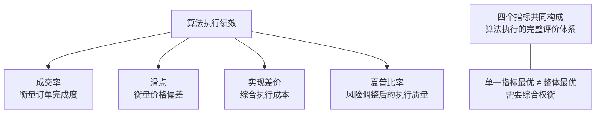

# 第17章 绩效评估指标

## 绩效评估指标：成交率、滑点、实现差价与夏普比率

做算法执行，最怕什么？

怕策略明明赚钱，执行却亏钱。怕信号发出去，单子没成交。怕成交了，价格却跑偏了。

我刚开始做量化那会儿，就吃过这个亏。策略回测年化30%，实盘一跑，直接腰斩。后来一查，全是执行环节在漏钱。所以今天咱们聊聊四个核心指标——成交率、滑点、实现差价、夏普比率。这些指标，说白了就是用来衡量你的算法到底有没有把单子执行好。

### 1. 成交率（Fill Rate）

成交率，顾名思义，就是你的订单有多少被实际成交了。

公式很简单：

```text
Fill Rate = 实际成交数量 / 委托数量 × 100%
```

举个例子。你下了一个1000股的买单，结果只成交了800股。那成交率就是80%。

为什么这个指标重要？

- **流动性判断**：成交率低，说明市场深度不够，或者你的订单太大。
- **策略执行度**：信号要求买入1000股，结果只买了800股，那策略的预期收益自然打折扣。
- **成本隐藏**：没成交的部分，可能需要在更差的价格上补单，这会产生额外成本。

> **我的经验：** 我个人习惯把成交率分成两个维度看——按订单数算和按成交量算。按订单数算，能看出有多少订单被完全拒绝；按成交量算，能看出资金利用率。两者结合，才能看清问题全貌。

### 2. 滑点（Slippage）

滑点，就是预期成交价和实际成交价之间的差值。

你想想看，你看到买一价是10.00元，于是下了市价单。结果成交价是10.05元。这0.05元就是滑点。

滑点通常分为两种：

- **正向滑点**：实际成交价比预期好。比如你买的时候，成交价比买一还低。这种情况很少见，但确实存在。
- **负向滑点**：实际成交价比预期差。这是常态，也是我们主要关注的对象。

滑点的来源，说白了就两个：

1. **市场冲击**：你的订单太大，把价格推高了。
2. **延迟**：从信号发出到订单到达交易所，这中间的时间差里价格变了。

> **避坑指南：** 我曾经在回测里把滑点设成固定值，比如0.01%。结果实盘发现，大单的滑点远高于小单。后来我改用基于成交量的动态滑点模型，才勉强贴近真实情况。记住，滑点不是常数，它是订单规模的函数。

### 3. 实现差价（Implementation Shortfall）

这个指标，我个人认为是衡量执行质量最全面的指标。它把整个执行过程的成本都算进去了。

```text
实现差价 = 实际成交均价 - 决策价格
```

这里的决策价格，通常是你做出交易决策那一刻的市场价格。比如你决定买入时，市场价是10.00元。最终你以10.10元的均价成交。那实现差价就是0.10元。

实现差价可以拆成几个部分：

| 成本类型 | 说明 | 示例 |
|---------|------|------|
| 固定成本 | 佣金、印花税、过户费等 | 每笔交易5元佣金 |
| 延迟成本 | 从决策到下单期间的价格变动 | 决策时10.00，下单时10.02 |
| 市场冲击 | 订单执行导致的价格变动 | 下单后价格从10.02涨到10.05 |
| 机会成本 | 未成交部分的价格变动 | 没买到的部分后来涨到10.20 |

嗯，这里要注意。实现差价越小，说明你的算法执行得越好。但也不是越小越好——如果你为了降低实现差价而拼命抢单，可能会增加市场冲击，反而得不偿失。

### 4. 夏普比率在算法执行中的应用

夏普比率，大家应该不陌生。它衡量的是风险调整后的收益。

```text
Sharpe Ratio = (策略收益 - 无风险利率) / 收益波动率
```

但在算法执行里，夏普比率怎么用？

我举个例子。你开发了两个执行算法：

- 算法A：平均滑点0.02%，但波动很大，有时候滑点0.01%，有时候0.05%
- 算法B：平均滑点0.03%，但非常稳定，波动很小

哪个更好？

从夏普比率的角度看，算法B可能更优。因为它的执行成本更稳定，不会给策略带来额外的波动。你想想看，策略本身已经有波动了，执行环节再添乱，那整个系统的夏普比率就会下降。

> **核心观点：** 算法执行的目标，不是单纯追求最低滑点，而是追求最低的「执行成本波动」。稳定的执行，才能让策略的夏普比率最大化。

### 知识体系结构图

下面这张图，帮你理清这四个指标之间的关系：



### 如何综合运用这些指标？

说实话，这四个指标不是孤立的。它们之间互相影响。

- **成交率 vs 滑点**：追求高成交率，往往意味着要接受更大的滑点。比如用市价单，成交率接近100%，但滑点可能很大。
- **实现差价 vs 夏普比率**：实现差价低，不一定夏普比率高。如果为了降低实现差价而频繁交易，反而增加了波动。
- **滑点 vs 实现差价**：滑点是实现差价的一部分，但实现差价还包含了机会成本。有时候滑点小，但机会成本大，实现差价反而高。

> **我的建议：** 在实际工作中，我会先设定一个可接受的实现差价上限，然后在这个约束下，尽量提高成交率、降低滑点波动。最后用夏普比率来验证——如果执行后的策略夏普比率比回测时低太多，那说明执行环节有问题，需要回头调整算法参数。

好了，这四个指标就聊到这儿。记住，指标是工具，不是目的。目的是让你的策略在实盘中跑出和回测一样的效果。下次你回测策略时，不妨把执行成本也加进去，看看你的策略到底能扛住多大的滑点。
