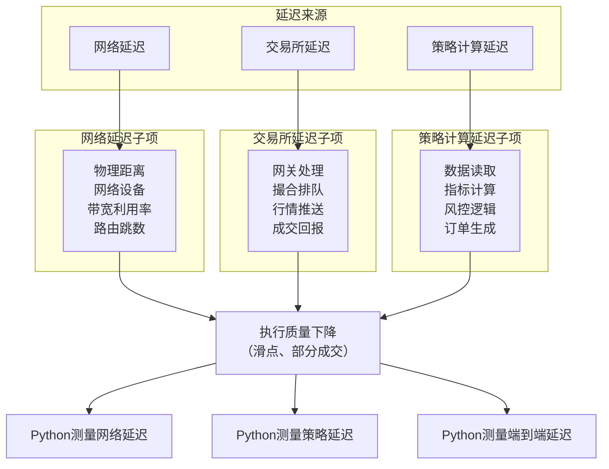

# 第18章 延迟与执行质量

做程序化交易的朋友，最怕什么？

怕延迟。说白了，就是你的订单比别人慢了一拍。这一拍，可能就是几百万的利润差。我入行那会儿，有个前辈跟我说过一句话，我一直记着：「在量化交易里，慢就是死。」

今天我们就来聊聊延迟这件事。它从哪来？怎么影响你的执行质量？以及，我们怎么用Python把它测出来。

## 延迟的来源：三个主要环节

交易延迟不是单一的问题。它像一条链子，每个环节都可能卡住你。我个人习惯把延迟来源分成三大块：网络、交易所、策略计算。

### 1. 网络延迟

这是最直观的。你的交易服务器到交易所的物理距离，决定了光速传播的时间。举个例子，如果你的服务器在上海，交易所也在上海，那网络延迟大概在1-2毫秒。但如果你的服务器在贵州，交易所还在上海，那延迟可能就飙到20-30毫秒了。

我在项目中遇到过最夸张的一次，客户把服务器托管在了一个偏远机房，结果网络抖动严重，订单经常超时。后来我们花了三天时间排查，才发现是机房到交易所的专线带宽不够，高峰期丢包率高达5%。

> **关键点：** 网络延迟不仅取决于距离，还取决于网络设备、路由跳数、带宽利用率。别只看ping值，要看实际交易链路的稳定性。

### 2. 交易所延迟

交易所那边也有延迟。你想想看，交易所的撮合引擎要处理成千上万的订单，它有自己的处理时间。这个时间包括：

- **网关处理时间：** 订单到达交易所网关，进行校验、解析的时间
- **撮合引擎排队时间：** 订单进入撮合队列，等待被处理的时间
- **行情推送时间：** 成交回报、行情快照的生成和推送时间

我记得有一次，某个交易所的撮合引擎在行情剧烈波动时，处理时间从正常的0.5毫秒飙升到了50毫秒。嗯，那天的交易员们估计都疯了。

### 3. 策略计算延迟

这个往往被新手忽略。你的策略代码本身也需要时间运行。比如：

- 读取行情数据
- 计算技术指标（移动平均线、RSI等）
- 执行风控逻辑
- 生成订单并发送

我见过一个团队，他们的策略里用了复杂的机器学习模型，每次预测要花200毫秒。你想想看，200毫秒在交易世界里是什么概念？足够市场波动好几个来回了。

> **避坑指南：** 我曾经犯过一个错误，在策略里用了Python的pandas做实时计算。pandas确实方便，但它的性能在毫秒级交易中完全不够用。后来我全部改成了numpy和Cython，计算时间从10毫秒降到了0.3毫秒。

## 延迟对执行的影响

延迟不是数字游戏，它直接关系到你的钱袋子。我总结了几种典型的影响：

| 延迟类型 | 影响 | 后果 |
| --- | --- | --- |
| 网络延迟 | 订单到达交易所的时间变晚 | 错过最佳成交价格，滑点增大 |
| 交易所延迟 | 订单排队时间变长 | 部分成交或无法成交，影响策略执行 |
| 策略计算延迟 | 信号生成滞后 | 基于过时数据做决策，策略失效 |

说白了，延迟就是让你的交易「慢半拍」。在高频交易中，这半拍可能就是生与死的区别。在普通程序化交易中，它也会让你的策略表现大打折扣。

> **注意：** 不要以为只有高频交易才关心延迟。即使是分钟级别的策略，如果网络抖动导致订单延迟几秒钟，也可能让你在关键价位上吃大亏。

## 用Python测量延迟

好了，理论说完了，我们来点实际的。怎么用Python测量延迟？我个人习惯从三个维度去测：

### 1. 测量网络延迟

最简单的办法是用ping，但ping测的是ICMP协议，不是交易协议。我更推荐用socket直接测TCP连接时间。

```python
import socket
import time

def measure_network_latency(host, port, trials=10):
    latencies = []
    for _ in range(trials):
        start = time.perf_counter()
        try:
            sock = socket.socket(socket.AF_INET, socket.SOCK_STREAM)
            sock.settimeout(2)
            sock.connect((host, port))
            end = time.perf_counter()
            latencies.append((end - start) * 1000)  # 转换为毫秒
            sock.close()
        except Exception as e:
            print(f"连接失败: {e}")
    return latencies

# 示例：测量到某交易所的延迟
latencies = measure_network_latency("exchange.example.com", 443, trials=5)
print(f"平均延迟: {sum(latencies)/len(latencies):.2f} ms")
print(f"最大延迟: {max(latencies):.2f} ms")
print(f"最小延迟: {min(latencies):.2f} ms")
```

> **提示：** 用 `time.perf_counter()` 而不是 `time.time()`。`time.time()` 的精度不够，在毫秒级测量中会失真。`perf_counter()` 能精确到微秒级别。

### 2. 测量策略计算延迟

这个简单，在策略代码的关键节点打上时间戳就行。

```python
import time

def run_strategy_with_latency(data):
    # 开始计时
    start = time.perf_counter()

    # 模拟策略计算
    signal = compute_signal(data)  # 你的策略逻辑
    order = generate_order(signal)

    # 结束计时
    end = time.perf_counter()
    compute_latency = (end - start) * 1000

    # 发送订单
    send_start = time.perf_counter()
    send_order(order)
    send_end = time.perf_counter()
    send_latency = (send_end - send_start) * 1000

    return {
        "compute_latency_ms": compute_latency,
        "send_latency_ms": send_latency,
        "total_latency_ms": compute_latency + send_latency
    }

# 运行并记录
result = run_strategy_with_latency(market_data)
print(f"策略计算耗时: {result['compute_latency_ms']:.3f} ms")
print(f"订单发送耗时: {result['send_latency_ms']:.3f} ms")
```

### 3. 测量端到端延迟

这个最难，因为你得知道订单从发出到成交的完整时间。通常需要交易所提供时间戳，或者通过行情数据反推。

```python
import datetime

def measure_end_to_end_latency(order_send_time, order_fill_time):
    """
    order_send_time: 订单发送时间（本地时间戳）
    order_fill_time: 成交回报中的交易所时间戳
    """
    # 注意：需要处理本地时间和交易所时间的偏差
    local_send = datetime.datetime.fromtimestamp(order_send_time)
    exchange_fill = datetime.datetime.fromtimestamp(order_fill_time)

    latency = (exchange_fill - local_send).total_seconds() * 1000
    return latency

# 示例
send_ts = time.time()
# 假设成交回报返回了交易所时间
fill_ts = send_ts + 0.015  # 模拟15毫秒延迟
latency = measure_end_to_end_latency(send_ts, fill_ts)
print(f"端到端延迟: {latency:.2f} ms")
```

> **注意：** 端到端延迟测量需要精确的时间同步。如果你的服务器时间和交易所时间偏差超过1毫秒，那测出来的数据就没意义了。建议使用NTP服务，或者直接使用交易所提供的时钟同步方案。

## 知识体系总览

为了让你更直观地理解延迟的构成和测量方法，我画了一张图：



这张图把延迟的来源、影响和测量方法串在了一起。你可以把它当作一个检查清单，每次优化执行算法时，对照着看看哪个环节还有优化空间。

最后说一句，延迟优化是个持续的过程。别指望一次搞定。我自己的习惯是每周跑一次延迟测试，把数据记录下来，看看有没有异常波动。一旦发现某个环节的延迟突然变大，就立刻排查。嗯，这习惯救了我好几次。

