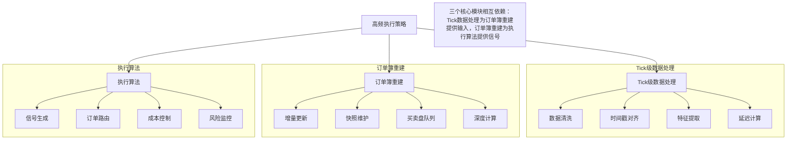

## 19、高频执行策略：高频交易中的执行算法、Tick级数据处理、订单簿重建、Python实现高频订单簿分析

高频交易，说白了就是跟时间赛跑。别人还在看分钟线，我们已经盯着Tick级数据了。我刚开始接触高频策略时，总觉得不就是速度快一点嘛，后来才发现——差之毫厘，谬以千里。今天我们就来聊聊高频执行策略的核心：Tick级数据处理、订单簿重建，以及怎么用Python把这些东西落地。

### 一、高频执行算法的核心逻辑

高频执行算法跟传统算法最大的区别在哪？我个人习惯用一个比喻：传统算法像开长途车，看的是路况和导航；高频算法像F1赛车，看的是毫秒级的轮胎抓地力和气流变化。

高频执行算法通常围绕三个目标展开：

- **速度优先**：延迟就是利润，每微秒都值钱
- **订单簿微观结构利用**：吃透买卖盘的每一层变化
- **信号衰减最小化**：你的信号别人也看到了，谁先执行谁赚钱

我在项目中遇到过一种情况：同样的信号，用不同的执行算法跑，收益能差出30%。原因就在于订单簿的微观结构——你看到的买一卖一，跟别人看到的，可能差了0.1个Tick。

### 二、Tick级数据处理：从原始数据到可用信号

Tick数据是什么？就是每一笔成交的原始记录。包括成交价、成交量、成交时间、买卖方向。嗯，这里要注意：不同交易所的Tick数据格式差异很大，有的带逐笔委托，有的只给成交快照。

处理Tick数据，我一般分三步走：

1. **清洗与对齐**：去掉异常Tick（比如价格超出涨跌停板、时间戳错乱）
2. **时间戳归一化**：把交易所时间、本地接收时间、策略处理时间对齐
3. **特征提取**：从Tick序列中提取微观结构特征

> **避坑指南**：我曾经因为时间戳没对齐，导致策略在回测时表现完美，实盘却一直亏钱。后来发现是交易所的撮合时间跟我的本地接收时间差了2毫秒——这2毫秒，在订单簿重建时足以让整个信号失效。

下面是一个简单的Tick数据清洗示例：

```python
import pandas as pd
import numpy as np

def clean_tick_data(df):
    """
    清洗Tick数据：去除异常值，对齐时间戳
    """
    # 去除价格异常（比如超过涨跌停板）
    df = df[(df['price'] > 0) & (df['price'] < 1e6)]

    # 去除成交量异常
    df = df[df['volume'] > 0]

    # 时间戳排序
    df = df.sort_values('timestamp')

    # 计算本地接收延迟（如果有的话）
    if 'local_ts' in df.columns:
        df['latency'] = df['local_ts'] - df['exchange_ts']
        # 去除延迟异常值（比如超过100ms）
        df = df[df['latency'] < 100_000]  # 微秒

    return df.reset_index(drop=True)
```

### 三、订单簿重建：从Tick到完整的买卖盘

订单簿重建，说白了就是把零散的Tick数据拼回完整的买卖盘。你想想看，交易所每秒可能产生几千笔成交，但订单簿的变化远不止这些——还有撤单、改单、新挂单。

重建订单簿的核心逻辑：

- 每个Tick事件都会改变订单簿的状态
- 我们需要维护一个**增量更新**的订单簿快照
- 快照频率取决于策略需求——有的需要每笔Tick都重建，有的只需要每秒重建一次

我个人习惯用**双端队列**来维护订单簿的买卖盘，因为高频场景下插入和删除操作非常频繁，用列表的话性能扛不住。

> **小技巧**：如果你做的是高频做市策略，建议每笔Tick都重建订单簿。如果是趋势跟踪策略，每秒重建一次就够了。我在实盘中吃过亏——每秒重建一次时信号质量下降，但每笔重建又太耗CPU。后来折中：每10毫秒重建一次，效果不错。

下面是一个简化的订单簿重建实现：

```python
from collections import deque
import bisect

class OrderBook:
    """
    高频订单簿重建类
    支持增量更新和快照查询
    """
    def __init__(self):
        self.bids = deque()  # 买盘，价格降序
        self.asks = deque()  # 卖盘，价格升序
        self.last_update_time = 0

    def update_from_tick(self, tick):
        """
        根据Tick事件更新订单簿
        tick格式: {'type': 'trade'/'add'/'cancel', 'side': 'buy'/'sell',
                   'price': float, 'volume': float, 'timestamp': int}
        """
        if tick['type'] == 'add':
            self._add_order(tick['side'], tick['price'], tick['volume'])
        elif tick['type'] == 'cancel':
            self._cancel_order(tick['side'], tick['price'], tick['volume'])
        elif tick['type'] == 'trade':
            self._match_order(tick['side'], tick['price'], tick['volume'])

        self.last_update_time = tick['timestamp']

    def _add_order(self, side, price, volume):
        """新增委托"""
        if side == 'buy':
            # 插入到买盘，保持价格降序
            idx = bisect.bisect_left([-p for p, _ in self.bids], -price)
            self.bids.insert(idx, (price, volume))
        else:
            # 插入到卖盘，保持价格升序
            idx = bisect.bisect_left([p for p, _ in self.asks], price)
            self.asks.insert(idx, (price, volume))

    def get_best_bid_ask(self):
        """获取最优买卖价"""
        if self.bids and self.asks:
            return self.bids[0][0], self.asks[0][0]
        return None, None

    def get_market_depth(self, levels=5):
        """获取市场深度"""
        bid_depth = list(self.bids)[:levels]
        ask_depth = list(self.asks)[:levels]
        return bid_depth, ask_depth
```

### 四、Python实现高频订单簿分析

有了订单簿重建，我们就可以做高频分析了。我个人常用的分析维度包括：

| 分析维度 | 计算方法 | 应用场景 |
| --- | --- | --- |
| 买卖价差 | 卖一价 - 买一价 | 衡量市场流动性 |
| 订单簿不平衡 | (买盘总量 - 卖盘总量) / (买盘总量 + 卖盘总量) | 预测短期价格方向 |
| 价格冲击成本 | 模拟吃掉N层订单簿后的平均成交价 | 评估大单执行成本 |
| 订单到达率 | 单位时间内新增委托数量 | 判断市场活跃度 |

下面是一个订单簿不平衡指标的计算示例：

```python
def calculate_order_imbalance(ob, depth=5):
    """
    计算订单簿不平衡指标
    正值表示买盘强势，负值表示卖盘强势
    """
    bid_depth, ask_depth = ob.get_market_depth(depth)

    bid_volume = sum(v for _, v in bid_depth)
    ask_volume = sum(v for _, v in ask_depth)

    if bid_volume + ask_volume == 0:
        return 0

    imbalance = (bid_volume - ask_volume) / (bid_volume + ask_volume)
    return imbalance

# 使用示例
ob = OrderBook()
# 模拟一些Tick事件
ticks = [
    {'type': 'add', 'side': 'buy', 'price': 100.0, 'volume': 100, 'timestamp': 1},
    {'type': 'add', 'side': 'sell', 'price': 100.1, 'volume': 200, 'timestamp': 2},
    {'type': 'add', 'side': 'buy', 'price': 99.9, 'volume': 150, 'timestamp': 3},
]

for tick in ticks:
    ob.update_from_tick(tick)

imbalance = calculate_order_imbalance(ob)
print(f"订单簿不平衡: {imbalance:.4f}")
# 输出: 订单簿不平衡: 0.1111  (买盘略强)
```

> **注意**：订单簿不平衡指标在高频场景下非常敏感。我曾经在实盘中看到这个指标在1秒内从+0.8跳到-0.9——这意味着市场方向可能在瞬间反转。如果你用这个指标做信号，一定要加一个平滑窗口，否则会被频繁的假信号搞死。

### 五、高频执行策略的实战要点

说了这么多理论，最后分享几个我在实战中总结的要点：

- **延迟是敌人，但不是唯一的敌人**：很多人只追求速度，忽略了订单簿的微观结构。其实有时候慢0.1毫秒，但能吃到更好的价格，反而更赚钱。
- **订单簿重建要快，但不能牺牲准确性**：我见过有人为了速度，用近似算法重建订单簿，结果信号质量下降得厉害。建议用Cython或者Numba加速关键路径。
- **回测和实盘的Tick数据差异很大**：回测时用的是历史Tick，实盘时是实时流。历史数据里没有网络延迟、没有数据丢失。所以回测表现好的策略，实盘可能完全不一样。
- **别忘了做压力测试**：高频场景下，行情爆发时每秒可能有上万笔Tick。你的订单簿重建代码能不能扛住？我建议用模拟数据做压力测试，至少达到正常行情的5倍量。

最后，我想说：高频执行算法不是万能的。它适合流动性好、波动性适中的市场。如果你做的是冷门品种，或者波动特别大的品种，高频策略反而容易亏钱。选对战场，比选对算法更重要。

### 高频执行策略知识体系


