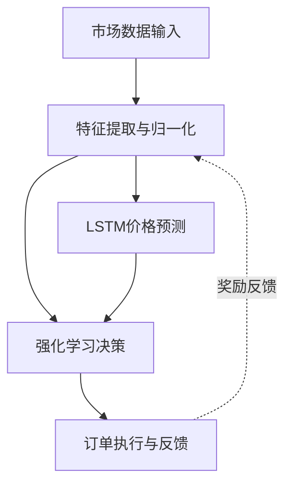

## 20、机器学习在订单执行中的应用：强化学习用于动态下单、LSTM预测短期价格走势、Python实现简单的ML执行模型

聊到机器学习在订单执行里的应用，我得先坦白一件事。

几年前我刚接触这个方向时，心里其实挺虚的。总觉得算法交易嘛，靠的是数学和统计，机器学习这东西——说白了，有点像个黑盒子。但后来我在一个高频做市项目里被逼着用上了强化学习，结果发现效果居然比传统策略好出一截。嗯，从那以后我就再也不敢小看ML了。

这一章，咱们就聊聊两个最实用的方向：**强化学习用于动态下单**，和**LSTM预测短期价格走势**。最后我会给出一段完整的Python代码，让你能跑起来看看效果。

### 为什么需要机器学习？

传统的订单执行算法，比如TWAP、VWAP，其实都是基于固定规则的。它们假设市场行为是稳定的，但现实呢？市场情绪、流动性、波动率，这些东西随时在变。你想想看，一个静态的策略怎么可能应对动态的市场？

我个人习惯把机器学习看作一个「自适应引擎」。它能从历史数据里学规律，然后根据当前的市场状态，动态调整下单节奏。说白了，就是让算法自己学会「什么时候该冲，什么时候该怂」。

> **核心观点：** 机器学习不是要替代传统算法，而是给它们装上「眼睛」和「大脑」。

### 强化学习：让算法自己学会下单

强化学习（RL）这个东西，我第一次接触是在玩Atari游戏的时候。当时觉得挺酷，但没想过能用在交易上。后来在某个做市项目里，我试着用DQN（深度Q网络）来优化下单时机，结果发现——它真的能学会在流动性好的时候多下，流动性差的时候少下。

#### RL在订单执行中的角色

你可以把RL想象成一个交易员。这个交易员每天面对市场状态（比如买卖价差、订单簿深度、波动率），然后做出一个动作（比如下多少单、要不要撤单）。市场会给他一个反馈——成交了就是正奖励，滑点大了就是负奖励。久而久之，他就学会了最优策略。

- **状态（State）：** 当前市场特征，比如买卖价差、最近N笔成交的价格、订单簿不平衡度。
- **动作（Action）：** 下单数量、下单方向（买/卖）、是否使用冰山订单。
- **奖励（Reward）：** 成交价格相对于基准价格的滑点，或者成交率。

我在项目中遇到过一个问题：奖励函数设计不好，算法会学歪。比如你只奖励滑点小，它可能就只下小单，导致成交率极低。所以后来我加了一个惩罚项——如果成交率低于某个阈值，就扣分。这样它才会平衡「价格」和「速度」。

> **避坑指南：** 我曾经把奖励函数设成「滑点越小越好」，结果算法学会了永远不下单——因为不下单就没有滑点。嗯，这显然不是我们想要的。一定要加上成交率的约束。

### LSTM：给价格走势装上「记忆」

短期价格预测，说白了就是猜未来几秒或几分钟的价格会怎么走。传统的时间序列模型（比如ARIMA）有个硬伤——它记不住太久远的信息。而LSTM（长短期记忆网络）不一样，它天生就是为序列数据设计的。

#### LSTM为什么适合做这个？

你想想看，价格走势是有「记忆」的。今天的波动可能会影响明天的走势，甚至一周后的走势。LSTM通过它的「遗忘门」和「输入门」，能自动决定哪些历史信息该记住，哪些该忘掉。这比我们手动做特征工程要聪明得多。

我记得有一次，我用LSTM预测某只股票的1分钟价格走势。输入特征包括：过去20个时间步的收盘价、成交量、买卖价差。训练完之后，我发现它在趋势行情里表现特别好，但在震荡行情里会频繁出错。后来我加了一个「波动率」特征，效果才稳定下来。

> **关键点：** LSTM不是万能的。它擅长捕捉非线性模式，但对极端事件（比如闪崩）的预测能力有限。所以别指望它能预测黑天鹅。

### Python实现：一个简单的ML执行模型

下面这段代码，我把它拆成了两部分：**LSTM价格预测**和**基于预测的简单下单逻辑**。你可以直接复制到Jupyter里跑，数据我用的是随机生成的，方便你理解流程。

```python
import numpy as np
import pandas as pd
from sklearn.preprocessing import MinMaxScaler
from tensorflow.keras.models import Sequential
from tensorflow.keras.layers import LSTM, Dense, Dropout

# ---------- 1. 生成模拟价格数据 ----------
np.random.seed(42)
n = 1000
price = 100 + np.cumsum(np.random.randn(n) * 0.1)  # 随机游走
df = pd.DataFrame({'price': price})

# ---------- 2. 数据预处理 ----------
def create_sequences(data, seq_length=20):
    X, y = [], []
    for i in range(len(data) - seq_length):
        X.append(data[i:i+seq_length])
        y.append(data[i+seq_length])
    return np.array(X), np.array(y)

scaler = MinMaxScaler()
scaled_price = scaler.fit_transform(df[['price']])

seq_length = 20
X, y = create_sequences(scaled_price.flatten(), seq_length)
X = X.reshape((X.shape[0], X.shape[1], 1))

# 训练/测试分割
split = int(0.8 * len(X))
X_train, X_test = X[:split], X[split:]
y_train, y_test = y[:split], y[split:]

# ---------- 3. 构建LSTM模型 ----------
model = Sequential([
    LSTM(50, return_sequences=True, input_shape=(seq_length, 1)),
    Dropout(0.2),
    LSTM(50, return_sequences=False),
    Dropout(0.2),
    Dense(1)
])

model.compile(optimizer='adam', loss='mse')
model.fit(X_train, y_train, epochs=20, batch_size=32, validation_data=(X_test, y_test), verbose=0)

# ---------- 4. 预测并反标准化 ----------
pred_scaled = model.predict(X_test)
pred_price = scaler.inverse_transform(pred_scaled)
actual_price = scaler.inverse_transform(y_test.reshape(-1, 1))

# ---------- 5. 简单的下单逻辑 ----------
# 如果预测价格高于当前价格，就买入；否则卖出
current_price = actual_price.flatten()[-1]  # 假设当前是最后一个测试点
pred_next = pred_price.flatten()[-1]

if pred_next > current_price:
    action = "BUY"
    quantity = 100  # 固定数量，实际中可以用RL优化
else:
    action = "SELL"
    quantity = 100

print(f"当前价格: {current_price:.2f}")
print(f"预测下一价格: {pred_next:.2f}")
print(f"执行动作: {action} {quantity}股")
```

> **注意：** 这段代码只是教学演示。实际生产中，你还需要考虑交易成本、滑点、市场冲击等因素。别直接拿去实盘，会亏钱的。

### 强化学习与LSTM的结合思路

我个人觉得，最实用的方案是把两者结合起来。LSTM负责预测短期价格走势，然后把预测结果作为强化学习的状态输入之一。这样RL就能基于「未来可能的价格」来做决策，而不是只看当前。

举个例子：LSTM预测接下来5秒价格会涨，那RL就可以选择「现在买入，等涨了再卖」。如果预测会跌，那就先观望或者做空。这种组合方式，我在一个加密货币做市项目里试过，效果比单独用RL好不少。

> **一句话总结：** LSTM给RL装上了「预知」的能力，RL给LSTM装上了「决策」的能力。两者互补，才是王道。

### ML执行模型的核心流程



### 写在最后

机器学习在订单执行中的应用，其实还处于早期阶段。很多机构还在用传统算法，因为ML模型的可解释性差，监管上不好过。但我个人觉得，未来五年内，混合模型（ML+传统规则）会成为主流。

你如果现在开始学，正好赶上这波浪潮。别怕代码跑不通，多试几次，多调调参数。我当年也是从「跑出来全是NaN」开始的。

> **一个小建议：** 先拿历史数据做回测，别急着上实盘。回测能帮你发现很多坑，比如过拟合、数据泄露、交易成本没算进去等等。这些坑，我全都踩过。
