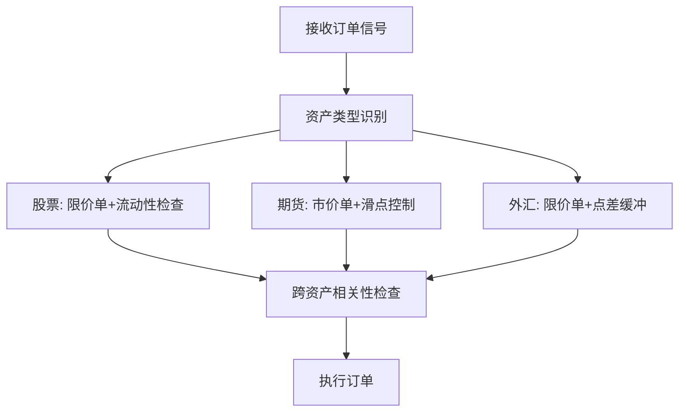

## 多资产执行策略：股票、期货、外汇的执行差异

做量化交易这些年，我接触过不少资产类别。说实话，每种资产都有自己的脾气。股票、期货、外汇，虽然都是交易，但执行起来差别很大。今天我就把这些差异掰开揉碎了讲给你听。

### 一、三大资产的执行差异

先说说股票。股票交易有个特点——流动性分布极不均匀。大盘股流动性好，小盘股可能半天都成交不了。我在做A股策略时遇到过这种情况：明明挂单价格合理，结果等了10分钟才成交。嗯，这里要注意，股票还有涨跌停板限制，极端行情下根本没法交易。

期货就不一样了。期货是保证金交易，杠杆高，波动也大。我个人习惯在期货交易中特别关注滑点控制。为什么？因为期货的买卖价差可能很大，尤其是临近交割的合约。我记得有一次做螺纹钢，夜盘突然跳水，我的限价单直接成了废单。

外汇市场更特殊。它是24小时交易的，流动性全球分布。但外汇的滑点问题更隐蔽——你看到的报价和实际成交价可能差好几个点。说白了，外汇做市商多，流动性分散，执行起来要格外小心。

> **核心差异总结：**
> - 股票：关注流动性分层和涨跌停限制
> - 期货：注意杠杆效应和交割日临近的流动性变化
> - 外汇：警惕24小时交易中的流动性空洞

### 二、跨资产相关性考虑

做多资产策略，最头疼的就是相关性。你以为分散了风险，结果一跌全跌。我见过太多人把股票和商品期货放在一起，以为能对冲，结果遇到系统性风险时，相关性瞬间变成1。

为什么会这样？因为不同资产之间确实存在联动。比如原油价格上涨，会推高化工品期货，同时打压航空股。这种相关性不是固定的，它会随着市场环境变化。我曾经在2020年3月做过回测，发现股债相关性在危机期间完全反转。

所以我的建议是：

- 用滚动窗口计算动态相关性，别用固定值
- 关注极端行情下的尾部相关性
- 把相关性纳入执行决策——比如股票和期货同时下单时，要考虑流动性冲击的叠加效应

> **避坑指南：** 我曾经在跨资产套利策略中忽略了相关性突变，结果两个头寸同时亏损。后来我加了一个相关性监控模块，一旦相关性超过阈值就暂停交易。

### 三、Python实现多资产执行框架

好了，理论说完了，咱们上代码。我设计了一个简单的多资产执行框架，支持股票、期货、外汇三种资产。核心思路是：统一接口，差异配置。

```python
class MultiAssetExecutor:
    def __init__(self):
        self.asset_configs = {
            'stock': {
                'order_type': 'limit',
                'slippage_model': 'linear',
                'liquidity_check': True
            },
            'futures': {
                'order_type': 'market',
                'slippage_model': 'percentage',
                'margin_ratio': 0.1
            },
            'forex': {
                'order_type': 'limit',
                'slippage_model': 'fixed',
                'spread_buffer': 2
            }
        }

    def execute(self, asset_type, order):
        config = self.asset_configs[asset_type]
        # 根据资产类型选择执行逻辑
        if asset_type == 'stock':
            return self._execute_stock(order, config)
        elif asset_type == 'futures':
            return self._execute_futures(order, config)
        elif asset_type == 'forex':
            return self._execute_forex(order, config)

    def _execute_stock(self, order, config):
        # 股票执行逻辑：限价单 + 流动性检查
        if config['liquidity_check']:
            liquidity = self._check_liquidity(order.symbol)
            if liquidity < order.quantity * 10:
                print(f"流动性不足，调整订单大小")
                order.quantity = liquidity // 10
        return self._send_order(order, config['order_type'])

    def _execute_futures(self, order, config):
        # 期货执行逻辑：市价单 + 滑点控制
        slippage = order.price * config['slippage_model']
        adjusted_price = order.price + slippage
        return self._send_order(order, 'market', adjusted_price)

    def _execute_forex(self, order, config):
        # 外汇执行逻辑：限价单 + 点差缓冲
        spread = self._get_spread(order.pair)
        order.price += spread * config['spread_buffer']
        return self._send_order(order, config['order_type'])
```

这个框架的好处是：你只需要配置不同资产的参数，执行逻辑自动适配。我实际项目中还加了相关性模块，用来协调多资产下单时机。

> **注意：** 上面的代码是简化版。真实环境中，你还需要考虑订单路由、交易所接口、风控检查等。千万别直接拿去实盘用！

### 四、多资产执行的核心逻辑



这张图的核心逻辑是：先识别资产类型，然后走不同的执行路径，最后统一做相关性检查。你想想看，如果不做相关性检查，股票和期货同时下单，可能造成流动性冲击叠加，成交价格会很难看。

### 五、实战中的注意事项

最后分享几个实战经验：

- **订单拆分：** 大单一定要拆分。我习惯用TWAP或VWAP算法，根据资产流动性动态调整拆分粒度。
- **延迟控制：** 不同资产的交易延迟不一样。外汇的延迟可能比股票高，下单时要考虑这个时间差。
- **资金管理：** 多资产交易时，保证金占用要统一计算。别让期货的保证金占用挤占了股票的资金。

> **我的小技巧：** 在实盘前，先用模拟账户跑一周。重点观察不同资产在相同市场环境下的执行表现。我曾经发现外汇在亚洲盘和欧洲盘的滑点差异很大，后来专门做了分时段配置。

好了，多资产执行策略就讲到这里。记住，没有万能的执行算法，只有最适合当前市场环境的配置。多测试，多总结，慢慢你就能找到感觉。
