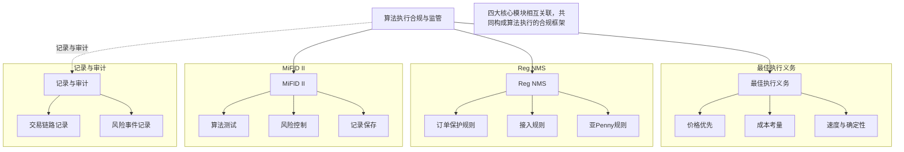

## 算法执行中的合规与监管：最佳执行义务、Reg NMS、MiFID II要求、记录与审计

做量化交易这些年，我越来越觉得，策略再牛，算法再快，如果合规没做好，那就是在刀尖上跳舞。今天咱们聊聊算法执行中绕不开的合规与监管问题。说白了，这不是为了应付检查，而是保护我们自己。

### 一、最佳执行义务（Best Execution）

最佳执行义务，听起来很官方，其实就是一句话：你得给客户找到当前条件下最好的成交结果。不是价格最低就行，还要考虑速度、流动性、成交概率、甚至市场冲击。

**核心要素有哪些？**

- **价格优先**：同等条件下，价格越好越优先
- **成本考量**：佣金、税费、滑点都要算进去
- **速度与确定性**：有些单子慢一秒可能就亏了
- **市场影响**：大单不能硬冲，得用算法拆单

> **我个人习惯**：在评估执行质量时，会用实现差价（Implementation Shortfall）作为核心指标。这个指标把理论成交价和实际成交价的差距量化了，很直观。

我在项目中遇到过一件事：有个客户抱怨我们执行慢，结果一查，是他在一个流动性极差的品种上挂了大单。你想想看，这种单子硬冲，价格肯定被打飞。后来我们改用了TWAP算法，虽然慢了点，但整体成本反而降了。这就是最佳执行——不是最快，而是最合适。

### 二、Reg NMS 要求

Reg NMS（国家市场系统规则）是美国那边的监管框架，2005年推出的。它的核心逻辑是保护投资者，防止市场碎片化带来的不公平。

**Reg NMS 的四大支柱：**

1. **订单保护规则**：不能无视其他交易所的更好报价
2. **接入规则**：公平接入各交易市场
3. **亚 penny 规则**：报价最小变动单位有规定
4. **市场数据规则**：数据分发要公平透明

嗯，这里要注意。Reg NMS 对算法交易影响最大的就是订单保护规则。你的算法必须检查全国最优买卖价（NBBO），不能只看自己所在的交易所。

> **我曾经踩过的坑**：早期做美股算法时，我图省事只查了主交易所的报价。结果有一次，客户的大单在纳斯达克成交了，但纽交所那边有更好的价格。虽然只差了一分钱，但合规部门找上门来了。从那以后，我所有的算法都强制接入 SIP（证券信息处理器）数据流。

### 三、MiFID II 要求

MiFID II 是欧洲的金融工具市场指令，2018年生效。它比 Reg NMS 更严格，覆盖面也更广。我个人觉得，MiFID II 是当前全球最严的算法交易监管框架。

**MiFID II 对算法交易的核心要求：**

| 要求类别 | 具体内容 |
| --- | --- |
| 算法测试 | 上线前必须在沙盒环境测试，不能直接上生产 |
| 风险控制 | 必须有价格保护、订单频率限制、最大订单量限制 |
| 记录保存 | 所有算法参数、交易记录至少保存5年 |
| 人员资质 | 算法开发人员需要注册，并持续培训 |

为什么会这么严？因为2010年的闪电崩盘让监管层意识到，算法交易失控的后果很严重。MiFID II 要求每个算法都有一个唯一的标识符，方便追踪问题。

> **我建议**：如果你的算法要接入欧洲市场，一定要提前做好算法生命周期管理。从开发、测试、上线到下线，每一步都要有文档记录。别问我怎么知道的——我帮一家券商做过 MiFID II 合规改造，光文档就写了300多页。

### 四、记录与审计

记录与审计，说白了就是「留痕」。监管机构查你的时候，你得能拿出证据，证明你的算法是合规的。

**需要记录哪些内容？**

- 算法版本号及变更日志
- 每次交易的完整链路（订单生成→路由→成交）
- 风险控制触发记录
- 系统异常及处理日志
- 参数调整记录（谁改的、什么时候改的、为什么改）

这里我分享一个实用的代码片段，用于记录算法执行的关键信息：

```python
import logging
import json
from datetime import datetime

class ComplianceLogger:
    def __init__(self, algo_id):
        self.algo_id = algo_id
        self.logger = logging.getLogger(f"compliance_{algo_id}")

    def log_order(self, order):
        record = {
            "timestamp": datetime.utcnow().isoformat(),
            "algo_id": self.algo_id,
            "order_id": order.id,
            "symbol": order.symbol,
            "side": order.side,
            "quantity": order.quantity,
            "price": order.price,
            "route": order.route,
            "nbbp": order.nbbp  # 记录当时的NBBO
        }
        self.logger.info(json.dumps(record))

    def log_risk_event(self, event_type, details):
        record = {
            "timestamp": datetime.utcnow().isoformat(),
            "algo_id": self.algo_id,
            "event_type": event_type,
            "details": details
        }
        self.logger.warning(json.dumps(record))
```

这个日志类我一直在用。它记录了每个订单的完整上下文，包括当时的NBBO。万一被审计，这些数据就是你的护身符。

> **审计的黄金法则**：如果你不能证明你的算法是合规的，那它就是不合规的。记录不是可选项，是必选项。

### 知识体系结构图



这张图把四个核心模块的关系理清楚了。最佳执行义务是目标，Reg NMS 和 MiFID II 是规则，记录与审计是保障。缺一个都不行。

> **最后说一句**：合规不是成本，是投资。一个合规的算法系统，能让你睡得安稳，也能让客户放心。我见过太多因为合规问题被罚得倾家荡产的案例。嗯，咱们做技术的，还是把合规意识刻在骨子里比较好。
